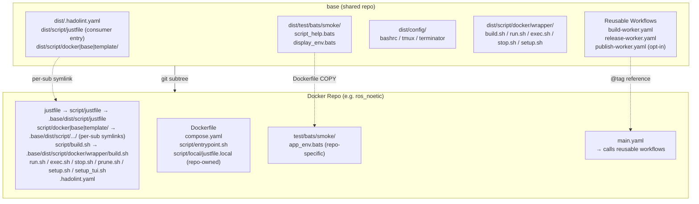
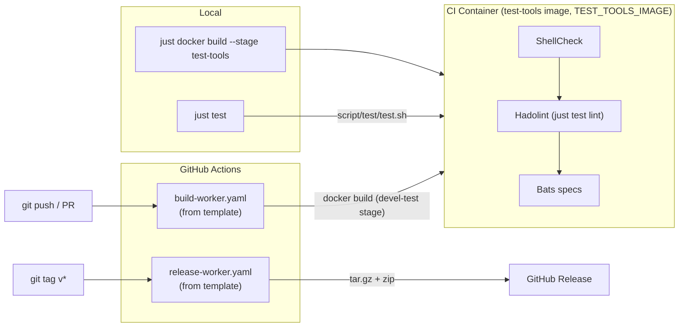

# base

[](https://github.com/ycpss91255-docker/base/actions/workflows/self-test.yaml)


[](./LICENSE)

Shared template for Docker container repos in the [ycpss91255-docker](https://github.com/ycpss91255-docker) organization.

**[English](README.md)** | **[繁體中文](doc/readme/README.zh-TW.md)** | **[简体中文](doc/readme/README.zh-CN.md)** | **[日本語](doc/readme/README.ja.md)**

---

## Table of Contents

- [TL;DR](#tldr)
- [Prerequisites](#prerequisites)
- [Overview](#overview)
- [Quick Start](#quick-start)
- [CI Reusable Workflows](#ci-reusable-workflows)
- [Running Template Tests](#running-template-tests)
- [Tests](#tests)
- [Directory Structure](#directory-structure)

---

## TL;DR

```bash
# New repo from scratch: first commit + subtree + one-time bootstrap
mkdir <repo_name> && cd <repo_name>
git init
git commit --allow-empty -m "chore: initial commit"
git subtree add --prefix=.base \
    https://github.com/ycpss91255-docker/base.git vX.Y.Z --squash
./.base/dist/script/base/init.sh   # one-time bootstrap; thereafter: just base init

# Upgrade to latest
just base update   # check
just base upgrade         # pull + update version + workflow tag

# Run CI
just test   # ShellCheck + Bats + Kcov
just                       # show all recipes
```

## Prerequisites

Container operations run through [`just`](https://github.com/casey/just) (the
command runner) layered on Docker. Install both on the host before using the
`just <verb>` entry point:

- **Docker** + Docker Compose v2 (`docker compose`).
- **just** -- any recent release works (the recipes use only variadic
  parameters, supported since early versions). Install via a package manager
  or the official installer:

  ```bash
  apt install just         # Debian 13+ / Ubuntu 24.04+
  brew install just        # macOS / Linuxbrew
  cargo install just       # from crates.io
  # or the official prebuilt-binary installer:
  curl --proto '=https' --tlsv1.2 -sSf https://just.systems/install.sh \
      | bash -s -- --to ~/.local/bin
  ```

  See the [official install guide](https://github.com/casey/just#installation)
  for every method. If `just` is unavailable each recipe has a raw fallback
  (`./script/<verb>.sh`, `./.base/dist/script/base/upgrade.sh`) -- see
  [Quick Start](#quick-start).

## Overview

This repo consolidates shared scripts, tests, and CI workflows used across all Docker container repos. Instead of maintaining identical files in 15+ repos, each repo pulls this template as a **git subtree** and uses symlinks.

### Architecture



### CI/CD Flow



### What's included

| File | Description |
|------|-------------|
| `build.sh` | Build containers (TTY-aware `--setup` launches `setup_tui.sh`, else runs `setup.sh`) |
| `run.sh` | Run containers (X11/Wayland support; same `--setup` semantics as `build.sh`; `--build` opt-in pre-flight ./build.sh test for fresh-clone CI parity) |
| `exec.sh` | Exec into running containers |
| `stop.sh` | Stop and remove containers |
| `prune.sh` | Prune dangling images / build cache for the repo |
| `setup_tui.sh` | Interactive setup.conf editor (dialog / whiptail front-end) |
| `dist/script/docker/wrapper/setup.sh` | Auto-detect system parameters and generate `.env` + `compose.yaml` |
| `dist/script/docker/lib/_lib.sh` | Core wrapper library (`_load_env`, `_compose`, `_compose_project`, ...) |
| `dist/script/docker/lib/bootstrap.sh` | Common wrapper initialization and arg parsing |
| `dist/script/docker/lib/compose.sh` | Docker Compose YAML generation and manipulation |
| `dist/script/docker/lib/conf.sh` | INI file parser and section merger |
| `dist/script/docker/lib/conf_logging.sh` | Logging configuration helpers |
| `dist/script/docker/lib/env.sh` | Environment variable setup and defaults |
| `dist/script/docker/lib/gitignore.sh` | Gitignore file management |
| `dist/script/docker/lib/hook.sh` | Per-wrapper pre/post hook invocation |
| `dist/script/docker/lib/i18n.sh` | Language detection and localization (`_detect_lang`, `_LANG`) |
| `dist/script/docker/lib/log.sh` | Unified logging and output utilities |
| `dist/script/docker/lib/config_summary.sh` | Summary of runtime configuration |
| `dist/script/docker/lib/_tui_backend.sh` | dialog/whiptail wrapper functions used by `setup_tui.sh` |
| `dist/script/docker/lib/_tui_conf.sh` | INI validators + read/write for `setup_tui.sh` and `setup.sh` writeback |
| `dist/script/docker/runtime/logging.sh` | Host-side log tee helper (per-start file + stable symlink) |
| `dist/script/docker/runtime/logrotate.sh` | Shared rotate/symlink/prune primitives (tee + transcript) |
| `dist/script/docker/runtime/smoke.sh` | Runtime install-check smoke |
| `dist/script/docker/runtime/entrypoint.sh` | Template entrypoint helper |
| `script/test/test.sh` | base self-test dispatcher (local + in-container) |
| `script/test/drivers/` | One driver per tool — `bats.sh` / `shellcheck.sh` / `hadolint.sh` |
| `script/test/lint_bare_stderr.sh` | Bare stderr lint checker |
| `config/` | Container-internal shell configs (bashrc, tmux, terminator) |
| `setup.conf` | Single per-repo runtime configuration (image / build / deploy / gui / network / volumes) |
| `dist/test/bats/smoke/` | Shared smoke tests + runtime assertion helpers (see below) |
| `test/bats/unit/` | base self-tests, Unit level (bats + kcov) |
| `test/bats/integration/` | base self-tests, Integration level (init/upgrade end-to-end) |
| `test/bats/system/` | base self-tests, System level / Regression (runtime smoke gate, opt-in) |
| `test/bats/acceptance/` | base self-tests, Acceptance level (UAT/OAT; reserved, S5 #785) |

Test content is laid out **tool-first** -- `test/<tool>/<category>/`
for specs (e.g. `test/bats/unit/`) and `test/lint/<tool>/` for linters --
so adding a tool is a new folder, not a new command surface. The category
vocabulary is ISTQB-aligned (levels Unit / Integration / System /
Acceptance + the Smoke type); see
[ADR-00000018](doc/adr/00000018-istqb-test-taxonomy.md) and
[ADR-00000012](doc/adr/00000012-tool-first-test-layout.md) (supersedes the
category-first ADR-00000004). A consumer ships its own `test/bats/smoke/`; base
ships its own `test/bats/{unit,integration,system,acceptance}/`.

| `.hadolint.yaml` | Shared Hadolint rules |
| `justfile` (→ `script/justfile`) | Repo entry — layered namespaced recipes (`just docker build`, `just docker run`, `just test`, `just base upgrade`, etc.). Sub-cmds and flags pass straight through as `{{args}}` (`just docker build --no-cache --stage test-tools`); bare `just` lists all namespaces. |
| `dist/script/docker/justfile.docker` | `docker` namespace — container ops (`just docker build/run/exec/stop/prune/setup/setup-tui`). |
| `dist/script/base/justfile.base` | `base` namespace — manage the `.base` subtree (`just base init/update/upgrade/completions`). |
| `dist/script/base/init.sh` | First-time symlink setup + new-repo scaffolding (bootstrap: `./.base/dist/script/base/init.sh`; thereafter `just base init`). |
| `dist/script/base/upgrade.sh` | Subtree version upgrade (`just base upgrade [vX.Y.Z]`). |
| `script/test/justfile.test` | base self-test entry (`just test`, `just test lint`, `just test coverage`, …). |
| `script/release/justfile.release` | base `release` namespace (release / publish tooling). |
| `dist/dockerfile/Dockerfile` | Multi-stage Dockerfile template for new repos |
| `dockerfile/Dockerfile.test-tools` | Pre-built lint/test tools image (shellcheck, hadolint, bats, bats-mock) |
| `.github/workflows/` | Reusable CI workflows (build + release) |

### Getting help (namespace vs recipe)

`just` help works at two levels; the dashed `just <ns> --help` form is a
documented `just` dispatch limitation, not a bug:

| You want | Use | Notes |
|---|---|---|
| List a namespace's recipes | `just <ns> help` (`just <ns> h`) | e.g. `just docker help`, `just base help`. **Localised**: renders each recipe's one-line summary in your language (`$LANG`, or `--lang <en\|zh-TW\|zh-CN\|ja>`) for the `docker` / `base` / `template` namespaces. Bare `just <ns>` lists too, but stays English. |
| Help for one recipe | `just <ns> <recipe> --help` | e.g. `just docker build --help`, `just base upgrade --help`, `just base update --help` -- `--help` is forwarded to the backing script. |
| List every namespace | `just` | Top-level overview. `just --list` (and bare `just <ns>`) stay English -- just's native listing cannot be intercepted; `just <ns> help` is the translated entry point. |
| `just <ns> --help` | (avoid) | A dashed name cannot be a `just` recipe/alias, so this cannot be intercepted; `just` prints `Did you mean 'help'?` and points you at `just <ns> help`. |

### Wrapper UX cheat sheet (#291)

Single canonical reference for what each user-facing script accepts.
Downstream READMEs link here instead of duplicating the table.

| Flag / form | `build.sh` | `run.sh` | `exec.sh` | `stop.sh` | `setup.sh` (CLI) |
|---|:---:|:---:|:---:|:---:|:---:|
| `-h` / `--help` | yes | yes | yes | yes | yes |
| `-C` / `--chdir DIR` | yes | yes | yes | yes | — |
| `--lang LANG` | yes | yes | yes | yes | yes |
| `--dry-run` | yes | yes | yes | yes | — |
| `-s` / `--setup` | yes | yes | — | — | — (target of `--setup`) |
| `-t` / `--target TARGET` | yes (#280, alias to positional) | yes | yes | — (Q2: stays project-wide) | — |
| `-q` / `--quiet` | — | — | — | — | yes (#285, on mutating subcommands) |
| `--gui auto\|force\|off` | yes (#338) | yes (#338) | — | — | yes (apply, #338) |
| `--no-x11-cookie` | yes (#338) | yes (#338) | — | — | yes (apply, #338) |
| `--print-resolved` | — | — | — | — | yes (apply, #338) |
| `--` separator | — | yes | yes (#289) | — | yes (per subcommand) |
| Positional meaning | TARGET | CMD | CMD | `docker compose down` pass-through | subcommand name |

Design decisions locked by #291:

- **Q1** (build.sh positional vs flag): keep positional + `-t` / `--target` as a backwards-compatible alias. `./build.sh runtime` and `./build.sh -t runtime` both work; downstream READMEs may use either, but should prefer the flag form for parity with `run.sh` / `exec.sh`.
- **Q2** (stop.sh `-t`): not adopted. `stop.sh` stays project-wide (`docker compose down`), since per-service stop has different docker-side semantics (`docker compose stop <service>`) and would conflate two cleanup verbs under one flag. Users wanting per-service control call `docker compose stop <service>` directly.
- **Q3** (setup.sh positional): subcommand-first verb-style (`./setup.sh set <key> <value>`), unchanged. Different mental model from the wrapper trio's TARGET / CMD, matching `git` / `docker` CLI convention.

### Dockerfile stages (convention)

Downstream repos follow a standard multi-stage layout, defined in
`dist/dockerfile/Dockerfile`. All stages share a common base image
parameterized by `ARG BASE_IMAGE`.

| Stage | Parent | Purpose | Shipped? |
|-------|--------|---------|----------|
| `sys` | `${BASE_IMAGE}` | User/group, sudo, timezone, locale, APT mirror | intermediate |
| `base` | `sys` | Development tools and language packages | intermediate |
| `devel` | `base` | App-specific tools + `entrypoint.sh` + PlotJuggler (env repos) | **yes** (primary artifact) |
| `test` | `devel` | Ephemeral: ShellCheck + Hadolint + Bats smoke (all from `test-tools:local`) | no (discarded) |
| `runtime-base` (optional) | `sys` | Minimal runtime deps (sudo, tini) | intermediate |
| `runtime` (optional) | `runtime-base` | Slim runtime image (application repos only) | yes, when enabled |

Notes:
- Repos that only ship a developer image (`env/*`) skip `runtime-base` /
  `runtime` — the section stays commented in `Dockerfile`.
- `test` is always built from `devel`, so runtime assertions inside
  `test/bats/smoke/<repo>_env.bats` see the same binaries / files a user would
  find after `docker run ... <repo>:devel`.
- `Dockerfile.test-tools` builds the lint/test tool bundle (bats + shellcheck +
  hadolint). The downstream `test` stage consumes it through an `ARG
  TEST_TOOLS_IMAGE` build arg — defaults to `test-tools:local` (matches the
  local `./build.sh` flow that builds `Dockerfile.test-tools` into the host
  Docker daemon). CI overrides it to
  `ghcr.io/ycpss91255-docker/test-tools:vX.Y.Z` (pre-built multi-arch image
  pushed by `.github/workflows/release-test-tools.yaml` on every tag) so
  buildx pulls the arch-correct binaries over the wire instead of rebuilding
  them per run, and sidesteps the cross-step image-store isolation that
  `docker-container` buildx drivers enforce.

#### Baked artifacts live at `/opt`, not `$HOME`

The container user is baked at **build** time: the `sys` stage takes the
`USER_NAME` / `USER_UID` / `USER_GID` build args and `devel` then sets
`ENV HOME="/home/${USER_NAME}"`. `just build` injects the local host's user,
while CI and the release path bake `user` (UID 1000) -- so `$HOME` differs
between two images built from the same commit.

Anything an image bakes **under `$HOME`** is therefore coupled to the
build-time username, and that only bites at deploy time: run a prebuilt /
GHCR / `docker save`+`load` image under a different `USER_NAME`, or rebuild
with one, and every home-relative path points at a different, **empty**
`/home/<other>/...`. The baked workspace is invisible and
`source ~/some_ws/install/setup.bash` fails. An absolute `/opt/...` path is
immune -- there is no `$HOME` indirection left to resolve.

The convention, stated in the shipped `Dockerfile` where you will meet it:

1. Install self-built artifacts (colcon workspaces, SDKs, compiled tools) at
   absolute `/opt/<name>`. Reserve `$HOME` for dotfiles and convenience
   symlinks.
2. Source the **absolute** path from the entrypoint / bashrc, never `~` or
   `$HOME`. A `~/<name> -> /opt/<name>` symlink created in the per-user `RUN`
   block is encouraged for interactive discoverability, but nothing may
   *source* it.
3. Never spell a concrete username into a path -- use `${HOME}` /
   `${USER_NAME}`.

Rule 3 is mechanical and gated: the `home-literal` lint
(`just test lint --home-literal`, CI job `lint-static (home-literal)`) fails
on a concrete username in a home path anywhere under `dist/` or
`dockerfile/`. Rules 1-2 are a judgement call no grep can make. Rationale:
[ADR-00000024](doc/adr/00000024-bake-artifacts-at-opt-not-home.md).

#### Adding extra stages (#215)

Any `FROM <base> AS <stage>` outside the baseline blocklist
`{sys, devel-base, devel, runtime-test}` (legacy
`{base, test}` also accepted during the v0.21.x transition) is
auto-emitted as a compose service that
`extends: devel` (inherits volumes / network / GPU / GUI / cap_add /
additional_contexts) and overrides only `build.target` / `image` /
`container_name` / `stdin_open` / `tty` / `profiles`. Use case:
entrypoint variants like NVIDIA Isaac Sim's `headless` + `gui` on top
of `devel`.

User flow:

```dockerfile
# Add to Dockerfile (no setup.conf change needed)
FROM devel AS headless
ENTRYPOINT ["/isaac-sim/runheadless.sh"]
CMD ["-v"]

FROM devel AS gui
ENTRYPOINT ["/isaac-sim/runapp.sh"]
```

```bash
just docker build                            # regenerates compose.yaml, builds all stages
just docker run -t headless                  # runs the headless variant
just docker run -t gui                       # runs the gui variant
just docker exec -t headless bash            # exec into running headless container

# Kit-style args (containing `=`) pass straight through as recipe
# arguments — no env-var workaround needed:
just docker exec -t headless-stream /isaac-sim/runheadless.sh -v --/app/livestream/port=49100

# Equivalent direct .sh invocation:
./build.sh
./run.sh -t headless
./exec.sh -t headless bash
```

Constraints:

- Stage names must match `^[a-z][a-z0-9_-]*$` — uppercase / leading
  digit / dot etc. are rejected (WARN + skip; the rest of the parse
  continues).
- Names colliding with the baseline `{sys, devel-base, devel,
  runtime-test}` (plus legacy aliases `{base, test}` during the
  v0.21.x transition) are a hard error from `setup.sh apply`. So are
  names colliding with the template-controlled image-tag namespace
  (`latest`, `v[0-9]*`). `devel-test` is **not** in that set and **not**
  a collision — it is emitted as the `test` service through the
  per-stage model (#493, see below), which is what gives
  `[stage:devel-test]` a runtime control surface.
- Adding / removing a stage triggers `setup.sh check-drift` (via
  `SETUP_DOCKERFILE_HASH` in `.env.generated`), so wrappers auto-regenerate
  `compose.yaml` on the next invocation. Unrelated `RUN apt-get
  install` edits do **not** trigger drift.

#### Per-stage `setup.conf` overrides (#220)

Stages auto-emitted by #215 share devel's runtime config (volumes /
GPU / network / GUI) by default. When a stage needs different runtime
settings — e.g. NVIDIA Isaac Sim's `headless` running a WebRTC
livestream wants `network=bridge` + a port mapping + `gui=off`, while
`devel` and `gui` keep `network=host` + X11 — add a `[stage:<name>]`
section to your repo's `setup.conf`:

```ini
[gui]
mode = auto

[network]
mode = host

[stage:headless]
gui.mode = off
network.mode = bridge
network.port_1 = 8080:80
deploy.gpu_capabilities = gpu compute utility graphics video
```

Use `./setup_tui.sh` for an interactive editor:

- **Advanced → Per-stage overrides**: drills straight into the editor.
  The entry only appears when your Dockerfile has at least one
  non-baseline stage.
- **Features → Per-stage overrides** (#221): always-visible
  discoverability surface that lists conditional / power-user
  features. When the precondition is met it acts as a shortcut into
  the same editor; when not, it pops a msgbox explaining how to
  enable.

Allowlist (v1 — keys that can be overridden per-stage):

| Section | Keys |
|---|---|
| `[deploy]` | `gpu_mode`, `gpu_count`, `gpu_capabilities`, `gpu_runtime` (legacy `runtime` still accepted) |
| `[gui]` | `mode` |
| `[network]` | `mode`, `ipc`, `pid`, `network_name`, `port_<N>`, `port_inherit` |
| `[security]` | `privileged`, `cap_add_<N>`, `cap_add_inherit`, `cap_drop_<N>`, `cap_drop_inherit`, `security_opt_<N>`, `security_opt_inherit` |
| `[volumes]` | `mount_<N>`, `mount_inherit` |
| `[environment]` | `env_<N>`, `env_inherit` |

List fields (`mount_*` / `port_*` / `env_*` / `cap_add_*` / `cap_drop_*`
/ `security_opt_*`) follow **append-default**: the stage's items are
appended to top-level entries. To replace top-level entirely, set
`<list>_inherit = false` (e.g. `volumes.mount_inherit = false`, or
`security.cap_add_inherit = false` to drop a stage's inherited caps —
#526: a read-only probe stage clears the flash stage's `SYS_ADMIN`).

Notes:

- `[stage:devel]` is **reserved** (v1 no-op + WARN). Edit top-level
  sections to tune devel. Revisit in v2.
- `[stage:devel-test]` (#493) is the override surface for the **`test`
  service** (the `devel-test` Dockerfile stage). By default `test`
  `extends: devel` and inherits its runtime config; declare
  `[stage:devel-test]` to diverge — e.g. `deploy.gpu_mode = force` to
  give GPU-requiring runtime tests (Isaac Sim pytest) a GPU even when
  devel has none. The service name stays `test` (`./script/exec.sh -t
  test` unchanged); `build.target` stays `devel-test`.
- `[stage:sys|base|test]` is a **hard error** (baseline collision) —
  use `[stage:devel-test]` to control the test service, not
  `[stage:test]`.
- `[stage:foo]` referencing a stage absent from the Dockerfile is
  **WARN + skipped** (the rest of `setup.sh apply` continues).
- Override keys outside the allowlist are **WARN + skipped per-key**.

### Smoke test helpers (for downstream repos)

`test/bats/smoke/test_helper.bash` (loaded by every smoke spec via
`load "${BATS_TEST_DIRNAME}/test_helper"`) ships a small set of runtime
assertion helpers. Downstream repos should prefer these over ad-hoc
`[ -f ... ]` / `command -v` checks so failures produce decorated
diagnostics pointing at the missing artifact.

| Helper | Usage |
|--------|-------|
| `assert_cmd_installed <cmd>` | Fails unless `<cmd>` is on `PATH` |
| `assert_cmd_runs <cmd> [flag]` | Fails unless `<cmd> <flag>` exits 0 (default flag: `--version`) |
| `assert_file_exists <path>` | Fails unless `<path>` is a regular file |
| `assert_dir_exists <path>` | Fails unless `<path>` is a directory |
| `assert_file_owned_by <user> <path>` | Fails unless `<path>`'s owner is `<user>` |
| `assert_pip_pkg <pkg>` | Fails unless `pip show <pkg>` returns 0 |

### What stays in each repo (not shared)

- `Dockerfile`
- `compose.yaml`
- `script/` — repo-local runtime helpers (invoked inside the container by `ENTRYPOINT` / `CMD` or by hand)
  - `script/entrypoint.sh` (canonical)
  - any ros / app launch helpers etc.
- `script/docker/` — repo-local Dockerfile-internal build helpers (invoked from a Dockerfile `RUN`, never inside a running container; see commented stub + lint COPY in `dist/dockerfile/Dockerfile`, #275)
- `doc/` and `README.md`
- Repo-specific smoke tests

## Per-repo runtime configuration

Each downstream repo drives its runtime config — GPU reservation, GUI
env/volumes, network mode, extra volume mounts — through a single
`setup.conf` INI file. `setup.sh` reads it (plus system detection) and
regenerates both `.env.generated` and `compose.yaml`; users never hand-edit
those two derived artifacts. The hand-authored `.env` overlay is a different
file: setup scaffolds it once and never rewrites it.

### One conf, 15 sections

The section list below is not prose: it is `SCHEMA_SECTIONS`
(`dist/script/docker/lib/schema.sh`), the single source for which sections
exist and in what order, and the `derived-figures` lint fails if this block
or its count drifts from it.

```
[project]  name — the compose project this checkout runs under (empty =
           derive <DOCKER_HUB_USER>-<IMAGE_NAME>). Set it per WORKTREE in
           .setup.conf.local to run two checkouts at once
[image]    rules = prefix:docker_, suffix:_ws, @default:unknown
[build]    apt_mirror_ubuntu, apt_mirror_debian            # Dockerfile build args
[deploy]   gpu_mode (auto|force|off), gpu_count, gpu_capabilities
           dri_groups (auto|off) — iGPU /dev/dri group_add on GUI svcs
[lifecycle] restart (no|always|unless-stopped|on-failure|on-failure:N)
           default unless-stopped; DEPLOY-scoped — see "Restart policy"
           below. init (true|false) — Docker init/PID1 reaper; default
           true. watchdog_* — in-container health probe, opt-in
[gui]      mode (auto|force|off)
[network]  mode (host|bridge|none), ipc, pid (host|private), privileged
           port_N = host:container (published only under bridge)
[security] privileged (false), cap_add_N, cap_drop_N, security_opt_N
           (+ the matching *_inherit toggles; opt-in, lean by default)
[resources] shm_size
[environment] env_N = KEY=VALUE — set-once defaults, baked as ENV into a
           deployable stage; volatile per-task vars go in .env instead
[tmpfs]    tmpfs_N = /path[:size=N] — RAM-backed mount points
[devices]  device_N = host:container, plus cgroup rules (opt-in)
[volumes]  mount_1 (workspace, auto-populated on first run)
           mount_2..mount_N (extra host mounts; devices via /dev path)
[additional_contexts] context_N = name=source — extra named build contexts
[logging]  driver (json-file default), max_size, max_file, compress
           local_path (host-side log dir; bind-mounted to /var/log/<repo>)
           container_log_keep (20), container_log_days (14) (per-start
           container-log retention; keep-count AND age, stricter wins)
           wrapper_transcript (tee verbs to log/<verb>/; default true),
           wrapper_transcript_keep (20), wrapper_transcript_days (14)
           [logging.<svc>] for per-service key-level override
```

Template default lives at `.base/dist/.setup.conf`; per-repo overrides go
at the repo-root dotfile `<repo>/.setup.conf` (tool-managed by `just
setup`, kept out of the hand-editable `config/` surface).
Section-level **replace** strategy: a section present in a higher layer
fully replaces the lower layer's section; omitted sections fall through.

#### Three layers: the third is yours (`.setup.conf.local`)

| Layer | Tracked | Whose it is |
|---|---|---|
| `.base/dist/.setup.conf` | shipped in the subtree | base's default |
| `<repo>/.setup.conf` | committed | the repo's -- what CI and every other checkout use |
| `<repo>/.setup.conf.local` | **gitignored** | yours, on this machine, in this worktree |

Same grammar, same section-replace rule, at every step. Write the third
one with `--local`:

```bash
./setup.sh set --local project.name myrepo-wt2
```

Why the whole section is replaced rather than merged key-by-key: eight of
the sections above are `<prefix>_N` ordered lists. Overriding `port_2`
alone would assemble one ordered list out of two layers, you could never
*remove* an item, and adding one would need the highest `N` from a layer
you cannot see. Related keys also gate each other (`[network] mode`
decides whether `port_N` is emitted at all), so a half-override produces
combinations neither layer wrote.

Three things follow, all of them loud rather than silent:

- Writing a section with plain `set` while `.setup.conf.local` defines it
  **warns** and names the section. It is not refused -- the value is still
  the committed one CI and other checkouts use -- but it will not change
  anything on this machine.
- Every wrapper's pre-run summary carries a `local override:` row naming
  the file and the sections it replaces.
- `just docker setup deploy` **refuses** while the file exists (see
  [Field deployment](#field-deployment-just-docker-setup-deploy)).

#### Running two worktrees at once

Each checkout runs under a compose project name, and everything it creates
-- containers, networks, volumes -- is namespaced by it. Two checkouts that
resolve the same name collide: the second `run` reuses the first's
containers.

`[project] name` is that name. It ships **empty**, meaning "derive
`<DOCKER_HUB_USER>-<IMAGE_NAME>`, as before", so nothing changes until you
set it. Set it in the *local* layer, because a per-worktree name is yours
rather than the repo's:

```bash
cd ~/work/myrepo-wt2
./setup.sh set --local project.name myrepo-wt2
just build            # regenerates; both worktrees now run side by side
```

The value is resolved once into `.env.generated` as `PROJECT_NAME`, and
both consumers read it from there: the wrapper's `docker compose -p`, and
the generated `compose.yaml`'s `name: ${PROJECT_NAME}` (so `lazydocker`,
`docker compose ps` and IDE panels agree with the wrapper). Rule for the
value: lowercase letters, digits, `-` and `_`, beginning with a letter or a
digit -- docker compose's own rule.

Changing it does **not** move the image tag. That is `[image]` /
`DOCKER_HUB_USER`, a deliberately separate axis: which containers a run
owns and which image it built are different questions.

**Privileges are opt-in** (#466): the template ships lean `[security]`
(`privileged = false`, no `cap_add` / `security_opt`) and `[devices]`
(no `/dev:/dev`) defaults, so lightweight repos and tooling stages stay
clean. Enable what a container needs via `setup_tui.sh` (security /
devices pages), `setup.sh add security.cap_add SYS_ADMIN`, or by
uncommenting the examples in the template.

#### Network mode: host default, bridge opt-in (#794)

`[network] mode` ships as **`host`** and stays there by default. This is a
deliberate fail-safe for the ROS-plurality org, not a convenience:

> **Cross-machine ROS MUST stay on `host`.** Under `bridge` the container
> lives on the `172.17.x` docker network, which is **not routable off the
> box and cannot be made routable**. A multi-machine robot flipped to
> bridge will have its ROS 1 / ROS 2 peers — a safety scanner, a LiDAR —
> go **silently unreachable across machines while CI stays green**. That
> failure is silent, catastrophic, and safety-relevant, so the default
> fails safe toward it (host) and tightening is opt-in.

For a **confirmed single-machine** repo (app container, AI tooling — no
cross-machine ROS), you can tighten to bridge for least-privilege network
isolation:

```bash
./setup.sh set network.mode bridge
./setup.sh set network.ipc private   # optional: private IPC namespace too
./setup.sh apply
```

Published ports (`[network] port_<N>`, e.g. `port_1 = 8080:80`) only take
effect once you are on bridge — compose ignores `ports:` under host
networking. The tool says so rather than dropping the value silently:
`setup.sh set` / `add` warns the moment a port is stored under a non-bridge
mode (and when `mode` is switched away from bridge with ports already
configured), and `apply` / `setup deploy` warn again when the emitter
leaves the `ports:` block out.

Local GUI keeps working under bridge: when the GUI is enabled **and**
`network.mode = bridge`, `setup.sh` pins the container's `hostname:` to the
host's name in the generated `compose.yaml`, so the local X11
MIT-MAGIC-COOKIE (which is keyed to the host's hostname) still matches.
Under `host` networking nothing is injected — the container already shares
the host's UTS namespace.

#### Restart policy is deploy-scoped (#841)

`[lifecycle] restart` names the Docker restart policy
(`no` | `always` | `unless-stopped` | `on-failure` | `on-failure:N`). The
template ships **`unless-stopped`**, and the policy is emitted **only on a
deployable stage's service** -- a field service is meant to come back after a
host reboot, which is the whole reason it is not `no`.

"Deployable" is `_is_deployable_stage` (`dist/script/docker/lib/stage.sh`),
the one predicate both the compose emitter and `setup.sh deploy` share. It
rejects `devel` (the interactive shell -- the container lives exactly as long
as that shell, so an auto-restart fights you instead of helping), any
`*-test` stage (it exists to run, assert and **exit**, so a policy that reacts
to exit turns a green test run into a restart loop), and the build
intermediates `sys` / `devel-base`. For any of those the emitter clears the
policy, so:

- you do **not** set `unless-stopped` yourself -- it is the shipped default;
- setting it is **not** dangerous on `devel` or a `*-test` stage -- those
  services structurally cannot receive it, so the classic "always-restarting
  container that exits 0" footgun is prevented by construction rather than by
  your care;
- `devel` therefore carries **no** `restart:` line for an `extends: devel`
  stage to inherit. Each emitted stage gets its own verdict from the same
  predicate.

Override per repo, or per stage:

```bash
./setup.sh set lifecycle.restart on-failure:5
./setup.sh apply                       # regenerates compose.yaml
```

```ini
[stage:runtime]
lifecycle.restart = always
```

**On upgrade:** repos seeded from the old template carry a literal
`restart = no` that nobody chose (it was the devel-scoped default, copied
wholesale into every `.setup.conf`). `upgrade.sh` rewrites exactly that
value to `unless-stopped`, once, and only on the upgrade that crosses the
rescope -- see [Updating](#updating). If `no` is genuinely what you want,
set it back afterwards; it is never rewritten again.

#### Container init: PID1 reaper (#792)

`[lifecycle] init` toggles Docker's `init: true` on every service, which
runs the daemon init (`docker-init` = tini) as **PID 1** — a zombie reaper
and signal forwarder. It **defaults ON**: a deliberate exception to
"lifecycle knobs default off", because init is transparent to a correct
single-service workload, while running as PID 1 *without* reaping / signal
forwarding is a footgun (`stop` hangs until SIGKILL; orphaned children pile
up as zombies). It applies on the next compose regeneration, so an existing
repo picks it up on `setup.sh apply`. Disable it with:

```bash
./setup.sh set lifecycle.init false
./setup.sh apply                       # regenerates compose.yaml
```

**Caveat:** tini forwards signals only to its **direct child** (PID 2 = the
entrypoint). An entrypoint that itself supervises children must still
`trap` + forward signals to them — init does not reach grandchildren for
signalling. **Reaping, however, is comprehensive:** any orphaned process in
the container is reaped, so killed subtrees never accumulate as zombies.

#### Watchdog: supervised restart (#797)

The third `[lifecycle]` capability base owns (sibling to restart and init)
is a **generic, health-check-driven watchdog** for the container's one
service. It is **generic** because the app supplies the health-check
*command*; base ships the supervision loop. **Every knob defaults OFF** —
with `watchdog_check` empty (the master switch) there is no watchdog and
no behavior change, and the entrypoint's `. /usr/local/lib/base/watchdog.sh`
line is a no-op. Enable it per repo:

```bash
./setup.sh set lifecycle.watchdog_check 'curl -fsS localhost:8080/health'
./setup.sh set lifecycle.watchdog_on_fail restart-service   # optional
./setup.sh apply                       # regenerates compose.yaml
```

Once `watchdog_check` is set, `setup.sh apply` emits the `WATCHDOG_*`
values into each service's `environment:`, and the sourced helper runs the
loop: after `watchdog_start_period`, it runs `watchdog_check` every
`watchdog_interval`s (each bounded by `watchdog_timeout`); after
`watchdog_failures` consecutive failures it takes the `watchdog_on_fail`
action.

| Knob | Default | Meaning |
|------|---------|---------|
| `watchdog_check` | *(empty)* | Health-check command; its exit status is the health signal (0 = healthy). **Empty disables the watchdog.** |
| `watchdog_interval` | `30` | Seconds between checks. |
| `watchdog_timeout` | `10` | Per-check timeout (seconds); a hung check counts as unhealthy. |
| `watchdog_start_period` | `0` | Startup grace window (seconds) before checks begin, so a still-initializing service is not killed. |
| `watchdog_failures` | `3` | Consecutive failures before acting. |
| `watchdog_on_fail` | `restart-container` | Failure action (see below). |
| `watchdog_max_restarts` | `5` | `restart-service` ceiling before giving up. |
| `watchdog_notify` | *(empty)* | Optional command run once, on give-up. |

**Two failure modes** (`watchdog_on_fail`):

- **`restart-container`** (default, Docker-native): the watchdog runs as a
  background monitor while the entrypoint `exec`s the service as PID 2; on
  the failure threshold it **exits the container** so Docker's restart
  policy (`[lifecycle] restart`) restarts the whole container. Docker's own
  backoff absorbs restart storms — there is no watchdog-side backoff. Pair
  it with a `restart` policy (e.g. `on-failure`) so the container actually
  comes back.
- **`restart-service`**: the watchdog **restarts only the in-container
  service in place** (the container stays up), for heavy-init containers
  where a full restart is expensive. It supervises the service as a
  **process-group leader** (via `setsid`) and stops/restarts it like
  `docker stop` (SIGTERM → bounded grace → SIGKILL) against the **whole
  group**, so the service *and every grandchild it spawned* die on each
  restart — no orphaned subtree leaks. (`init = true` reaps *dead*
  children but does not kill *live* orphans; it is this process-group kill,
  not init, that prevents the leak. Init is still recommended as the
  surviving PID 1, and the supervisor also traps SIGTERM so `docker stop`
  gracefully stops the service.) It counts restarts; on reaching
  `watchdog_max_restarts` it **gives up LOUDLY** (never silently churns),
  runs `watchdog_notify` (if set), then falls back to exiting the container
  (the Docker-native end state).

Both the health-check and the notify command are **pluggable** — base
ships the hook points, the app/operator fills in the definition of
"healthy" and the delivery of the give-up notification. Watchdog events
(restart, give-up) are **always logged loudly to stderr** (captured by
`docker logs`, never silent); when the [logging output to host](#logging-output-to-host)
feature is on, they are **also** written to a `watchdog.log` under the log
dir's `watchdog/` subdir (per-start file + stable symlink + retention,
reusing the same `logrotate.sh` primitives as the container logs).

On first `setup.sh` run (no per-repo setup.conf yet), the template file
is copied to the repo-root `<repo>/.setup.conf` and the detected
workspace is written to `[volumes]
mount_1`. Subsequent runs read `mount_1` as source of truth — clear it
to opt out of mounting a workspace. Edit via:

```bash
./setup_tui.sh                      # interactive dialog/whiptail editor
./setup_tui.sh volumes              # jump directly to one section
./build.sh --setup            # launches setup_tui.sh under TTY; setup.sh otherwise
./.base/dist/script/base/init.sh --gen-conf # plain copy of .base/dist/.setup.conf
                              # to <repo>/.setup.conf
```

### Where each parameter lives (env vs workload)

Not every runtime value belongs in `setup.conf`. The dividing question
(axis A, [ADR-00000003](doc/adr/00000003-env-vs-workload-param-boundary.md))
is **"does this value change when you switch machines?"** -- if yes it is
*environment* (machine-bound, stays in `setup.conf`); if it changes per
task it is *workload*. "Does it need a rebuild?" (axis C) breaks grey
cases. Three channels carry these values, and only the first survives
into a field deployment that ships just the image:

| Parameter kind | Examples | Where it lives | Dev host | Field |
|---|---|---|---|---|
| machine-bound / set-once | GPU reservation, `privileged`, device/volume mounts, `IMAGE_NAME`, APT mirror | `setup.conf` (committed) | rendered into `compose.yaml` | resolved into the bundle's self-contained `compose.yaml` (literal values, no `${VAR}`) |
| volatile workload **env vars** | `ROS_DOMAIN_ID`, `LOG_LEVEL`, API tokens, dataset selectors | `.env` overlay (hand-authored, gitignored) | injected via `env_file` on top of the generated cache (later file wins) | **not carried** -- nothing copies `.env` into a bundle; a value the field needs belongs in `[environment]` (row 1), which bakes as `ENV` |
| structured app **config** | bridge topic lists, pipeline definitions | `config/app/` (#504) | bind-mounted at `/opt/app/config` (edit + restart, no rebuild) | `COPY`-baked default + optional mount-wins override via `config/<component>/deploy.manifest` (edit `config/` + `./deploy.sh up`, no rebuild) |

`setup.conf`'s `[environment]` section is the *first* kind -- stable,
machine-bound env defaults that get baked into the runtime image as
`ENV`. Put per-task env vars in the `.env` overlay instead, so a tweak
needs only `just docker run` (no `compose.yaml` regenerate, no `SETUP_CONF_HASH`
drift, no git churn).

> The `.env` overlay, the runtime-stage `ENV` bake, and the self-contained
> field-deploy bundle land through the
> [#497](https://github.com/ycpss91255-docker/base/issues/497) epic; this
> section documents the routing model they implement.

### Field deployment (`just docker setup deploy`)

`just docker setup deploy` (or the direct `./setup.sh deploy`) builds a
self-contained field-deploy **folder** from the same `setup.conf` -- the
deploy half of the routing model above
([ADR-00000023](doc/adr/00000023-config-field-override-and-field-deploy-contract.md),
amending [ADR-00000003](doc/adr/00000003-env-vs-workload-param-boundary.md);
[PRD invariant 8](doc/PRD.md)). It targets a *field-oriented* stage (default
`runtime`; **never** `devel` or a `*-test` stage) and produces a folder
carrying everything the target host needs -- the host never sees base's
toolchain, source tree, or `setup.conf`.

```bash
just docker setup deploy                      # build the runtime bundle (prompts first)
just docker setup deploy --stage runtime      # explicit field stage
just docker setup deploy --dry-run            # print the build plan, build nothing
just docker setup deploy --stage runtime -y   # skip the confirmation prompt
just docker setup deploy -o /tmp/robot-bundle # custom output folder
```

The bundle lands at `deploy/<repo>-<stage>-<version>/` (the repo-root
`deploy/` folder is gitignored; `<version>` = `git describe --tags --always
--dirty`, and the image is tagged `<repo>:<stage>-<version>` so loading
several field versions on one host never collides). It contains:

| File | What it is |
|---|---|
| `image.tar.xz` | the `xz`-compressed image (`deploy.sh` `docker load`s it) |
| `compose.yaml` | fully-resolved, self-contained compose -- literal values, **no `${VAR}` interpolation** (except a GUI stage's `${DISPLAY}` host passthrough), no `setup.conf` / `.env` dependency; carries `restart: unless-stopped` |
| `config/` | editable copies of each operator-tunable file (see below) |
| `deploy.sh` | thin `up` / `down` / `logs` launcher |
| `README` | field-operator instructions |

What it does, in order:

1. bake the `[environment]` defaults into the image as real `ENV` (S3) and
   `COPY` `config/app/` into it when present (S4) -- so the field image is
   self-contained (no env file, no config bind travels);
2. `docker build --target <stage>` the immutable image, tagged
   `<repo>:<stage>-<version>`;
3. `docker save | xz` it into `image.tar.xz`;
4. write the fully-resolved `compose.yaml` (same shared resolver `apply` uses,
   so the field never drifts from dev), the `deploy.sh` launcher and the
   `README`, then extract each tunable file's baked default into `config/`.

Before building it prints the resolved `compose.yaml` so you can review every
resolved parameter, then prompts (skip with `-y`; `--dry-run` prints the plan
without building; a non-interactive shell without `-y` refuses).

**It refuses outright while `<repo>/.setup.conf.local` exists.** That file is
gitignored, so a bundle built from it could not be reproduced from a clean
checkout -- and nothing about the bundle would say why
([PRD invariant 8](doc/PRD.md),
[ADR-00000025](doc/adr/00000025-per-worktree-setup-conf-local-override.md)).
The refusal fires before the preview and before any build step, so
`--dry-run` reports it too. `--allow-local-override` builds anyway and
records in the bundle's own `README` which sections came from the untracked
file, because the person running the bundle in the field is not the person
who chose to bypass the gate.

**On the field machine** -- copy the folder over, then drive it with the
`deploy.sh` launcher (it loads the image and drives `docker compose`; no
`docker run`, no `setup.conf`, no base toolchain):

```bash
cd <repo>-runtime-<version>
./deploy.sh up      # unxz | docker load the image, then docker compose up -d
./deploy.sh logs    # docker compose logs (add -f to follow)
./deploy.sh down    # docker compose down
```

`restart: unless-stopped` means the container auto-starts on host reboot; stop
it with `./deploy.sh down`.

**Adjusting config in the field (no rebuild).** A component declares which
container-internal paths a field operator may retune in a committed
`config/<component>/deploy.manifest` (INI-lite, per-stage sections each listing
absolute container paths). The bundle ships an editable copy of each declared
file under `config/`, and the resolved `compose.yaml` bind-mounts it over the
image's baked default (**mount-wins**). Edit a file under `config/` and re-run
`./deploy.sh up` -- the mounted copy wins, no rebuild. Paths **not** declared
stay baked-only. The image must bake a default file at every declared path,
else deploy generation fails loud with an actionable message.

Those binds are **read-only by default**: the operator edits on the host, the
container reads. A path opts into container writes with an explicit `rw` flag,
so the exception is reviewable data rather than a blanket permission:

```ini
[runtime]
/etc/myapp/camera.yaml                  # read-only, the default
/var/lib/myapp/calibration.yaml rw      # the container may write this one
```

Anything else after the path (a typo, a second token) is a malformed manifest
and fails loud naming the file and the line -- never a silent skip, never a
silent downgrade to read-only. The default is not permissive because nothing
in "the operator retunes a value" requires the container to write, and a
writable mount quietly depends on the container's baked-in user id matching
whoever unpacked the bundle on the field host: reads work either way, writes
fail on the machine that matters. Read-only turns that into an immediate,
obvious failure in development instead, and confines the user-id question to
the paths actually declared `rw` (see
[#870](https://github.com/ycpss91255-docker/base/issues/870)).

Workload env vars ride as baked `ENV` defaults (a GUI stage additionally reads
`${DISPLAY}` / `${XAUTHORITY}` etc. from the field host's own shell); the dev
workspace bind is intentionally dropped (the field image ships its own code).
`--group-add` GIDs (iGPU `/dev/dri`) are resolved on the generating host and
may need adjusting on a different field machine.

**Continuous deployment.** The deploy tool labels honestly and never blocks --
it stamps a `-dirty` / short-commit `<version>` so a review deploy of any tree
state is possible. For automated CD, call the base-shipped guard first:
`./.base/dist/deploy/cd-guard.sh` refuses to deploy unless the working tree is
clean **and** HEAD sits on a tag, so a shipped field bundle is always traceable
to a released version.

### Logging output to host

Set `[logging] local_path` to tee container stdout/stderr to a host-side
file, in addition to the docker daemon's json-file log:

```ini
[logging]
local_path = ./log/     # repo-relative; or /abs/, or ~/dir/
container_log_keep = 20  # keep at most N most-recent per-start files
container_log_days = 14  # AND drop files older than D days (stricter wins)
```

Re-run any wrapper to regenerate `compose.yaml`. On each container start
the tee writes a per-start file `<local_path>/<svc>_<ts>.log` and repoints
a stable symlink `<local_path>/<svc>.log` at it (glog-style): `tail
<svc>.log` always shows the current run, while earlier runs stay on disk.
Old per-start files are pruned by `container_log_keep` most-recent AND
`container_log_days` age (stricter wins), never the symlink. `docker logs
<ct>` is unaffected (json-file keeps rolling history).

For **new repos** generated with `init.sh` from this version on, the
helper is pre-wired in `script/entrypoint.sh` — setting
`[logging] local_path` is the only step. For **existing repos**, add
this single un-guarded line to `script/entrypoint.sh` before the
final `exec` as a one-time migration:

```bash
. /usr/local/lib/base/logging.sh
```

The helper is COPY'd into the image at the stable in-image path
`/usr/local/lib/base/logging.sh` by `Dockerfile`'s devel stage (refs
#368), together with its `logrotate.sh` sibling (refs #805), so the
source line works at build-time AND runtime in every workspace layout —
no `$USER` deref, no workspace bind-mount dependence.

Troubleshooting: `local_path` set but the host file stays empty →
check `script/entrypoint.sh` actually contains the source line
(`grep logging.sh script/entrypoint.sh`).

### Wrapper transcripts

Separate from the container-app logging above, each non-interactive
container-ops verb (`just docker build` / `setup` / `stop` / `prune` /
`upgrade`) tees its own combined output to a plaintext transcript for
debugging:

```
log/<verb>/<UTC-ts>-<traceid8>.log    # ANSI stripped; terminal keeps colour
log/<verb>/latest.log                 # symlink to the most recent run
```

The terminal output is unchanged (stdout and stderr stay separate); the
transcript is a faithful copy with ANSI escapes removed, ending in a
`transcript_complete exit_code=… duration=…s` line. Retention keeps the
most recent `wrapper_transcript_keep` (20) per verb and drops anything
older than `wrapper_transcript_days` (14), stricter wins. Turn it off
with `[logging] wrapper_transcript = false`. Interactive verbs
(`run` attached / `exec` / `setup-tui`) capture only the orchestration
phase and then detach before the interactive session (`run -d` is
non-interactive and is captured in full). `log/` is git- and
docker-ignored automatically.

```ini
[logging]
wrapper_transcript = true   # kill switch (default true)
wrapper_transcript_keep = 20
wrapper_transcript_days = 14
```

The `WRAPPER_TRANSCRIPT` environment variable **outranks that conf key**,
in both directions, for one invocation:

```bash
WRAPPER_TRANSCRIPT=false just docker build   # no transcript, conf untouched
WRAPPER_TRANSCRIPT=true  just docker build   # transcript even if the conf says false
```

It exists so a CI job or a test run can switch capture off without editing
a file that is committed and shared (base's own suite exports it, which is
why its specs never leave a `log/` tree in the checkout). Because it wins
over a setting you configured and can read back in `setup.sh show`, only
`true` and `false` are accepted: any other value **aborts the verb** naming
the variable, rather than quietly handing the decision back to the conf
key. Unset (or empty) means "no override".

To browse a transcript in [lnav](https://lnav.org) with timestamp
ordering and level highlighting, load the bundled regex format once:

```bash
lnav -i .base/dist/script/docker/lib/transcript.lnav-format.json   # one-time install
lnav log/build/latest.log
```

It recognizes the `<ISO ts> [service] LEVEL: msg` lines (DEBUG / INFO /
WARN / ERROR / FATAL); raw docker output falls through as body. It
coexists with `log.lnav-format.json` (the JSON `*.jsonl` format).

### Interactive TUI

`./setup_tui.sh` opens the main menu. The backend is `dialog` or `whiptail` (when both are missing it prints a `sudo apt install dialog` hint and exits). Cancel / Esc leaves without saving; saving auto-invokes `setup.sh` to regenerate `.env.generated` + `compose.yaml`.

`./setup_tui.sh <SECTION>` jumps straight to one editor. The `[deploy]` section configures GPU reservation only — it is named after Compose's `deploy:` key and has nothing to do with `./setup.sh deploy`, which builds a field-deploy bundle. Its unambiguous name is therefore `gpu` (`just docker setup-tui gpu`); `deploy` still works and opens a notice explaining which of the two you got.

Main menu structure (#221):

```
Main
├─ image            IMAGE_NAME detection rules
├─ build            APT mirrors + Dockerfile build args
├─ Runtime  ──→     network / deploy (GPU) / gui / environment / logging
├─ Mounts   ──→     volumes / devices / tmpfs
├─ Advanced ──→     security / additional_contexts
│                   / per_stage (conditional) / Reset
├─ Features         conditional / power-user features index
│                   (today: per_stage status row)
└─ Save & Exit
```

`./setup_tui.sh <section>` still drills directly into a section editor (e.g. `./setup_tui.sh volumes`), bypassing the main menu.

### When setup.sh runs

`setup.sh` runs only when explicitly triggered — it is not re-run on
every build or launch:

- **`just base init` / `./.base/dist/script/base/init.sh`** runs it once after the skeleton lands
- **`just base upgrade` / `./.base/dist/script/base/upgrade.sh`** re-runs it via init.sh
  after the subtree pull, so an upgrade always lands with `.env` /
  `compose.yaml` regenerated against the new baseline
- **`./build.sh --setup` / `./run.sh --setup`** (or `-s`) re-runs it on demand
- **First-time bootstrap**: `./build.sh` / `./run.sh` auto-run setup.sh
  the very first time (when `.env` is missing, e.g. after a fresh CI
  clone) — no manual `--setup` needed

> **Fresh-clone lint coverage (#216)**: `./run.sh` on a clone with no
> image cached locally triggers Compose's auto-build, which only walks
> `target: devel` (or whatever `-t` says) and **skips** the
> `target: devel-test` stage that runs ShellCheck / Hadolint / Bats
> smoke (pre-#243 this stage was named `test`). `run.sh`
> prints an informational `[run] INFO:` block when this is about to
> happen (TTY only). Pass `--build` to pre-flight `./build.sh test`
> first if you want full local-CI parity in one command:
>
> ```bash
> just docker build test                   # explicit lint + smoke pass
> just docker run --build                  # same, then compose up
> just docker run                          # default — fast path, lint/smoke skipped
> ```

`setup.sh apply` rewrites `compose.yaml` from scratch every time but
preserves `WS_PATH` / `APT_MIRROR_UBUNTU` / `APT_MIRROR_DEBIAN` from any
existing `.env`, so a hand-tuned workspace path or apt mirror survives
upgrades.

### Drift detection

`setup.sh` stores `SETUP_CONF_HASH`, `SETUP_GUI_DETECTED`, and
`SETUP_TIMESTAMP` in `.env`. On every `./build.sh` / `./run.sh`,
stored values are compared against the current setup.conf hash + system
detection; a `[WARNING]` is printed (non-blocking) when any of the
following changed since last setup:

- `setup.conf` contents (conf hash)
- GPU / GUI detection
- `USER_UID` (user identity change)

Re-run with `--setup` to regenerate `.env.generated` + `compose.yaml`.

### Host-detection overrides

`setup.sh apply` probes the host for two properties that gate the
`auto` resolver modes. Operators can override the probe with an
environment variable when the host's real state is wrong for the
target (containerised / CI hosts, or simulating other hardware). The
override only short-circuits detection; the resolver logic is unchanged.

| Env var | Replaces | Value | Effect under `auto` |
|---|---|---|---|
| `SETUP_DETECT_JETSON` | `/etc/nv_tegra_release` probe | `true` / `false` | `deploy.gpu_runtime` -> `nvidia` and `build.network` -> `host` when `true` |
| `SETUP_DETECT_DRI_GROUPS` | `stat` of `/dev/dri/{card*,renderD*}` | space-separated GIDs (empty = none) | `deploy.dri_groups` emits `group_add` with these GIDs |

```bash
# Simulate a Jetson on a desktop (forces nvidia runtime + host build-net)
SETUP_DETECT_JETSON=true ./setup.sh apply

# Pin the /dev/dri render GIDs a container is granted on a CI host
SETUP_DETECT_DRI_GROUPS="44 992" ./setup.sh apply
```

These are first-class operator knobs, not test-only hooks. See
`./setup.sh --help` for the same list.

### setup.sh subcommands (v0.11.0+)

`setup.sh` is a git-style backend with explicit subcommands. The build / run / TUI scripts call it for you; invoke directly for scripted / non-interactive use:

| Subcommand | Use |
|---|---|
| `apply` | Regenerate `.env.generated` + `compose.yaml` from setup.conf + system detection (never the hand-authored `.env` overlay) |
| `check-drift` | Exit 0 in-sync / 1 drifted (drift descriptions on stderr) |
| `set <section>.<key> <value>` | Write a single key. `--local` targets the gitignored `.setup.conf.local` instead of the committed `.setup.conf`; without it, writing a section `.setup.conf.local` already defines warns by name |
| `show <section>[.<key>]` | Read single key or whole section |
| `list [<section>]` | INI-style dump |
| `add <section>.<list> <value>` | Append to list-style section (`mount_*` / `env_*` / `port_*` / …); reuses next empty slot or `max+1`. Takes `--local` |
| `remove <section>.<key>` / `<section>.<list> <value>` | Delete by exact key, or by value match. Takes `--local` |
| `reset [-y\|--yes]` | Restore template default; archives prior `.setup.conf` → `.setup.conf.bak`, prior `.env` → `.env.bak` |
| `deploy [--stage S] [--output F] [--dry-run] [-y] [--allow-local-override]` | Build a self-contained field-deploy **folder** (`image.tar.xz` + fully-resolved `compose.yaml` + editable `config/` + `up`/`down`/`logs` `deploy.sh` + `README`) for field stage `S` (default `runtime`; not `devel` / `*-test`); previews the resolved `compose.yaml` and prompts before building. Refuses while `.setup.conf.local` exists unless `--allow-local-override` is passed. See [Field deployment](#field-deployment-just-docker-setup-deploy) |

Typed keys validate against `_tui_conf.sh` validators (the same ones the TUI uses). `set` / `add` / `remove` / `reset` do **not** regenerate `.env.generated` — chain `apply` afterwards, or `build.sh` / `run.sh` will trigger drift-regen on next invocation.

#### Migration from v0.10.x (BREAKING)

`setup.sh` (no args) and `setup.sh --base-path X --lang Y` (no subcommand) used to silently fall through to `apply`. v0.11.0 removes that fall-through:

| Invocation | Pre-v0.11 | v0.11+ |
|---|---|---|
| `setup.sh` | runs apply | prints help, exits 0 |
| `setup.sh --base-path X --lang Y` | runs apply | exit 1 "Unknown subcommand" |
| `setup.sh apply [...]` | runs apply | runs apply (unchanged) |

If a downstream repo has custom scripts invoking `setup.sh` directly, prepend `apply`. The bundled `build.sh` / `run.sh` / `init.sh` / `setup_tui.sh` are already updated.

### Derived artifacts (gitignored)

- `.env.generated` — runtime variable values (incl. the resolved
  `PROJECT_NAME`) + `SETUP_*` drift metadata
- `compose.yaml` — full compose with baseline + conditional blocks

Open `compose.yaml` anytime to inspect the repo's current effective
configuration. Both files are regenerated on every `just base upgrade`
(init.sh re-runs `setup.sh apply` after the subtree pull) — never
hand-edit them; put your overrides in `setup.conf` instead.

`.env` is gitignored too but is **not** derived: it is the hand-authored
workload overlay, scaffolded once on first apply and never rewritten
afterwards. Editing it is safe, and running `setup` will not destroy it.

`.setup.conf.local` is the same shape one layer up: gitignored, yours,
never rewritten by tooling. It is a config *input*, not an artifact -- see
[Three layers](#three-layers-the-third-is-yours-setupconflocal).

### Per-wrapper hooks (#440)

Every wrapper (`run` / `build` / `exec` / `stop` / `prune` / `setup` /
`setup_tui`) checks for an optional repo-local script at:

```
script/hooks/pre/<wrapper>.sh    # runs after env prep, before main work
script/hooks/post/<wrapper>.sh   # runs after main work (or in EXIT trap for run.sh)
```

`init.sh` ships 14 executable stubs (`exit 0` by default), so the
hook framework is ready out of the box. Replace `exit 0` with your
own host-side steps (e.g. `multiarch/qemu-user-static` binfmt
registration, mount-point dir creation, hardware preflight). Stubs
are idempotent across upgrades — pre-#440 templates pick up the
scaffolding on the next `just base upgrade`.

**Contract:**

| Aspect | Behavior |
|---|---|
| Args | Same `"$@"` the wrapper received |
| Where | Host-side (NOT inside the container) |
| `pre` non-zero | Aborts the wrapper |
| `post` non-zero | Overrides wrapper exit code; cleanup still runs (run.sh) |
| Not executable | Hard fail with `chmod +x` hint |
| `--dry-run` | Both hooks silently skipped |

**Example — jetson_sdk_manager binfmt setup:**

```bash
# script/hooks/pre/run.sh
#!/usr/bin/env bash
if [ ! -f /proc/sys/fs/binfmt_misc/qemu-aarch64 ]; then
  docker run --rm --privileged \
    multiarch/qemu-user-static --reset -p yes
fi
```

### Naming scheme: three namespaces, two user identities

`setup.sh` emits three names in `.env` / `compose.yaml`. They look
similar on a single-user dev machine, but they live in **three
different namespaces** and pick their user prefix from **two
different identities**. Sysadmins running shared hosts need to know
the difference; solo developers can treat the two identities as the
same and move on.

| Name | Format | Namespace | User prefix |
|---|---|---|---|
| `image:` | `${DOCKER_HUB_USER:-local}/<repo>:<tag>` | **Registry** (Docker Hub) | `DOCKER_HUB_USER` |
| `container_name:` | `${USER_NAME}-<repo>` | **Host daemon** (per docker daemon, flat global) | `USER_NAME` (OS user, refs #322) |
| compose project name | `${DOCKER_HUB_USER}-<repo>` | **Host daemon** (drives default network / volume labels) | `DOCKER_HUB_USER` |

- `DOCKER_HUB_USER` — your Docker Hub account, used to namespace
  images on the registry side. Image tags are addressable as
  `<DOCKER_HUB_USER>/<repo>:<tag>` whether or not you actually push.
- `USER_NAME` — the OS user (from `id -un`), used to keep two OS
  users on the same host from colliding on the daemon's flat
  container-name namespace.

The two identities are deliberately separate. Image names use the
Docker Hub identity because images are addressable on the registry,
and forcing per-OS-user image tags would shatter buildx cache reuse
and Docker Hub layer sharing. Container names use the OS identity
because the conflict it fixes (two users on the same host running
the same repo) is a host-daemon problem with no registry component.

Project-name choice of `DOCKER_HUB_USER` predates #322 and was kept
unchanged: on a single-user dev machine the two identities coincide
so the names line up visually with `container_name`; on a shared
host the project name still avoids cross-user collision *because*
`DOCKER_HUB_USER` happens to differ per user too. The `#322`
CHANGELOG entry's phrasing "aligns container-level naming with
project-level naming" is true under that single-user-machine
assumption — both are user-prefixed, just via different vars — not
literally the same prefix string in the multi-user case.

base is **single-instance** (#600): one fixed-name container/project
per repo. Multi-instance orchestration (running the same repo as N
parallel containers with unique project names and port overrides)
belongs to the compose layer, mirroring how `docker` has no project
concept and `docker compose` owns `-p` — base does not do multi at
all.

Two *checkouts* of the same repo are a different question, and base
does answer that one: give each checkout its own project name with
`[project] name` in `.setup.conf.local` — see [Running two worktrees
at once](#running-two-worktrees-at-once).

Worked example. OS user `alice`, Docker Hub user `alice-hub`, repo
`claude_code`:

```
image:          alice-hub/claude_code:devel
container_name: alice-claude_code
project name:   alice-hub-claude_code
```

A second OS user `bob` on the same host:

```
image:          bob-hub/claude_code:devel          (different registry tag, no cache reuse)
container_name: bob-claude_code
project name:   bob-hub-claude_code
```

If `alice` and `bob` share `DOCKER_HUB_USER` (e.g. a shared CI
service account), `image` collides on Docker Hub but `container_name`
still differentiates — registry pulls share the cached image and
hosts stay deconflicted.

## Quick Start

### Adding to a new repo

```bash
# 1. Initialize empty repo (skip if you already have one with at least one commit)
mkdir <repo_name> && cd <repo_name>
git init
git commit --allow-empty -m "chore: initial commit"

# 2. Add subtree (pin a specific release tag, not a moving branch)
git subtree add --prefix=.base \
    https://github.com/ycpss91255-docker/base.git vX.Y.Z --squash

# 3. Initialize symlinks (one-time bootstrap; runs setup.sh under the hood).
#    Thereafter use `just base init` (the symlinked entry).
./.base/dist/script/base/init.sh
```

> `git subtree add` requires `HEAD` to exist. On a freshly `git init`-ed repo with no commits, it fails with `ambiguous argument 'HEAD'` and `working tree has modifications`. The empty commit creates `HEAD` so subtree can merge into it.

### Updating

Prerequisites: `git config user.name` / `user.email` must be set, and
the working tree can't be mid-merge / rebase / cherry-pick / revert —
upgrade.sh fails fast with an actionable message instead of half-pulling.

```bash
# Check if update available
just base update

# Upgrade to latest (subtree pull + version file + workflow tag)
just base upgrade

# Or pin a specific version
just base upgrade v0.3.0
# Pinning to a version OLDER than the current local pin (e.g. rolling
# from v0.12.0-rc1 back to v0.11.0) is refused as an implicit downgrade
# per SemVer §11. Edit .base/.version manually if intentional.

# Fallback if just is unavailable
./.base/dist/script/base/upgrade.sh v0.3.0
```

`upgrade.sh` handles the full cycle in one go. **It writes to your repo, and
some of what it writes is your own files** -- read the next subsection before
running it on a repo with a live field deployment. The numbered cycle:

0. **Migrations, before anything else, each in its own commit.** See
   [What upgrade.sh rewrites in your repo](#what-upgradesh-rewrites-in-your-repo).
1. `git subtree pull --prefix=.base ... --squash`
2. Post-pull integrity check — `git reset --hard` rollback if subtree
   markers (`.base/.version`, `.base/dist/script/base/init.sh`,
   `.base/dist/script/docker/wrapper/setup.sh`) are missing (catches the
   destructive fast-forward seen on older `git-subtree.sh`)
3. `./.base/dist/script/base/init.sh` re-runs to: resync root symlinks
   (`build.sh` / `run.sh` / `justfile` …), sync `.gitignore` against
   the canonical entry set, `git rm --cached` any tracked-but-now-derived
   files (`.env.generated`, `compose.yaml`, …), and call `setup.sh apply` to
   regenerate `.env.generated` + `compose.yaml`
4. `sed` rewrites `.github/workflows/main.yaml`'s
   `build-worker.yaml@vX.Y.Z` / `release-worker.yaml@vX.Y.Z` refs
5. `apply_migrations` (`lib/dockerfile_migrate.sh`) heals the **repo-root
   `Dockerfile`** and **`script/entrypoint.sh`** where a base contract
   changed under them, and stages the result into the same commit as steps
   3-4

Don't `git subtree pull` by hand — the integrity check, init.sh
resync, sed and migration steps are easy to forget.

#### Pointing `.base` at a different upstream

`TEMPLATE_REMOTE` is the git remote every `.base` operation reads: the
"is there a newer tag" query and the `git subtree pull` that rewrites
`.base/` in your working tree. It defaults to
`https://github.com/ycpss91255-docker/base.git` — HTTPS, so a fresh clone,
a CI runner or a first-time contributor with no SSH key works out of the
box. The default has one definition,
`.base/dist/script/base/upstream.sh`; `TEMPLATE_REMOTE` overrides it per
invocation.

```bash
# SSH instead of HTTPS (agent-based auth, or a fork only reachable over SSH)
TEMPLATE_REMOTE=git@github.com:ycpss91255-docker/base.git just base upgrade

# A private fork you maintain: this repo tracks YOUR base
TEMPLATE_REMOTE=git@github.com:acme/base.git just base upgrade v1.2.0
```

**Everything under `.base/dist/` is fetched from this URL and then executed**
— the wrappers, the libs, the Dockerfile, the entrypoint. Give it only to a
repository you trust as much as your own: whoever controls it controls what
runs on your next `just build`. That is also why it is a per-invocation
environment variable and not a conf key — the re-point is visible in the
command that performed it, rather than sitting in a file that silently
redirects every future upgrade. A long-lived fork belongs in your own
tooling explicitly, not in a shell profile export.

The weekly upgrade *reminder* (`check-base-version.sh`) reads its own
`BASE_REPO` instead; see the base version monitor in
[CONTEXT.md](CONTEXT.md).

#### What upgrade.sh rewrites in your repo

`.base/` is base's; everything else in the repo is yours. Even so, an
upgrade is **not** read-only outside `.base/`: base contract changes that
cannot be absorbed inside the subtree are healed in your files instead, and
upgrade.sh does that by **committing**, so the change arrives in your
history authored by you. Nothing is silent — each migration announces itself
on stdout — but the transcript scrolls past, so here is the full list.

| When | What is rewritten | Committed as |
|---|---|---|
| Before step 1 | `config/docker/setup.conf` → `.setup.conf` (`git mv`; refuses and reports if BOTH exist, root file wins) | `chore: relocate setup.conf override to repo-root .setup.conf` |
| Before step 1 | `.setup.conf`'s `[lifecycle] restart = no` → `unless-stopped` | `chore: migrate [lifecycle] restart default to unless-stopped` |
| Step 3 | `.gitignore` canonical entries; `git rm --cached` of now-derived files | folded into the step-4 commit |
| Step 4 | `.github/workflows/main.yaml` worker `@tag` refs | `chore: update template references to <version>` |
| Step 5 | repo-root `Dockerfile`, `script/entrypoint.sh` | folded into the step-4 commit |

> **The restart migration changes runtime behaviour.** `[lifecycle] restart`
> used to be devel-scoped with a template default of `no`, and `init.sh
> --gen-conf` copies the whole template, so practically every repo carries a
> literal `restart = no` that nobody chose. The key is now deploy-scoped
> (see [Restart policy is deploy-scoped](#restart-policy-is-deploy-scoped-841)),
> which makes that copied `no` stale by construction. So it is rewritten --
> **a deployable-stage container that previously stayed down after a host
> reboot will now come back up.** If that is not what you want, set it back
> to `no` after the upgrade; the migration is inert from then on.
>
> It fires only on the upgrade that crosses the rescope (the *pre-pull*
> vendored template still shipping `restart = no` is the discriminator), only
> when your value is exactly `no`, and never on a repo that chose anything
> else.

**To see exactly what was done to your files**, afterwards:

```bash
git log --oneline <pre-upgrade-sha>..HEAD     # the migration commits by name
git diff <pre-upgrade-sha>..HEAD -- . ':!.base'   # everything outside .base/
```

What upgrade.sh does **not** touch: your `.setup.conf` beyond that one
`[lifecycle] restart` line, and `<repo>/config/` (bashrc / tmux /
terminator …) at all — if upstream `.base/dist/config/` or
`.base/dist/.setup.conf` moved since the last pull, upgrade.sh prints a
`diff -ruN .base/dist/config config` hint so you can reconcile manually,
rather than merging for you.

#### Automated version bumps (optional)

Downstream repos can let Dependabot open PRs whenever a new `template` tag
ships. Add `.github/dependabot.yml`:

```yaml
version: 2
updates:
  - package-ecosystem: "github-actions"
    directory: "/"
    schedule:
      interval: "weekly"
```

Dependabot notices the `uses: ycpss91255-docker/base/...@vX.Y.Z` refs in
`main.yaml`, compares against the template's latest tag, and files a PR. You
still run `just base upgrade vX.Y.Z` locally to sync the subtree itself —
Dependabot only bumps the workflow refs.

## CI Reusable Workflows

Repos replace local `build-worker.yaml` / `release-worker.yaml` with calls to this repo's reusable workflows:

```yaml
# .github/workflows/main.yaml
jobs:
  call-docker-build:
    uses: ycpss91255-docker/base/.github/workflows/build-worker.yaml@v1
    with:
      image_name: my_app
      build_args: |
        BASE_IMAGE=python:3.11-slim
        APP_VERSION=1.0
        DEBIAN_CODENAME=bookworm

  call-release:
    needs: call-docker-build
    if: startsWith(github.ref, 'refs/tags/')
    uses: ycpss91255-docker/base/.github/workflows/release-worker.yaml@v1
    with:
      archive_name_prefix: my_app
```

### build-worker.yaml inputs

| Input | Type | Required | Default | Description |
|-------|------|----------|---------|-------------|
| `image_name` | string | yes | - | Container image name |
| `build_args` | string | no | `""` | Multi-line KEY=VALUE build args |
| `build_runtime` | boolean | no | `true` | Whether to build runtime stage |
| `platforms` | string | no | `"linux/amd64"` | Comma-separated target platforms; each runs as a parallel native-runner shard (`linux/amd64` → ubuntu-latest, `linux/arm64` → ubuntu-24.04-arm) |
| `test_tools_version` | string | no | `"latest"` | Tag for `ghcr.io/ycpss91255-docker/test-tools:<tag>` build-arg; pin to the template release you upgraded from for reproducibility |

### release-worker.yaml inputs

| Input | Type | Required | Default | Description |
|-------|------|----------|---------|-------------|
| `archive_name_prefix` | string | yes | - | Archive name prefix |
| `extra_files` | string | no | `""` | Space-separated extra files |

### publish-worker.yaml inputs (opt-in, foundational image repos)

Pushes a Dockerfile target stage to a container registry on tag push.
Opt-in: only repos that consume this workflow publish images (default
template flow stays test-only). Typical use case: foundational image
repos that other repos consume via Docker `FROM`.

| Input | Type | Required | Default | Description |
|-------|------|----------|---------|-------------|
| `image_name` | string | yes | - | Image repo name on the registry (e.g. `my_image`); full ref becomes `${registry}/${owner}/${image_name}` |
| `tag_suffix` | string | no | `""` | Appended to both `:${version}` and `:latest` tags. Convention: `-<matrix-entry-name>` so each variant lands on its own tag |
| `is_latest` | boolean | no | `false` | When true, also pushes `:latest${tag_suffix}` alongside `:${version}${tag_suffix}`. Multi-variant repos set this only on the canonical default variant |
| `registry` | string | no | `"ghcr.io"` | Container registry hostname. GHCR uses GITHUB_TOKEN auth automatically |
| `target` | string | no | `"devel"` | Dockerfile target stage to publish. `devel` for app-base usage; `runtime` for production images |
| `build_args` | string | no | `""` | Multi-line KEY=VALUE build args (same shape as build-worker) |
| `platforms` | string | no | `"linux/amd64"` | Comma-separated target platforms; multi-arch publishes a single multi-arch manifest under each tag |
| `context_path` | string | no | `"."` | Build context (mirrors build-worker) |
| `dockerfile_path` | string | no | `""` | Optional explicit Dockerfile path |
| `build_contexts` | string | no | `""` | Optional newline-separated `<name>=<location>` build contexts |
| `test_tools_version` | string | no | `"latest"` | `ghcr.io/.../test-tools:<tag>` build-arg (pin to your template release for reproducibility) |

Caller example (foundational multi-variant repo):

```yaml
# .github/workflows/main.yaml
jobs:
  call-publish:
    needs: ci-passed
    if: startsWith(github.ref, 'refs/tags/')
    permissions:
      contents: read
      packages: write
    strategy:
      matrix:
        target:
          - { name: 'standard',  base: 'python:3.11-slim',     is_latest: true }
          - { name: 'minimal',   base: 'python:3.11-alpine',   is_latest: false }
    uses: ycpss91255-docker/base/.github/workflows/publish-worker.yaml@vX.Y.Z
    with:
      image_name: my_image
      tag_suffix: "-${{ matrix.target.name }}"
      is_latest: ${{ matrix.target.is_latest }}
      target: devel
      build_args: |
        BASE_IMAGE=${{ matrix.target.base }}
```

After a `v0.1.0` tag push, the matrix above yields:

```
ghcr.io/<org>/my_image:v0.1.0-standard
ghcr.io/<org>/my_image:latest-standard   # is_latest = true
ghcr.io/<org>/my_image:v0.1.0-minimal
```

Downstream app repos then `FROM ghcr.io/<org>/my_image:v0.1.0-standard` in their own Dockerfile, dropping the duplicated sys / base / devel layers.

## Running Template Tests

Using `script/test/justfile.test` (from template root):
```bash
just test        # Full CI (ShellCheck + Bats + Kcov) via docker compose
just test lint        # ShellCheck only
just test clean       # Remove coverage reports
just                      # Show repo recipes
just --list  # List CI recipes
```

Or directly:
```bash
./script/test/test.sh          # Full CI via docker compose
./script/test/test.sh --ci     # Run inside container (used by compose)
```

## Tests

See [TEST.md](doc/test/TEST.md) for the test index (per-category catalogs:
[unit](doc/test/unit.md) / [integration](doc/test/integration.md) /
[system](doc/test/system.md) / [acceptance](doc/test/acceptance.md) /
[smoke](doc/test/smoke.md)).

## Directory Structure

```
.base/                                  # subtree pinned in a consumer at <repo>/.base/
├── .version                            # Pinned base release tag
├── justfile                            # base's OWN self-test/release entry (mods test + release)
├── compose.yaml                        # base CI runner (test-tools services)
├── .dockerignore                       # Canonical ignore set (synced into consumers)
├── dist/                         # SHIPPED tooling + content (single source of truth)
│   ├── .hadolint.yaml                  # Shared Hadolint rules (symlinked into consumers)
│   ├── .setup.conf                     # Template runtime-config default (seeds <repo>/.setup.conf)
│   ├── dockerfile/
│   │   └── Dockerfile                  # Multi-stage Dockerfile template for new repos
│   ├── config/                         # Container-internal shell/tool configs (hand-editable)
│   │   └── shell/
│   │       ├── bashrc
│   │       ├── bashrc.d/               # Interactive shell bootstrap drop-ins
│   │       ├── terminator/             # setup.sh + config
│   │       └── tmux/                   # setup.sh + tmux.conf + README.adoc
│   ├── script/                         # Generic tooling (consumers symlink per-sub)
│   │   ├── justfile                    # Consumer container-ops entry (mods docker/base/template)
│   │   ├── docker/                     # `docker` namespace
│   │   │   ├── justfile.docker         # just docker build/run/exec/stop/prune/setup/setup-tui
│   │   │   ├── wrapper/                # build.sh / run.sh / exec.sh / stop.sh / prune.sh
│   │   │   │                           #   / setup.sh / setup_tui.sh
│   │   │   ├── lib/                    # Shared helper modules (_lib / compose / conf / log
│   │   │   │                           #   / i18n / hook / wrapper / schema / transcript / ...)
│   │   │   └── runtime/                # In-container: entrypoint.sh / logging.sh / smoke.sh
│   │   ├── base/                       # `base` namespace (manage the .base subtree)
│   │   │   ├── justfile.base           # just base init/update/upgrade/completions
│   │   │   ├── init.sh                 # First-time bootstrap + symlink/.gitignore resync
│   │   │   ├── upgrade.sh              # Subtree version upgrade (walks up to .base root)
│   │   │   └── completions.sh          # Opt-in shell tab-completion installer
│   │   └── template/                   # `template` namespace (scaffold repo-local groups)
│   │       ├── justfile.template       # just template new <name>
│   │       ├── new.sh
│   │       └── skel/                   # justfile.skel + skel.sh
│   └── test/
│       └── bats/
│           └── smoke/                  # Build-time smoke specs, one folder per `-test` stage
│               ├── shared/             # Runs on EVERY `-test` stage
│               │   ├── test_helper.bash #  assert_cmd_installed / _runs / file / dir / ...
│               │   └── entrypoint.bats
│               ├── devel-test/         # devel-test-only assertions
│               │   ├── script_help.bats
│               │   └── display_env.bats
│               └── runtime-test/       # runtime-test-only assertions (empty by default)
├── script/                             # base's OWN self-test/release tooling (not symlinked)
│   ├── test/
│   │   ├── justfile.test               # just test / lint / coverage / system
│   │   ├── test.sh                     # Dispatcher (local + in-container)
│   │   ├── lint_bare_stderr.sh
│   │   └── drivers/                    # One driver per lint/test tool (bats / shellcheck / hadolint
│   │                                   #   / issueref / adr_numbering / stale_setup_conf / readme_sync
│   │                                   #   / doc_counts / home_literal / derived_figures / coverage_gate)
│   └── release/
│       └── justfile.release            # just release <recipe>
├── dockerfile/
│   └── Dockerfile.test-tools           # Pre-built lint/test tools image (shellcheck/hadolint/bats)
├── test/                               # base's OWN specs (tool-first: test/<tool>/<category>/)
│   └── bats/
│       ├── unit/                       # Unit-level specs + bash helpers (bats + kcov)
│       ├── integration/                # Integration-level init/upgrade end-to-end specs
│       ├── system/                     # System level / Regression (opt-in; runtime-test smoke + deploy-bundle e2e)
│       └── acceptance/                 # Acceptance level (UAT/OAT; reserved, S5 #785)
├── .github/
│   ├── dependabot.yml
│   └── workflows/
│       ├── self-test.yaml              # base CI (ShellCheck + Bats + Kcov coverage gate)
│       ├── build-worker.yaml           # Reusable build + smoke-test workflow
│       ├── release-worker.yaml         # Reusable release (source archive) workflow
│       ├── publish-worker.yaml         # Reusable image publish workflow (opt-in)
│       ├── multi-distro-build-worker.yaml # Multi-distro build workflow
│       └── release-test-tools.yaml     # base's own test-tools image release
├── doc/
│   ├── readme/                         # README translations (zh-TW / zh-CN / ja)
│   ├── adr/                            # Architecture Decision Records (00000001 … 00000024)
│   ├── test/
│   │   ├── TEST.md                     # Test index (grand total + per-category links)
│   │   ├── unit.md                     # Unit spec catalog
│   │   ├── integration.md             # Integration spec catalog
│   │   ├── system.md                  # System / Regression spec catalog
│   │   ├── acceptance.md              # Acceptance spec catalog (reserved, S5 #785)
│   │   └── smoke.md                   # Smoke spec catalog
│   ├── changelog/
│   │   └── CHANGELOG.md
│   └── deprecations.md
├── CONTEXT.md
├── .gitignore
├── LICENSE
└── README.md
```

