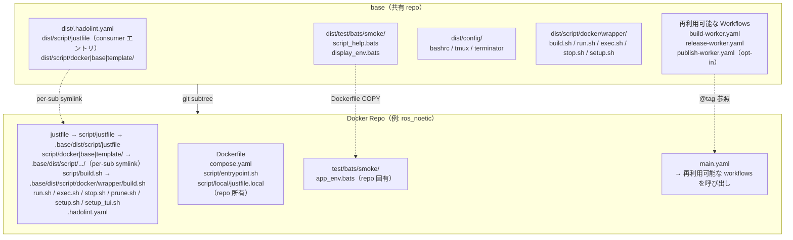
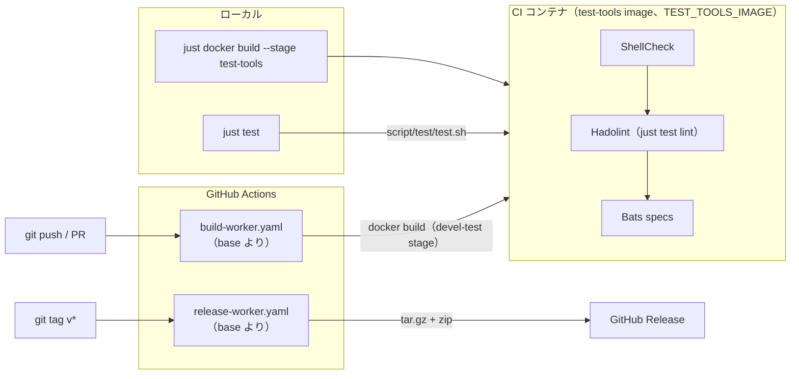

<!-- sync: base e5eb312a5446 90441c2b9a5c -->
# base

[](https://github.com/ycpss91255-docker/base/actions/workflows/self-test.yaml)


[](../../LICENSE)

[ycpss91255-docker](https://github.com/ycpss91255-docker) 組織のすべての Docker コンテナ repo 用共有テンプレート。

**[English](../../README.md)** | **[繁體中文](README.zh-TW.md)** | **[简体中文](README.zh-CN.md)** | **[日本語](README.ja.md)**

---

<!-- sync: table-of-contents e989d6153818 29df983109d0 -->
## 目次

- [TL;DR](#tldr)
- [前提条件](#前提条件)
- [概要](#概要)
- [クイックスタート](#クイックスタート)
- [CI Reusable Workflows](#ci-reusable-workflows)
- [ローカルテスト実行](#ローカルテスト実行)
- [テスト](#テスト)
- [ディレクトリ構造](#ディレクトリ構造)

---

<!-- sync: tldr b4f9c41522da 25d908de79c9 -->
## TL;DR

```bash
# ゼロからの新規 repo：初回コミット + subtree + 初回ブートストラップ
mkdir <repo_name> && cd <repo_name>
git init
git commit --allow-empty -m "chore: initial commit"
git subtree add --prefix=.base \
    https://github.com/ycpss91255-docker/base.git vX.Y.Z --squash
./.base/dist/script/base/init.sh   # 初回ブートストラップ。以降は just base init

# 最新版にアップグレード
just base update   # 確認
just base upgrade         # pull + バージョンファイル + workflow tag 更新

# CI 実行
just test   # ShellCheck + Bats + Kcov
just                       # 全 recipe 表示
```

<!-- sync: prerequisites 71356c1216b6 570879685262 -->
## 前提条件

コンテナ操作は Docker 上で [`just`](https://github.com/casey/just)（command
runner）を介して実行します。`just <verb>` エントリポイントを使う前に、host へ
両方をインストールしてください:

- **Docker** + Docker Compose v2（`docker compose`）。
- **just** -- 近年のどのリリースでも動作します（recipe は variadic
  パラメータのみ使用、初期バージョンから対応）。パッケージマネージャまたは
  公式インストーラで導入します:

  ```bash
  apt install just         # Debian 13+ / Ubuntu 24.04+
  brew install just        # macOS / Linuxbrew
  cargo install just       # crates.io から
  # または公式のビルド済みバイナリインストーラ:
  curl --proto '=https' --tlsv1.2 -sSf https://just.systems/install.sh \
      | bash -s -- --to ~/.local/bin
  ```

  全方式は[公式インストールガイド](https://github.com/casey/just#installation)を
  参照。`just` が使えない場合、各 recipe には raw fallback
  （`./script/<verb>.sh`、`./.base/dist/script/base/upgrade.sh`）があります
  -- [クイックスタート](#クイックスタート)参照。

<!-- sync: overview 435906a68746 9012a4430b92 -->
## 概要

本 repo は、すべての Docker コンテナ repo で共有されるスクリプト、テスト、CI workflow を一元管理しています。15 以上の repo で同一ファイルを個別管理する代わりに、各 repo が **git subtree** としてこのテンプレートを取り込み、symlink で参照します。

<!-- sync: architecture 2660c8dea634 77fdac990512 -->
### アーキテクチャ



<!-- sync: cicd-flow 5bd0f36f76ac ae291fa01a2f -->
### CI/CD フロー



<!-- sync: whats-included 68cb068c2b9f 4c85128450a3 -->
### 含まれるもの

| ファイル | 説明 |
|----------|------|
| `build.sh` | コンテナビルド（`--setup` は TTY がある場合 `setup_tui.sh` を起動、無ければ `setup.sh` を実行） |
| `run.sh` | コンテナ実行（X11/Wayland 対応；`--setup` の意味は `build.sh` と同じ） |
| `exec.sh` | 実行中のコンテナに入る |
| `stop.sh` | コンテナの停止・削除 |
| `prune.sh` | コンテナ / image / build キャッシュの整理 |
| `setup_tui.sh` | インタラクティブな setup.conf エディタ（dialog / whiptail フロントエンド） |
| `dist/script/docker/wrapper/setup.sh` | システムパラメータの自動検出と `.env` + `compose.yaml` 生成 |
| `dist/script/docker/lib/_lib.sh` | 共有 helper（`_load_env`、`_compose`、`_compose_project` など） |
| `dist/script/docker/lib/bootstrap.sh` | wrapper の共通初期化と引数解析 |
| `dist/script/docker/lib/compose.sh` | Docker Compose YAML の生成と操作 |
| `dist/script/docker/lib/conf.sh` | INI ファイルパーサ + section マージ |
| `dist/script/docker/lib/env.sh` | 環境変数のセットアップとデフォルト |
| `dist/script/docker/lib/gitignore.sh` | Gitignore ファイル管理 |
| `dist/script/docker/lib/hook.sh` | wrapper 毎の pre/post hook 呼び出し |
| `dist/script/docker/lib/i18n.sh` | 言語検出とローカライズ（`_detect_lang`、`_LANG`） |
| `dist/script/docker/lib/log.sh` | 統一されたログ / 出力ユーティリティ |
| `dist/script/docker/lib/config_summary.sh` | ランタイム設定のサマリ |
| `dist/script/docker/lib/conf_logging.sh` | ログ設定 helper |
| `dist/script/docker/lib/_tui_backend.sh` | `setup_tui.sh` が使用する dialog / whiptail ラッパ関数 |
| `dist/script/docker/lib/_tui_conf.sh` | INI バリデータ + 読み書き（`setup_tui.sh` と `setup.sh` の書き戻し用） |
| `dist/script/docker/runtime/logging.sh` | host 側ログ tee helper（per-start ファイル + 安定 symlink） |
| `dist/script/docker/runtime/logrotate.sh` | 共有 rotate/symlink/prune primitives（tee + transcript 共有） |
| `dist/script/docker/runtime/smoke.sh` | runtime install-check smoke |
| `dist/script/docker/runtime/entrypoint.sh` | テンプレート entrypoint helper |
| `config/` | コンテナ内部のシェル設定ファイル（bashrc、tmux、terminator、pip） |
| `setup.conf` | 単一の repo ランタイム設定（image / build / deploy / gui / network / volumes） |
| `dist/test/bats/smoke/` | 共有 smoke テスト + runtime assertion helpers（下記参照） |
| `test/bats/unit/` | base 自己テスト、ユニット（bats + kcov） |
| `test/bats/integration/` | base 自己テスト、init/upgrade の end-to-end |
| `test/bats/system/` | base 自己テスト、System レベル／Regression（runtime smoke gate、opt-in） |
| `test/bats/acceptance/` | base 自己テスト、Acceptance レベル（UAT/OAT；予約、S5 #785） |

テスト内容は **tool-first** で配置します — spec は `test/<tool>/<category>/`
（例：`test/bats/unit/`）、linter は `test/lint/<tool>/` — そのため
ツールの追加は新しいフォルダの追加であり、新しいコマンド面の追加では
ありません。[ADR-00000012](../adr/00000012-tool-first-test-layout.md)
（category-first の ADR-00000004 を置き換え）参照。consumer は自身の
`test/bats/smoke/` を出荷し、base は自身の
`test/bats/{unit,integration,system,acceptance}/` を出荷します。

| `.hadolint.yaml` | 共有 Hadolint ルール |
| `justfile`（→ `script/justfile`） | Repo コマンドエントリ — 階層化された namespace recipe（`just docker build`、`just docker run`、`just test`、`just base upgrade` 等）。サブコマンドと flag は `{{args}}` でそのまま渡されます（`just docker build --no-cache --stage test-tools`）。引数なしの `just` で全 namespace を一覧表示。 |
| `dist/script/docker/justfile.docker` | `docker` namespace — コンテナ操作（`just docker build/run/exec/stop/prune/setup/setup-tui`）。 |
| `dist/script/base/justfile.base` | `base` namespace — `.base` subtree を管理（`just base init/update/upgrade/completions`）。 |
| `dist/script/base/init.sh` | 初回 symlink セットアップ + 新 repo スケルトン生成（ブートストラップ：`./.base/dist/script/base/init.sh`；以降は `just base init`）。 |
| `dist/script/base/upgrade.sh` | Subtree バージョンアップグレード（`just base upgrade [vX.Y.Z]`）。 |
| `script/test/justfile.test` | base 自己テストのエントリ（`just test`、`just test lint`、`just test coverage`、…）。 |
| `script/release/justfile.release` | base の `release` namespace（release / publish ツール）。 |
| `script/test/test.sh` | base 自己テストのディスパッチャ（ローカル + コンテナ内） |
| `script/test/drivers/` | ツールごとに 1 つの driver — `bats.sh` / `shellcheck.sh` / `hadolint.sh` |
| `script/test/lint_bare_stderr.sh` | 素の stderr 出力 lint チェッカ |
| `dist/dockerfile/Dockerfile` | 新 repo のマルチステージ Dockerfile テンプレート |
| `dockerfile/Dockerfile.test-tools` | プリビルド lint/test ツール image（shellcheck、hadolint、bats、bats-mock） |
| `.github/workflows/` | 再利用可能な CI workflows（build + release） |

<!-- sync: dockerfile-stages-convention cfa1ef92737a 58d9b3fd819e -->
### Dockerfile ステージ（規約）

ダウンストリーム repo は `dist/dockerfile/Dockerfile` で定義される標準のマルチステージ構成に従います。
すべてのステージは `ARG BASE_IMAGE` で指定されるベース image を共有します。

| ステージ | 親ステージ | 用途 | 出荷 |
|----------|------------|------|------|
| `sys` | `${BASE_IMAGE}` | ユーザー/グループ、sudo、タイムゾーン、ロケール、APT mirror | 中間 |
| `devel-base` | `sys` | 開発ツールと言語パッケージ | 中間 |
| `devel` | `devel-base` | アプリ固有ツール + `entrypoint.sh` + config レイヤリング | **はい**（主成果物） |
| `devel-test` | `devel` | 一時的：ShellCheck + Hadolint + Bats smoke（いずれも `test-tools:local` から） | いいえ（build 後破棄） |
| `runtime-base`（任意） | `sys` | 最小 runtime 依存（sudo、tini） | 中間 |
| `runtime`（任意） | `runtime-base` | install 成果物のみの軽量 runtime image（application repos で使用） | 有効時に出荷 |
| `runtime-test`（任意） | `runtime` | 一時的：runtime install-check smoke | いいえ（build 後破棄） |

補足：
- developer image のみを出荷する repo（`env/*`）は `runtime-base` /
  `runtime` をスキップし、該当セクションは `Dockerfile` 内で
  コメントアウトしたままにします。
- `devel-test` は常に `devel` を継承するため、`test/bats/smoke/<repo>_env.bats` の
  runtime assertion が確認するバイナリやファイルは、ユーザーが
  `docker run ... <repo>:devel` で目にするものと一致します。
- `Dockerfile.test-tools` は lint/test ツールセット（bats + shellcheck + hadolint）をビルドします。ダウンストリームの `devel-test` ステージは `ARG TEST_TOOLS_IMAGE` build arg で参照します — デフォルト `test-tools:local`（ローカル `./build.sh` フロー、`Dockerfile.test-tools` を host Docker daemon に load）。CI では `ghcr.io/ycpss91255-docker/test-tools:vX.Y.Z`（`.github/workflows/release-test-tools.yaml` がタグ push ごとに publish するマルチアーキ image）で override し、buildx が registry からアーキ対応の bats / shellcheck / hadolint binary を直接 pull します。`docker-container` buildx driver の step 間 image store 分離問題を回避。

<!-- sync: baked-artifacts-live-at-opt-not-home eb898d65e2e1 b858748fa031 -->
#### ビルド成果物は `$HOME` ではなく `/opt` に置く

コンテナユーザーは **ビルド** 時に image へ焼き込まれます。`sys` ステージが
`USER_NAME` / `USER_UID` / `USER_GID` の build arg を受け取り、`devel` が
`ENV HOME="/home/${USER_NAME}"` を設定します。`just build` はローカルホストの
ユーザーを注入し、CI とリリース経路は `user`（UID 1000）を焼き込むため、
同じコミットからビルドした 2 つの image でも `$HOME` は異なり得ます。

そのため image が **`$HOME` 配下** に焼き込んだものはビルド時のユーザー名に
結び付きます。しかも問題が出るのはデプロイ時です。ビルド済み / GHCR /
`docker save`+`load` の image を別の `USER_NAME` で実行（あるいは別の
`USER_NAME` で再ビルド）すると、home 相対のパスはすべて別の **空の**
`/home/<other>/...` を指します。焼き込んだワークスペースは見えなくなり、
`source ~/some_ws/install/setup.bash` は失敗します。絶対パスの `/opt/...`
であれば `$HOME` という間接参照が無いため影響を受けません。

この規約は、実際に編集することになる `Dockerfile` に書かれています。

1. ビルド成果物（colcon ワークスペース、SDK、自前ビルドのツール）は絶対パス
   `/opt/<name>` にインストールする。`$HOME` は dotfile と利便性のための
   シンボリックリンク専用にする。
2. entrypoint / bashrc からは必ず **絶対パス** を source し、`~` や `$HOME`
   を使わない。per-user の `RUN` ブロックで `~/<name> -> /opt/<name>` の
   シンボリックリンクを作るのは対話利用の発見性のために推奨されますが、
   それを *source* してはいけません。
3. パスに具体的なユーザー名を書かない。`${HOME}` / `${USER_NAME}` を使う。

ルール 3 は機械的に判定できるためゲートされています。`home-literal` lint
（`just test lint --home-literal`、CI ジョブ `lint-static (home-literal)`）が
`dist/` または `dockerfile/` 配下の home パスに具体的なユーザー名を見つけると
失敗します。ルール 1-2 は grep では判定できない設計判断です。根拠は
[ADR-00000024](../adr/00000024-bake-artifacts-at-opt-not-home.md)。

<!-- sync: adding-extra-stages-215 2da5b4c5cc6a d0dd264be639 -->
#### 追加ステージの追加（#215）

baseline blocklist `{sys, devel-base, devel, runtime-test}`
以外の（v0.21.x 移行期間中は旧名 `{base, test}` も受付）
`FROM <base> AS <stage>` は、自動的に compose サービスとして
emit されます — `extends: devel`（volumes / network / GPU / GUI /
cap_add / additional_contexts を継承）し、`build.target` /
`image` / `container_name` / `stdin_open` / `tty` / `profiles`
のみを override します。典型的な用途は entrypoint バリアント、
例えば NVIDIA Isaac Sim の `devel` 上に乗せる `headless` + `gui`
の 2 種類の起動モード。

ユーザー操作フロー：

```dockerfile
# Dockerfile に新 stage を追加（setup.conf は変更不要）
FROM devel AS headless
ENTRYPOINT ["/isaac-sim/runheadless.sh"]
CMD ["-v"]

FROM devel AS gui
ENTRYPOINT ["/isaac-sim/runapp.sh"]
```

```bash
just docker build                            # compose.yaml を再生成、全 stage を build
just docker run -t headless                  # headless バリアントを起動
just docker run -t gui                       # gui バリアントを起動
just docker exec -t headless bash            # running の headless container に exec

# Kit スタイルの `=` 付き引数も just ではそのまま渡せます (#469):
just docker exec -t headless-stream /isaac-sim/runheadless.sh -v --/app/livestream/port=49100

# 等価な直接 .sh 呼び出し:
./build.sh
./run.sh -t headless
./exec.sh -t headless bash
```

制約：

- Stage 名は `^[a-z][a-z0-9_-]*$` に一致する必要があり、大文字
  / 数字始まり / ピリオドなどは拒否されます（WARN + skip、
  他の stage は解析を続行）。
- baseline `{sys, devel-base, devel, runtime-test}`（v0.21.x 移行期間
  中は旧名 `{base, test}` も衝突対象）と衝突する場合は `setup.sh apply`
  が hard error で exit 1。template が管理する image tag namespace
  （`latest`、`v[0-9]*`）との衝突も hard error。`devel-test` はその集合に
  **含まれず**、衝突にも**なりません** — per-stage モデルを通じて `test`
  service として emit され（#493）、それが `[stage:devel-test]` に runtime
  制御面を与えています。
- Stage の追加 / 削除は `setup.sh check-drift` をトリガーします
  （`.env.generated` 内の `SETUP_DOCKERFILE_HASH` 経由）。次回 wrapper 起動
  時に自動的に `compose.yaml` を再生成します。`RUN apt-get install`
  などの他の編集は drift をトリガー**しません**。

<!-- sync: per-stage-setupconf-overrides-220 a5064ca6a91f 0b2469a1ba80 -->
#### Per-stage `setup.conf` overrides（#220）

#215 で auto-emit された stage はデフォルトで devel の runtime 設定
（volumes / GPU / network / GUI）を共有します。stage ごとに異なる
runtime 設定が必要な場合 — 例えば NVIDIA Isaac Sim の `headless`
が WebRTC livestream で `network=bridge` + port mapping + `gui=off`
を必要とし、`devel` と `gui` は `network=host` + X11 を維持する
場合 — repo の `setup.conf` に `[stage:<name>]` セクションを
追加します：

```ini
[gui]
mode = auto

[network]
mode = host

[stage:headless]
gui.mode = off
network.mode = bridge
network.port_1 = 8080:80
deploy.gpu_capabilities = gpu compute utility graphics video
```

`./setup_tui.sh` でも対話的に編集できます：

- **Advanced → Per-stage overrides**：直接エディタへ。このエントリ
  は Dockerfile に少なくとも 1 つの非 baseline stage がある場合の
  み表示されます。
- **Features → Per-stage overrides**（#221）：常時表示の機能一覧
  入口。条件を満たしている時はクリックで上記 Advanced と同じ
  エディタへ、満たしていない時は有効化方法を説明する msgbox を
  表示します。

Override 可能な key (v1)：

| Section | Keys |
|---|---|
| `[deploy]` | `gpu_mode`, `gpu_count`, `gpu_capabilities`, `gpu_runtime`（旧名 `runtime` も引き続き受理） |
| `[gui]` | `mode` |
| `[network]` | `mode`, `ipc`, `pid`, `network_name`, `port_<N>`, `port_inherit` |
| `[security]` | `privileged`, `cap_add_<N>`, `cap_add_inherit`, `cap_drop_<N>`, `cap_drop_inherit`, `security_opt_<N>`, `security_opt_inherit` |
| `[volumes]` | `mount_<N>`, `mount_inherit` |
| `[environment]` | `env_<N>`, `env_inherit` |

List フィールド（`mount_*` / `port_*` / `env_*` / `cap_add_*` /
`cap_drop_*` / `security_opt_*`）は **append-default**：stage の項目が
top-level の後に追加されます。完全に top-level を置き換える場合は
`<list>_inherit = false` を設定します（例：
`volumes.mount_inherit = false`、または
`security.cap_add_inherit = false` で stage が継承した caps をクリア
—— #526：読み取り専用の probe stage が flash stage の `SYS_ADMIN` を
クリア）。

注意事項：

- `[stage:devel]` は**予約済み** (v1 no-op + WARN)。devel を
  調整する場合は top-level セクションを直接編集してください。
  v2 で再検討します。
- `[stage:sys|base|test]` は **hard error**（baseline collision）。
- `[stage:foo]` で参照される stage が Dockerfile に存在しない
  場合 → **WARN + skip**（`setup.sh apply` の他の処理は継続）。
- allowlist 外の override key → **WARN + key 単位で skip**。

<!-- sync: smoke-test-helpers-for-downstream-repos 86bd640f4dd5 3fe3efa43f54 -->
### Smoke test ヘルパー（ダウンストリーム repo 用）

`test/bats/smoke/test_helper.bash`（各 smoke spec が
`load "${BATS_TEST_DIRNAME}/test_helper"` で読み込み）が runtime
assertion helpers のセットを提供します。ダウンストリーム repo は
素の `[ -f ... ]` / `command -v` より優先してこれらの helper を使用
すべきです。失敗時は欠落している成果物を直接指し示す decorated な
診断メッセージを出力します。

| Helper | 用法 |
|--------|------|
| `assert_cmd_installed <cmd>` | `<cmd>` が `PATH` 上にない場合に失敗 |
| `assert_cmd_runs <cmd> [flag]` | `<cmd> <flag>` が 0 以外で終了した場合に失敗（flag のデフォルトは `--version`） |
| `assert_file_exists <path>` | `<path>` が通常ファイルでない場合に失敗 |
| `assert_dir_exists <path>` | `<path>` がディレクトリでない場合に失敗 |
| `assert_file_owned_by <user> <path>` | `<path>` の所有者が `<user>` でない場合に失敗 |
| `assert_pip_pkg <pkg>` | `pip show <pkg>` が 0 以外で終了した場合に失敗 |

<!-- sync: what-stays-in-each-repo-not-shared 5cff28619497 69c33a09cc50 -->
### 各 repo で個別管理するファイル（共有しない）

- `Dockerfile`
- `compose.yaml`
- `script/` — repo ローカルの **runtime helpers**（container 内で `ENTRYPOINT` / `CMD` または手動で呼ばれる）
  - `script/entrypoint.sh`（canonical）
  - ros / アプリ起動 helper 等
- `script/docker/` — repo ローカルの **Dockerfile-internal build helpers**（Dockerfile `RUN` で呼び、container 起動後は使わない；サンプル + lint COPY は `dist/dockerfile/Dockerfile` 参照、#275）
- `doc/` と `README.md`
- Repo 固有の smoke test

<!-- sync: per-repo-runtime-configuration b02fd5d770dc 3d66f7630138 -->
## repo ごとのランタイム設定

各下流 repo は 1 つの `setup.conf` INI ファイルで自身のランタイム設定
（GPU 予約 / GUI env/volumes / network mode / 追加 volume mounts）を
駆動します。`setup.sh` がこれ + システム検出結果を読み、`.env.generated`
と `compose.yaml` を再生成します — この 2 つの生成物をユーザが手動編集
する必要はありません。手書きの `.env` overlay は別のファイルで、setup は
最初に scaffold するだけで以後上書きしません。

<!-- sync: one-conf-15-sections 825dbace1f47 66721dcea0e2 -->
### 単一 conf、15 個の section

以下の section 一覧は散文ではなく `SCHEMA_SECTIONS`
（`dist/script/docker/lib/schema.sh`）— 「どの section が、どの順で存在
するか」の唯一の情報源です。このブロックまたはその個数がコードとずれると
`derived-figures` lint が失敗します。

```
[project]  name — この checkout が動く compose project（空 =
           <DOCKER_HUB_USER>-<IMAGE_NAME> を導出）。2 つの checkout を
           同時に動かすなら .setup.conf.local に WORKTREE ごとに設定する
[image]    rules = prefix:docker_, suffix:_ws, @default:unknown
[build]    apt_mirror_ubuntu、apt_mirror_debian            # Dockerfile build args
[deploy]   gpu_mode (auto|force|off)、gpu_count、gpu_capabilities
           dri_groups (auto|off) — GUI service への iGPU /dev/dri group_add
[lifecycle] restart (no|always|unless-stopped|on-failure|on-failure:N)
           既定は unless-stopped;DEPLOY スコープ — deployable stage の
           service にのみ emit され、devel と `*-test` stage では emitter
           がポリシーを消すため、devel には extends:devel が継承できる
           restart: 行がありません。詳細は英語 README の
           「Restart policy is deploy-scoped」を参照。
           init (true|false) — Docker init/PID1 reaper;既定 true。
           watchdog_* — コンテナ内ヘルスチェック（opt-in）
[gui]      mode (auto|force|off)
[network]  mode (host|bridge|none)、ipc、pid (host|private)、privileged
           port_N = host:container（bridge のときのみ publish）
[security] privileged（false）、cap_add_N、cap_drop_N、security_opt_N
           （対応する *_inherit トグルも;既定は最小、必要な分だけ opt-in）
[resources] shm_size
[environment] env_N = KEY=VALUE — set-once の既定値。deployable stage の
           ENV として bake される;タスクごとに変わる変数は .env へ
[tmpfs]    tmpfs_N = /path[:size=N] — RAM-backed マウントポイント
[devices]  device_N = host:container、および cgroup rule（opt-in）
[volumes]  mount_1（workspace、初回実行時に自動記入）
           mount_2..mount_N（追加の host mount；デバイスは /dev path 指定）
[additional_contexts] context_N = name=source — 追加の名前付き build context
[logging]  driver（デフォルト json-file）、max_size、max_file、compress
           local_path（host 側 log ディレクトリ；/var/log/<repo> にバインドマウント）
           container_log_keep (20)、container_log_days (14)（起動ごとの
           コンテナ log 保持；keep-count と age の厳しい方が勝つ）
           wrapper_transcript（verb の出力を log/<verb>/ に tee；既定 true）、
           wrapper_transcript_keep (20)、wrapper_transcript_days (14)
           [logging.<svc>] で個別 service に key-level override 可能
```

テンプレート既定値は `.base/dist/.setup.conf`；repo ごとの上書きは repo
ルートの dotfile `<repo>/.setup.conf`（`just setup` が管理し、手で編集する
`config/` 面には意図的に置かない）。セクションレベル **replace** 戦略：上位
レイヤに section があれば下位の section を全置換；無ければ下位に落ちる。

<!-- sync: three-layers-the-third-is-yours-setupconflocal d6b292a21a41 e6aee3651ebf -->
#### 3 レイヤ、3 枚目はあなたのもの（`.setup.conf.local`）

| レイヤ | バージョン管理 | 誰のものか |
|---|---|---|
| `.base/dist/.setup.conf` | subtree で出荷 | base の既定値 |
| `<repo>/.setup.conf` | commit 済み | repo のもの —— CI も他のどの checkout もこれを使う |
| `<repo>/.setup.conf.local` | **gitignored** | あなたのもの。このマシン、この worktree だけ |

3 枚とも同じ文法、同じ section-replace 規則です。3 枚目は `--local` で書きます：

```bash
./setup.sh set --local project.name myrepo-wt2
```

キー単位のマージではなく section 全置換である理由：上の section のうち 8 つは
`<prefix>_N` の順序付きリストです。`port_2` だけを上書きすると 2 つのレイヤ
から 1 本の順序付きリストが組み上がり、項目を「削除」する手段が無く、追加
するには見えないレイヤの最大 `N` を知る必要があります。関連キーどうしも
互いを制御する（`[network] mode` が `port_N` を emit するかを決める）ため、
中途半端な上書きはどのレイヤも書いていない組み合わせを生みます。

ここから 3 つの帰結があり、いずれも黙って起きることはありません：

- `.setup.conf.local` がその section を定義しているとき、通常の `set` で同じ
  section を書くと section 名を挙げて**警告**します。拒否はしません ——
  その値は CI と他の checkout が使う commit 済みの値のままです —— が、この
  マシンでは何も変わりません。
- 各 wrapper の実行前サマリに `local override:` 行が加わり、ファイルと
  それが置換する section を表示します。
- `just docker setup deploy` はこのファイルがある限り**拒否**します
  （[フィールド配備](#フィールド配備just-docker-setup-deploy)参照）。

<!-- sync: running-two-worktrees-at-once efccbe6e6686 d0a3c3b2d126 -->
#### 2 つの worktree を同時に動かす

各 checkout は compose プロジェクト名のもとで動き、生成するもの
—— container / network / volume —— はすべてその名前で名前空間化されます。
同じ名前に解決される 2 つの checkout は衝突します：2 回目の `run` は 1 つ目の
container をそのまま使い回します。

`[project] name` がその名前です。出荷時は**空**で、「従来どおり
`<DOCKER_HUB_USER>-<IMAGE_NAME>` を導出する」意味なので、設定するまで何も
変わりません。worktree ごとの名前は repo のものではなくあなたのものなので、
*local* レイヤに設定してください：

```bash
cd ~/work/myrepo-wt2
./setup.sh set --local project.name myrepo-wt2
just build            # 再生成される。以後 2 つの worktree を並行して動かせる
```

値は一度だけ解決され `.env.generated` の `PROJECT_NAME` に記録されます。
消費側は両方ともそこから読みます：wrapper の `docker compose -p` と、生成
された `compose.yaml` の `name: ${PROJECT_NAME}`（したがって `lazydocker` /
`docker compose ps` / IDE パネルは wrapper と一致します）。値の規則は小文字
英字・数字・`-`・`_` で、先頭は英字か数字 —— docker compose 自身の規則です。

この値を変えても image タグは動きません。そちらは `[image]` /
`DOCKER_HUB_USER` で、意図的に別の軸です：ある実行がどの container を所有
するかと、どの image を build したかは別の問いだからです。

**権限はオプトイン**（#466）：template が出荷する `[security]`
（`privileged = false`、`cap_add` / `security_opt` なし）と `[devices]`
（`/dev:/dev` なし）は絞った既定値で、軽量な repo やツール stage を
きれいに保ちます。コンテナに必要なものだけを `setup_tui.sh`
（security / devices ページ）、`setup.sh add security.cap_add SYS_ADMIN`、
または template の例のコメント解除で有効化してください。

初回の `setup.sh` 実行時（repo 側の setup.conf がまだ無い状態）、
template ファイルが repo にコピーされ、検出された workspace が
`[volumes] mount_1` に書き込まれます。以降の実行は `mount_1` を
真のソースとして扱います — 空にすれば workspace マウントを
オプトアウトできます。編集方法：

```bash
./setup_tui.sh                      # インタラクティブな dialog/whiptail エディタ
./setup_tui.sh volumes              # 特定 section に直接ジャンプ
./build.sh --setup            # TTY 下では setup_tui.sh を起動、それ以外は setup.sh を実行
./.base/dist/script/base/init.sh --gen-conf # .base/dist/.setup.conf を repo ルートに単純コピー
```

<!-- sync: logging-output-to-host df27d24459b2 b6f9fea109de -->
### ホスト側へのログ出力

`[logging] local_path` を設定するとコンテナの stdout/stderr が
ホスト側のファイルに tee 出力されます。docker daemon の json-file
ログは並行して保持されます：

```ini
[logging]
local_path = ./log/     # repo 相対、または /abs/、~/dir/ も可
container_log_keep = 20  # 直近 N 件の per-start ファイルだけ残す
container_log_days = 14  # かつ D 日より古いものを削除（厳しい方が優先）
```

任意の wrapper を再実行すると `compose.yaml` が再生成されます。
コンテナが起動するたびに tee は per-start ファイル
`<local_path>/<svc>_<ts>.log` を書き、安定した symlink
`<local_path>/<svc>.log` をそこへ張り替えます（glog スタイル）:
`tail <svc>.log` は常に今回の実行を映し、過去の実行分もディスク上に
残ります。古い per-start ファイルは `container_log_keep`（直近 N 件）
と `container_log_days`（D 日）の厳しい方で削除され、symlink 自体は
削除されません。`docker logs <ct>` の動作は変わりません（json-file
はローリング履歴を維持）。

**新規 repo**：本バージョン以降の `init.sh` で生成された
`script/entrypoint.sh` には helper の source 行が事前に組み込まれて
います。`[logging] local_path` を設定するだけで動作します。
**既存 repo**：`script/entrypoint.sh` の最後の `exec` の手前に
次の 1 行を追加して一度だけ移行してください：

```bash
. /usr/local/lib/base/logging.sh
```

Helper は `Dockerfile` の devel stage によりイメージ内の
安定パス `/usr/local/lib/base/logging.sh` に、兄弟の `logrotate.sh`
（refs #805）とともにコピーされています（refs #368）。そのため、この
source 行は build-time / runtime どちらでも、どんな workspace 構成でも
動作します — `$USER` 参照や workspace bind mount への依存はありません。

トラブルシューティング：`local_path` を設定したのにホスト側
ファイルが空のまま → `script/entrypoint.sh` に source 行が
含まれているか確認してください
（`grep logging.sh script/entrypoint.sh`）。

<!-- sync: interactive-tui 23df6f6f09ab f5eb99a83f34 -->
### インタラクティブ TUI

`./setup_tui.sh` はメインメニューを開きます。バックエンドは
`dialog` または `whiptail`（どちらも無い場合は `sudo apt install
dialog` のヒントを表示して終了）。Cancel / Esc で保存せず退出；
保存後は自動的に `setup.sh` を呼び出して `.env.generated` +
`compose.yaml` を再生成します。

`./setup_tui.sh <SECTION>` で個別のエディタへ直接移動できます。`[deploy]`
セクションが設定するのは GPU 予約だけで、名前は Compose の `deploy:` キー
由来です。field bundle を作る `./setup.sh deploy` とは無関係なので、この
エディタの曖昧でない名前は `gpu`（`just docker setup-tui gpu`）です。
`deploy` も使えますが、どちらなのかを説明する通知が先に出ます。

メインメニュー構造（#221）：

```
Main
├─ image            IMAGE_NAME 検出ルール
├─ build            APT mirrors + Dockerfile build args
├─ Runtime  ──→     network / deploy（GPU）/ gui / environment / logging
├─ Mounts   ──→     volumes / devices / tmpfs
├─ Advanced ──→     security / additional_contexts
│                   / per_stage（条件付き）/ Reset
├─ Features         条件付き / 上級者向け機能の一覧（per_stage の状態を含む）
└─ Save & Exit
```

`./setup_tui.sh <section>` は引き続き任意の section エディタへ
直接ジャンプできます（例：`./setup_tui.sh volumes`）。

<!-- sync: when-setupsh-runs 78e1acddfeef a459f0591501 -->
### setup.sh の実行タイミング

`setup.sh` は明示的にトリガーされた時のみ実行されます — build / run
の度に再実行されることはありません：

- **`just base init` / `./.base/dist/script/base/init.sh`** がスケルトン生成後に 1 回自動実行
- **`just base upgrade` / `./.base/dist/script/base/upgrade.sh`** が subtree pull の後に
  init.sh 経由でもう一度実行されるため、アップグレードは常に新しい
  baseline で `.env` / `compose.yaml` を再生成した状態で着地します
- **`./build.sh --setup` / `./run.sh --setup`**（または `-s`）— ユーザが
  明示的に再実行。TTY がある場合は先に `setup_tui.sh` を起動して `setup.conf`
  を編集させ、TTY が無い場合は直接 `setup.sh` を呼び出します
- **初回 bootstrap**：`./build.sh` / `./run.sh` は `.env` が無い初回実行
  （CI の新規 clone 等）では、同じ TTY-aware フローを自動で通ります。
  `--setup` 指定は不要

> **Fresh-clone の lint カバレッジ（#216）**：image がローカルに
> キャッシュされていない `./run.sh` は Compose auto-build を起動
> しますが、auto-build は **`target: devel`**（または `-t` で指定
> された target）のみをビルドし、`target: devel-test`（pre-#243 は
> `test`）レイヤの ShellCheck / Hadolint / Bats smoke はスキップ
> されます。`run.sh`
> はこの状況を検知し、`compose up` の前に `[run] INFO:` ブロック
> を表示します（TTY 環境のみ）。CI と同じ完全な検証を 1 コマンド
> で実行したい場合は `--build` フラグを付けてください：
>
> ```bash
> just docker build test                   # 明示的に lint + smoke を実行
> just docker run --build                  # lint + smoke を実行してから compose up
> just docker run                          # デフォルト — 高速パス、lint/smoke はスキップ
> ```

`setup.sh apply` は毎回 `compose.yaml` をゼロから書き直しますが、
既存 `.env` の `WS_PATH` / `APT_MIRROR_UBUNTU` / `APT_MIRROR_DEBIAN` は
保持されるため、手動で調整した workspace パスや apt mirror はアップ
グレードで上書きされません。

<!-- sync: drift-detection 25d3585b5c5f 05855d6ce3cf -->
### ドリフト検出

`setup.sh` は `.env` に `SETUP_CONF_HASH` / `SETUP_GUI_DETECTED` /
`SETUP_TIMESTAMP` を書き込みます。`./build.sh` / `./run.sh` は毎回
エントリ時点で現行の `setup.conf` ハッシュ + システム検出値と比較し、
以下のいずれかが変化した場合に `[WARNING]` を出力（実行は継続）：

- `setup.conf` の内容（conf hash）
- GPU / GUI の検出結果
- `USER_UID`（ユーザ ID の変化）

`--setup` を付けて再実行すれば `.env.generated` + `compose.yaml` を再生成できます。

<!-- sync: field-deployment-just-docker-setup-deploy 66110bfc975b eba624dfb163 -->
### フィールド配備（`just docker setup deploy`）

`just docker setup deploy`（または直接 `./setup.sh deploy`）は同じ `setup.conf` から自己完結型のフィールド配備**ディレクトリ**を生成します —— 上記ルーティングモデルの deploy 側です（[ADR-00000023](../adr/00000023-config-field-override-and-field-deploy-contract.md)、[ADR-00000003](../adr/00000003-env-vs-workload-param-boundary.md) を改訂；[PRD invariant 8](../PRD.md)）。対象は *フィールド向け* ステージ（既定 `runtime`；`devel` や `*-test` ステージは**決して**対象になりません）で、生成されるディレクトリは配備先ホストが必要とするものをすべて含みます —— フィールドホストが base のツールチェーン・ソースツリー・`setup.conf` を見ることはありません。

```bash
just docker setup deploy                      # runtime バンドルを生成（先に確認）
just docker setup deploy --stage runtime      # フィールドステージを明示
just docker setup deploy --dry-run            # build plan を表示するだけで build しない
just docker setup deploy --stage runtime -y   # 確認プロンプトをスキップ
just docker setup deploy -o /tmp/robot-bundle # 出力ディレクトリを指定
```

バンドルは `deploy/<repo>-<stage>-<version>/` に出力されます（repo 直下の `deploy/` は gitignore 済み；`<version>` は `git describe --tags --always --dirty`、イメージ tag は `<repo>:<stage>-<version>` なので、1 台のホストに複数のフィールドバージョンを load しても衝突しません）。中身:

| ファイル | 内容 |
|---|---|
| `image.tar.xz` | `xz` 圧縮したイメージ（`deploy.sh` が `docker load` する） |
| `compose.yaml` | 完全に解決済みの自己完結 compose —— すべてリテラル値で **`${VAR}` 展開なし**（GUI ステージの `${DISPLAY}` ホストパススルーは例外）、`setup.conf` / `.env` に依存しない；`restart: unless-stopped` 付き |
| `config/` | オペレータが調整可能な各ファイルの編集用コピー（後述） |
| `deploy.sh` | 薄い `up` / `down` / `logs` ランチャ |
| `README` | フィールドオペレータ向けの手順 |

処理は順に:

1. `[environment]` の既定値をイメージの実 `ENV` として焼き込み（S3）、`config/app/` があればイメージへ `COPY`（S4）—— フィールドイメージを自己完結化（env ファイルも config bind も持ち運ばない）;
2. `docker build --target <stage>` で不変イメージを build し、`<repo>:<stage>-<version>` を tag;
3. `docker save | xz` で `image.tar.xz` を作成;
4. 完全に解決済みの `compose.yaml`（`apply` と同じ resolver を共用するため、フィールドが dev からドリフトしない）、`deploy.sh` ランチャ、`README` を書き出し、調整可能な各ファイルの焼き込み済みデフォルトを `config/` へ取り出す。

build 前に解決済みの `compose.yaml` を表示するので、解決された各パラメータを確認してから進められます（`-y` でスキップ；`--dry-run` は plan を表示するだけで build しない；非対話シェルで `-y` なしは拒否）。

**`<repo>/.setup.conf.local` が存在する限り、そのまま拒否します。** このファイルは gitignored なので、それを使って build した bundle はクリーンな checkout から再現できません —— しかも bundle 自体には何の説明も残りません（[PRD invariant 8](../PRD.md)、[ADR-00000025](../adr/00000025-per-worktree-setup-conf-local-override.md)）。拒否はプレビューより前、いかなる build 手順よりも前に発生するので `--dry-run` でも報告されます。`--allow-local-override` を渡すと build を続行し、バージョン管理外のファイルから取り込んだ section を bundle 自身の `README` に記録します —— フィールドでこの bundle を動かす人は、ゲートを迂回すると決めた人とは別人だからです。

**フィールドマシン側** —— ディレクトリごとコピーし、`deploy.sh` ランチャで操作します（イメージを load して `docker compose` を駆動します；`docker run` も `setup.conf` も base のツールチェーンも不要）:

```bash
cd <repo>-runtime-<version>
./deploy.sh up      # unxz | docker load してから docker compose up -d
./deploy.sh logs    # docker compose logs（-f で追従）
./deploy.sh down    # docker compose down
```

`restart: unless-stopped` によりホスト再起動後もコンテナは自動起動します。停止するには `./deploy.sh down` を使います。

**フィールドでの設定変更（リビルド不要）**: コンポーネントは、フィールドオペレータが再調整してよいコンテナ内パスを、コミット済みの `config/<component>/deploy.manifest`（INI-lite、ステージごとの section にコンテナ内絶対パスを列挙）で宣言します。バンドルは宣言された各ファイルの編集用コピーを `config/` に同梱し、解決済み `compose.yaml` がそれをイメージ内の焼き込みデフォルトへ bind mount で被せます（**mount-wins**）。`config/` 配下のファイルを編集して `./deploy.sh up` を再実行すれば反映されます —— マウントされたコピーが勝ち、リビルドは不要です。宣言され**ていない**パスは焼き込みのみのままです。イメージは宣言されたすべてのパスにデフォルトファイルを焼き込んでいる必要があり、欠けていれば deploy 生成時に対処方法付きで明示的に失敗します。

これらの bind は**デフォルトで読み取り専用（`:ro`）**です: ホスト側でオペレータが編集し、コンテナは読むだけです。コンテナから書き込ませたい場合はパスの後ろに `rw` フラグを明示します。例外を一律の許可ではなくレビュー可能なデータにするためです:

```ini
[runtime]
/etc/myapp/camera.yaml                  # 読み取り専用、デフォルト
/var/lib/myapp/calibration.yaml rw      # これはコンテナが書き込んでよい
```

パスの後ろにそれ以外のもの（打ち間違い、余分なトークン）が現れた場合は manifest の書式エラーとして、ファイル名と行番号を示して明示的に失敗します —— 黙って読み飛ばすことも、黙って読み取り専用へ落とすこともしません。デフォルトを緩めない理由は、「オペレータが値を再調整する」ためにコンテナ側の書き込みは本来不要であり、書き込み可能な mount はビルド時に焼き込まれたコンテナの user id が、フィールドホストでバンドルを展開した人と一致することに暗黙に依存するからです: 読み取りはどちらでも成功し、書き込みだけが最も重要なマシンで失敗します。読み取り専用にすれば、それが開発段階で即座に、はっきりと失敗するようになり、user id の問題も実際に `rw` を宣言したパスだけに閉じ込められます（[#870](https://github.com/ycpss91255-docker/base/issues/870) 参照）。

workload の環境変数は焼き込み済み `ENV` のデフォルトとして運ばれます（GUI ステージは加えてフィールドホスト自身のシェルから `${DISPLAY}` / `${XAUTHORITY}` などを読みます）。dev の workspace bind は意図的に外しています（フィールドイメージは自身のコードを同梱）。`--group-add` の GID（iGPU `/dev/dri`）は生成ホスト由来で、別のフィールドマシンでは調整が必要な場合があります。

**継続的デリバリ（CD）**: deploy ツールは正直にラベル付けするだけでブロックはしません —— `-dirty` / short-commit の `<version>` を刻むので、どのツリー状態でもレビュー用の配備が可能です。自動化された CD では、base が同梱するガードを先に呼んでください: `./.base/dist/deploy/cd-guard.sh` は作業ツリーがクリーンで **かつ** HEAD が tag 上にある場合以外は配備を拒否するため、出荷されるフィールドバンドルは常にリリース済みバージョンへ辿れます。

<!-- sync: setupsh-subcommands-v0110 eb459a5fdd40 1ea39c05036b -->
### setup.sh のサブコマンド（v0.11.0+）

`setup.sh` は git スタイルのバックエンドで、明示的なサブコマンドを提供します。build / run / TUI スクリプトが内部で呼び出してくれるので、直接呼び出すのはスクリプト化 / 非対話シナリオでの利用が想定されています：

| サブコマンド | 用途 |
|---|---|
| `apply` | setup.conf + システム検出から `.env.generated` + `compose.yaml` を再生成（手書きの `.env` overlay は対象外） |
| `check-drift` | 同期なら 0、ドリフトしていれば 1（ドリフト内容は stderr） |
| `set <section>.<key> <value>` | 単一キーを書き込む。`--local` は commit 済みの `.setup.conf` ではなく gitignored な `.setup.conf.local` を対象にする；付けない場合、`.setup.conf.local` が既に定義している section への書き込みは section 名を挙げて警告される |
| `show <section>[.<key>]` | 単一キーまたは section 全体を読み取る |
| `list [<section>]` | INI スタイルでダンプ |
| `add <section>.<list> <value>` | リスト型 section（`mount_*` / `env_*` / `port_*` …）に追加；空きスロット優先、無ければ `max+1`。`--local` 可 |
| `remove <section>.<key>` / `<section>.<list> <value>` | キー指定または値マッチで削除。`--local` 可 |
| `reset [-y\|--yes]` | テンプレートのデフォルトに戻す；旧 `.setup.conf` → `.setup.conf.bak`、旧 `.env` → `.env.bak` |
| `deploy [--stage S] [--output F] [--dry-run] [-y] [--allow-local-override]` | 自己完結型のフィールド配備**ディレクトリ**（`image.tar.xz` + 完全解決済み `compose.yaml` + 編集可能な `config/` + `up`/`down`/`logs` の `deploy.sh` + `README`）を生成。フィールド stage `S` は既定 `runtime`（`devel` / `*-test` は不可）；build 前に解決済み `compose.yaml` をプレビューして確認。`.setup.conf.local` がある場合は `--allow-local-override` を付けない限り拒否。[フィールド配備](#フィールド配備just-docker-setup-deploy)参照 |

型付きキーは `_tui_conf.sh` のバリデータ（TUI と同じもの）を経由します。`set` / `add` / `remove` / `reset` は **`.env.generated` を自動再生成しません** — 必要に応じて `apply` を続けて呼ぶか、次回 `build.sh` / `run.sh` の drift 検出で自動再生成されます。

<!-- sync: migration-from-v010x-breaking 6bd85945e2d2 79ebc84b0a81 -->
#### v0.10.x からの移行（BREAKING）

`setup.sh`（引数なし）と `setup.sh --base-path X --lang Y`（サブコマンドなし）は従来サイレントに `apply` にフォールスルーしていました。v0.11.0 でこのフォールスルーを廃止：

| 呼び出し方 | v0.11 以前 | v0.11+ |
|---|---|---|
| `setup.sh` | apply 実行 | help を表示して exit 0 |
| `setup.sh --base-path X --lang Y` | apply 実行 | exit 1「Unknown subcommand」 |
| `setup.sh apply [...]` | apply 実行 | apply 実行（変更なし） |

下流 repo にカスタムスクリプトが `setup.sh` を直接呼び出している場合、先頭に `apply` を付けてください。template 同梱の `build.sh` / `run.sh` / `init.sh` / `setup_tui.sh` はすでに更新済みです。

<!-- sync: derived-artifacts-gitignored 9135501a7168 b52923ea8035 -->
### 生成物（gitignored）

- `.env.generated` — ランタイム変数（解決済みの `PROJECT_NAME` を含む）+ `SETUP_*` drift metadata
- `compose.yaml` — baseline + 条件ブロック込みの完全な compose

いつでも `compose.yaml` を開けば現在の完全なランタイム設定を確認できます。
両ファイルは `just base upgrade` のたびに再生成されます（init.sh が subtree
pull 後に `setup.sh apply` を再実行）— 手動編集はしないでください。
override は `setup.conf` に書きます。

`.env` も gitignore されますが生成物では**ありません**。手書きの workload
overlay で、最初の apply で一度 scaffold されたあとは上書きされません。
編集しても setup の実行で消えることはありません。

`.setup.conf.local` は 1 つ上のレイヤで同じ形をしています：gitignored、
あなたのもの、ツールが書き換えることはありません。設定の*入力*であって
生成物ではありません ——
[3 レイヤ](#3-レイヤ3-枚目はあなたのものsetupconflocal)参照。

<!-- sync: per-wrapper-hooks-440 3f5c5d24592f b6f612f647f5 -->
### Wrapper 毎の pre/post hook（#440）

各 wrapper（`run` / `build` / `exec` / `stop` / `prune` / `setup` /
`setup_tui`）は、以下 2 つのオプショナルな repo-local script を検出します:

```
script/hooks/pre/<wrapper>.sh    # env 準備完了後、main logic 前
script/hooks/post/<wrapper>.sh   # main logic 後（run.sh は EXIT trap 内）
```

`init.sh` が 14 個の executable stub を自動生成（デフォルト `exit 0`）するので、
hook framework は箱から出してすぐに使えます。`exit 0` を host-side の処理
（例: `multiarch/qemu-user-static` の binfmt 登録、mount ディレクトリ作成、
hardware preflight）に置き換えてください。stub は upgrade に対して
冪等 — pre-#440 の template でも `just base upgrade` 後に scaffolding が
補完されます。

**Contract:**

| 項目 | 動作 |
|---|---|
| 引数 | wrapper が受け取った `"$@"` と同じ |
| 実行位置 | ホスト（container 内では**ない**） |
| `pre` 非ゼロ | wrapper を abort |
| `post` 非ゼロ | wrapper exit code を override；cleanup は実行（run.sh） |
| 非 executable | hard fail + `chmod +x` ヒント |
| `--dry-run` | 両 hook とも silent skip |

**例 — jetson_sdk_manager の binfmt 登録:**

```bash
# script/hooks/pre/run.sh
#!/usr/bin/env bash
if [ ! -f /proc/sys/fs/binfmt_misc/qemu-aarch64 ]; then
  docker run --rm --privileged \
    multiarch/qemu-user-static --reset -p yes
fi
```

<!-- sync: naming-scheme-three-namespaces-two-user-identities 66fe689054d6 bd1b2a0c153c -->
### 命名スキーム: 3 つの namespace と 2 つの user identity

`setup.sh` は `.env` / `compose.yaml` に 3 つの名前を生成します。
単一ユーザの開発機では見た目が似通っていますが、これらは**3 つの
独立した namespace**に属し、**2 つの異なる user identity**から
プレフィックスを取ります。共用ホスト（複数 OS user）のシナリオで
は区別が顕在化します。個人開発機では 2 つの identity が一致する
ことが多く、深追いする必要はありません。

| 名前 | 形式 | Namespace | User プレフィックス |
|---|---|---|---|
| `image:` | `${DOCKER_HUB_USER:-local}/<repo>:<tag>` | **Registry**（Docker Hub） | `DOCKER_HUB_USER` |
| `container_name:` | `${USER_NAME}-<repo>` | **ローカル daemon**（同一 docker daemon 内のフラットなグローバル） | `USER_NAME`（OS user、refs #322） |
| compose project name | `${DOCKER_HUB_USER}-<repo>` | **ローカル daemon**（デフォルト network / volume label に影響） | `DOCKER_HUB_USER` |

- `DOCKER_HUB_USER` — Docker Hub アカウント。registry 側で image
  に名前空間を付けるために使います。実際に push しない場合でも、
  image tag は `<DOCKER_HUB_USER>/<repo>:<tag>` という形で
  この identity を含みます。
- `USER_NAME` — ホストの OS user（`id -un`）。同じマシン上の
  異なる OS user が daemon のフラットな container 名前空間で
  衝突するのを防ぐために使います。

2 つの identity を意図的に分けています。Image は registry 上で
アドレス可能なオブジェクトなので Docker Hub identity を使う —
OS user でプレフィックスを付けてしまうと buildx cache や Docker
Hub の layer 共有が破綻します。Container name に OS identity を
使うのは、ここで解決したい衝突（同一ホスト上の 2 user が同一 repo
を同時実行）が daemon 側の問題であり、registry とは無関係だからです。

Project name に `DOCKER_HUB_USER` を使うのは #322 以前からの
決定で、そのまま据え置きました。個人開発機では 2 つの identity
が重なるため `container_name` と視覚的に揃います。共用ホストでは
`DOCKER_HUB_USER` も user ごとに異なるのが普通なので、project
name も結果としてユーザ間衝突を回避できます。`#322` の CHANGELOG
が言う「container レベルの命名を project レベルに揃える」とは
「単一ユーザ機」前提での記述です — どちらも user プレフィックス
を持つという意味では揃っていますが、複数ユーザ機ではそれぞれ別の
変数から来るので前綴文字列は同一ではありません。

base は**単一インスタンス**です（#600）: repo ごとに固定名の
container / project が 1 組だけ。マルチインスタンスのオーケストレーション
（同一 repo を N 個の並行 container として、それぞれ独自の project name と
port override で動かすこと）は compose レイヤの仕事です。`docker` 自体に
project の概念がなく `-p` は `docker compose` が持つのと同じ構図で、base は
multi には一切関与しません。

同一 repo の 2 つの *checkout* は別の話で、そちらには base の答えがあります:
`.setup.conf.local` の `[project] name` で checkout ごとに固有の project name
を与えてください — [2 つの worktree を同時に動かす](#2-つの-worktree-を同時に動かす)
を参照。

具体例。OS user `alice`、Docker Hub user `alice-hub`、repo
`claude_code`:

```
image:          alice-hub/claude_code:devel
container_name: alice-claude_code
project name:   alice-hub-claude_code
```

同じホスト上の別の OS user `bob`:

```
image:          bob-hub/claude_code:devel          (registry tag が異なり cache 共有なし)
container_name: bob-claude_code
project name:   bob-hub-claude_code
```

`alice` と `bob` が同じ `DOCKER_HUB_USER` を共有している場合
（例: 共用 CI サービスアカウント）、`image` は Docker Hub 上で
衝突しますが `container_name` で区別できます — registry pull は
キャッシュされた image を共有し、ホスト内の daemon では互いに
分離されたままです。

<!-- sync: quick-start 629a4900e292 c1409df67119 -->
## クイックスタート

<!-- sync: adding-to-a-new-repo 9d28519b56a5 b31a2413d97f -->
### 新規 repo への追加

```bash
# 1. 空の repo を初期化（既存の repo でコミットが 1 つ以上ある場合はスキップ）
mkdir <repo_name> && cd <repo_name>
git init
git commit --allow-empty -m "chore: initial commit"

# 2. subtree 追加（移動する branch ではなく、特定の release tag を指定）
git subtree add --prefix=.base \
    https://github.com/ycpss91255-docker/base.git vX.Y.Z --squash

# 3. symlink 初期化（初回ブートストラップのみ；裏で setup.sh を実行）。
#    以降は `just base init`（symlink されたエントリ）を使用。
./.base/dist/script/base/init.sh
```

> `git subtree add` は `HEAD` の存在を前提とします。`git init` 直後でコミットが無い repo では `ambiguous argument 'HEAD'` と `working tree has modifications` で失敗します。空コミットで `HEAD` を作成しておけば subtree がマージできます。

<!-- sync: updating 7ffccdece8ee 2eb5d1522276 -->
### アップグレード

前提条件：`git config user.name` / `user.email` が設定済みで、working tree
が merge / rebase / cherry-pick / revert 進行中ではないこと — upgrade.sh
は対処方針付きのメッセージを出して fail-fast し、中途半端な pull を防ぎます。

```bash
# 新バージョンの確認
just base update

# 最新にアップグレード（subtree pull + バージョンファイル + workflow tag）
just base upgrade

# バージョン指定
just base upgrade v0.3.0
# 指定したバージョンが現在の local pin より古い場合（例：v0.12.0-rc1 から
# v0.11.0 への巻き戻し）は SemVer §11 に従って暗黙の downgrade として
# 拒否されます。意図的な rollback の場合は .base/.version を手動編集
# してください。

# just が使えない場合のフォールバック
./.base/dist/script/base/upgrade.sh v0.3.0
```

`upgrade.sh` は一度に完結します。**ただし、あなたの repo に書き込みます。
書き換えの一部はあなた自身のファイルです** — 稼働中の field デプロイを持つ
repo で実行する前に、次の項を読んでください。手順：

0. **マイグレーション。すべての手順より先に、それぞれ独立した commit として
   実行されます。** 
   [upgrade.sh が repo 内で書き換えるもの](#upgradesh-が-repo-内で書き換えるもの)
   を参照。
1. `git subtree pull --prefix=.base ... --squash`
2. Post-pull 整合性チェック — subtree マーカー（`.base/.version`、
   `.base/dist/script/base/init.sh`、`.base/dist/script/docker/wrapper/setup.sh`）が消えた場合は
   `git reset --hard` で rollback（旧 `git-subtree.sh` の destructive FF
   対策）
3. `./.base/dist/script/base/init.sh` 再実行：root symlinks（`build.sh` / `run.sh`
   / `justfile` …）の再同期、`.gitignore` を canonical entry set に
   同期、derived artifact になった旧 tracked ファイル
   （`.env.generated`、`compose.yaml`、…）を `git rm --cached`、最後に
   `setup.sh apply` を呼んで `.env.generated` + `compose.yaml` を再生成
4. `sed` で `.github/workflows/main.yaml` の
   `build-worker.yaml@vX.Y.Z` / `release-worker.yaml@vX.Y.Z` を更新
5. `apply_migrations`（`lib/dockerfile_migrate.sh`）が、base contract の
   変更に追随できていない **repo ルートの `Dockerfile`** と
   **`script/entrypoint.sh`** を修復し、手順 3-4 と同じ commit に含めます

手動で `git subtree pull` しないでください — 整合性チェック、init.sh
resync、sed、マイグレーションの手順は忘れがちです。

<!-- sync: pointing-base-at-a-different-upstream 46d9dded3008 e2489cd00db6 -->
#### `.base` を別の upstream に向ける

`TEMPLATE_REMOTE` は `.base` に関わるすべての操作が読む git remote です
（新しいタグの有無を問い合わせるクエリと、working tree の `.base/` を
書き換える `git subtree pull`）。既定は
`https://github.com/ycpss91255-docker/base.git` — HTTPS なので、clone
した直後の環境、CI runner、SSH 鍵を持たない初めての貢献者でもそのまま
動きます。この既定値の定義は
`.base/dist/script/base/upstream.sh` の 1 か所だけで、
`TEMPLATE_REMOTE` は実行ごとの上書きです。

```bash
# HTTPS ではなく SSH（agent 認証、または SSH でしか到達できない fork）
TEMPLATE_REMOTE=git@github.com:ycpss91255-docker/base.git just base upgrade

# 自分で保守する private fork: この repo が追うのは「あなたの」base
TEMPLATE_REMOTE=git@github.com:acme/base.git just base upgrade v1.2.0
```

**`.base/dist/` 配下はすべてこの URL から取得され、そのまま実行されます**
— wrapper、lib、Dockerfile、entrypoint のすべてです。自分の repo と同じ
だけ信頼できる場所にのみ向けてください。その repo を管理する人が、次の
`just build` で動くものを決めることになります。conf キーではなく実行ごと
の環境変数である理由もそこにあります。向き先の変更は実行したコマンドに
残り、以後のアップグレードを黙って書き換えるファイルには残りません。長期
的な fork は shell profile の export ではなく、自分のツールチェーンに明示
的に組み込んでください。

毎週のアップグレード「通知」（`check-base-version.sh`）は別の変数
`BASE_REPO` を読みます。[CONTEXT.md](../../CONTEXT.md) の base version
monitor を参照してください。

<!-- sync: what-upgradesh-rewrites-in-your-repo 8c9b33aec195 2409ef1bac33 -->
#### upgrade.sh が repo 内で書き換えるもの

`.base/` は base のもの、それ以外は全部あなたのものです。それでも
アップグレードは `.base/` の外に対して読み取り専用では**ありません**：
subtree の内側で吸収できない base contract の変更は、あなたのファイル側で
修復されます。しかも upgrade.sh はそれを **commit** して行うため、変更は
あなたの名義で history に入ります。すべて stdout に出るので隠れてはいません
が、ログは流れていくので、完全な一覧を以下に示します。

| タイミング | 書き換わるもの | Commit メッセージ |
|---|---|---|
| 手順 1 の前 | `config/docker/setup.conf` → `.setup.conf`（`git mv`。両方存在する場合は変更を拒否して報告し、ルート側を採用） | `chore: relocate setup.conf override to repo-root .setup.conf` |
| 手順 1 の前 | `.setup.conf` の `[lifecycle] restart = no` → `unless-stopped` | `chore: migrate [lifecycle] restart default to unless-stopped` |
| 手順 3 | `.gitignore` の canonical entry；derived になったファイルの `git rm --cached` | 手順 4 の commit に同梱 |
| 手順 4 | `.github/workflows/main.yaml` の worker `@tag` | `chore: update template references to <version>` |
| 手順 5 | repo ルートの `Dockerfile`、`script/entrypoint.sh` | 手順 4 の commit に同梱 |

> **restart のマイグレーションは runtime の挙動を変えます。**
> `[lifecycle] restart` は以前 devel スコープで、template の既定値が `no`
> でした。`init.sh --gen-conf` は template を丸ごとコピーするため、ほぼ
> すべての repo が「誰も選んでいない」`restart = no` を抱えています。この
> key は現在 deploy スコープ（英語 README の「Restart policy is
> deploy-scoped」を参照）なので、コピーされた `no` は構造的に古い値です。
> だから書き換えられます — **これまで host の再起動後に上がってこなかった
> deployable stage のコンテナが、以後は自動的に起動します。** それが望みで
> なければ、アップグレード後に `no` に戻してください。マイグレーションは
> それ以降このファイルに触れません。
>
> 発火するのはこの rescope をまたぐ 1 回のアップグレードだけで（判定基準は
> *pull 前* に vendored されている template がまだ `restart = no` を出荷して
> いること）、値がちょうど `no` のときだけです。他の値を選んだ repo には
> 一切触れません。

**実際に何が変更されたかを後から確認するには：**

```bash
git log --oneline <アップグレード前の sha>..HEAD        # マイグレーション commit を名前で列挙
git diff <アップグレード前の sha>..HEAD -- . ':!.base'  # .base/ 以外のすべての差分
```

upgrade.sh が **触れない**もの：`.setup.conf` のうち `[lifecycle] restart`
の 1 行を除くすべてと、`<repo>/config/`（bashrc / tmux / terminator …）
全体です — 上流の `.base/dist/config/` や `.base/dist/.setup.conf` が前回
pull 以降変わっていれば、upgrade.sh は
`diff -ruN .base/dist/config config` のヒントを表示するだけで、あなたの
代わりにマージはしません。

<!-- sync: automated-version-bumps-optional 7a8394ea238f 5f4d60c01228 -->
#### 自動バージョン更新（任意）

ダウンストリーム repo は、`base` の新しい tag が出るたびに Dependabot が PR を立てるよう設定できます。`.github/dependabot.yml` を追加します：

```yaml
version: 2
updates:
  - package-ecosystem: "github-actions"
    directory: "/"
    schedule:
      interval: "weekly"
```

Dependabot は `main.yaml` 内の `uses: ycpss91255-docker/base/...@vX.Y.Z` ref を見て、base の最新 tag と照合して PR を出します。subtree 自体は引き続きローカルで `just base upgrade vX.Y.Z` を実行する必要があります — Dependabot が扱うのは workflow ref のみです。

<!-- sync: ci-reusable-workflows 037f8d72c0f1 e32a8671869f -->
## CI Reusable Workflows

各 repo のローカル `build-worker.yaml` / `release-worker.yaml` を、本 repo の reusable workflows 呼び出しに置き換えます：

```yaml
# .github/workflows/main.yaml
jobs:
  call-docker-build:
    uses: ycpss91255-docker/base/.github/workflows/build-worker.yaml@v1
    with:
      image_name: my_app
      build_args: |
        BASE_IMAGE=python:3.11-slim
        APP_VERSION=1.0
        DEBIAN_CODENAME=bookworm

  call-release:
    needs: call-docker-build
    if: startsWith(github.ref, 'refs/tags/')
    uses: ycpss91255-docker/base/.github/workflows/release-worker.yaml@v1
    with:
      archive_name_prefix: my_app
```

<!-- sync: build-workeryaml-inputs 9f38b2b745d2 7964ab737b93 -->
### build-worker.yaml パラメータ

| パラメータ | 型 | 必須 | デフォルト | 説明 |
|------------|------|------|------------|------|
| `image_name` | string | はい | - | コンテナイメージ名 |
| `build_args` | string | いいえ | `""` | 複数行 KEY=VALUE ビルド引数 |
| `build_runtime` | boolean | いいえ | `true` | runtime stage をビルドするか |
| `platforms` | string | いいえ | `"linux/amd64"` | カンマ区切りのターゲットプラットフォーム；各プラットフォームがネイティブ runner 上で並列実行（`linux/amd64` → ubuntu-latest、`linux/arm64` → ubuntu-24.04-arm） |
| `test_tools_version` | string | いいえ | `"latest"` | `ghcr.io/ycpss91255-docker/test-tools:<tag>` のタグ。下流側は採用した template release にピン留めすると再現性が確保できる |

<!-- sync: release-workeryaml-inputs 018ae0329ece 70d1e3d75a6c -->
### release-worker.yaml パラメータ

| パラメータ | 型 | 必須 | デフォルト | 説明 |
|------------|------|------|------------|------|
| `archive_name_prefix` | string | はい | - | アーカイブ名プレフィックス |
| `extra_files` | string | いいえ | `""` | 追加ファイル（スペース区切り） |

<!-- sync: running-template-tests 961bde4ce2e8 8ec510a4fc2f -->
## ローカルテスト実行

`script/test/justfile.test`（template ルートから）を使用：
```bash
just test        # フル CI（ShellCheck + Bats + Kcov）docker compose 経由
just test lint        # ShellCheck のみ
just test clean       # カバレッジレポート削除
just             # repo recipe 一覧表示
just --list  # CI ターゲット表示
```

直接実行：
```bash
./script/test/test.sh          # フル CI（docker compose 経由）
./script/test/test.sh --ci     # コンテナ内で実行（compose から呼び出し）
```

<!-- sync: tests 4b88c3ca9f6c b57030344caf -->
## テスト

詳細は [TEST.md](../test/TEST.md) のテスト索引を参照（種別ごとのカタログ：
[unit](../test/unit.md) / [integration](../test/integration.md) /
[system](../test/system.md) / [acceptance](../test/acceptance.md) /
[smoke](../test/smoke.md)）。

<!-- sync: directory-structure 25353d9e9485 0165dd0e6930 -->
## ディレクトリ構造

```
.base/                                  # consumer の <repo>/.base/ に pin された subtree
├── .version                            # pin された base release tag
├── justfile                            # base 自身の自己テスト/release エントリ（mods test + release）
├── compose.yaml                        # base CI runner（test-tools サービス）
├── .dockerignore                       # canonical な ignore セット（consumer へ同期）
├── dist/                         # 出荷されるツール + コンテンツ（single source of truth）
│   ├── .hadolint.yaml                  # 共有 Hadolint ルール（consumer へ symlink）
│   ├── .setup.conf                     # ランタイム設定テンプレート（<repo>/.setup.conf の元）
│   ├── dockerfile/
│   │   └── Dockerfile                  # 新 repo 用マルチステージ Dockerfile テンプレート
│   ├── config/                         # コンテナ内部のシェル/ツール設定（手編集可）
│   │   └── shell/
│   │       ├── bashrc
│   │       ├── bashrc.d/               # インタラクティブシェル bootstrap drop-in
│   │       ├── terminator/             # setup.sh + config
│   │       └── tmux/                   # setup.sh + tmux.conf + README.adoc
│   ├── script/                         # 汎用ツール（consumer が per-sub で symlink）
│   │   ├── justfile                    # Consumer コンテナ操作エントリ（mods docker/base/template）
│   │   ├── docker/                     # `docker` namespace
│   │   │   ├── justfile.docker         # just docker build/run/exec/stop/prune/setup/setup-tui
│   │   │   ├── wrapper/                # build.sh / run.sh / exec.sh / stop.sh / prune.sh
│   │   │   │                           #   / setup.sh / setup_tui.sh
│   │   │   ├── lib/                    # 共有 helper モジュール（_lib / compose / conf / log
│   │   │   │                           #   / i18n / hook / wrapper / schema / transcript / ...）
│   │   │   └── runtime/                # コンテナ内：entrypoint.sh / logging.sh / smoke.sh
│   │   ├── base/                       # `base` namespace（.base subtree を管理）
│   │   │   ├── justfile.base           # just base init/update/upgrade/completions
│   │   │   ├── init.sh                 # 初回ブートストラップ + symlink/.gitignore 再同期
│   │   │   ├── upgrade.sh              # Subtree バージョンアップグレード（.base root まで遡る）
│   │   │   └── completions.sh          # opt-in なシェル tab-completion インストーラ
│   │   └── template/                   # `template` namespace（repo ローカルグループの scaffold）
│   │       ├── justfile.template       # just template new <name>
│   │       ├── new.sh
│   │       └── skel/                   # justfile.skel + skel.sh
│   └── test/
│       └── bats/
│           └── smoke/                  # ビルド時 smoke spec、`-test` stage ごとに 1 ディレクトリ
│               ├── shared/             # すべての `-test` stage で実行
│               │   ├── test_helper.bash #  assert_cmd_installed / _runs / file / dir / ...
│               │   └── entrypoint.bats
│               ├── devel-test/         # devel-test 専用のアサーション
│               │   ├── script_help.bats
│               │   └── display_env.bats
│               └── runtime-test/       # runtime-test 専用のアサーション（既定では空）
├── script/                             # base 自身の自己テスト/release ツール（symlink しない）
│   ├── test/
│   │   ├── justfile.test               # just test / lint / coverage / system
│   │   ├── test.sh                     # ディスパッチャ（ローカル + コンテナ内）
│   │   ├── lint_bare_stderr.sh
│   │   └── drivers/                    # lint/test ツールごとに 1 driver（bats / shellcheck / hadolint
│   │                                   #   / issueref / adr_numbering / stale_setup_conf / readme_sync
│   │                                   #   / doc_counts / home_literal / derived_figures / coverage_gate）
│   └── release/
│       └── justfile.release            # just release <recipe>
├── dockerfile/
│   └── Dockerfile.test-tools           # プリビルド lint/test ツール image（shellcheck/hadolint/bats）
├── test/                               # base 自身の spec（tool-first：test/<tool>/<category>/）
│   └── bats/
│       ├── unit/                       # Unit レベルの spec + bash ヘルパ（bats + kcov）
│       ├── integration/                # Integration レベルの init/upgrade end-to-end spec
│       ├── system/                     # System レベル／Regression（opt-in；runtime-test smoke + deploy bundle e2e）
│       └── acceptance/                 # Acceptance レベル（UAT/OAT；予約、S5 #785）
├── .github/
│   ├── dependabot.yml
│   └── workflows/
│       ├── self-test.yaml              # base CI（ShellCheck + Bats + Kcov カバレッジゲート）
│       ├── build-worker.yaml           # 再利用可能な build + smoke-test workflow
│       ├── release-worker.yaml         # 再利用可能な release（source archive）workflow
│       ├── publish-worker.yaml         # 再利用可能な image publish workflow（opt-in）
│       ├── multi-distro-build-worker.yaml # マルチ distro build workflow
│       └── release-test-tools.yaml     # base 自身の test-tools image release
├── doc/
│   ├── readme/                         # README 翻訳（zh-TW / zh-CN / ja）
│   ├── adr/                            # Architecture Decision Records（00000001 … 00000024）
│   ├── test/
│   │   ├── TEST.md                     # テスト索引（総数 + 種別リンク）
│   │   ├── unit.md                     # ユニットテスト一覧
│   │   ├── integration.md             # 統合テスト一覧
│   │   ├── system.md             # System／Regression テスト一覧
│   │   ├── acceptance.md         # Acceptance テスト一覧（予約、S5 #785）
│   │   └── smoke.md                   # smoke テスト一覧
│   ├── changelog/
│   │   └── CHANGELOG.md
│   └── deprecations.md
├── CONTEXT.md
├── .gitignore
├── LICENSE
└── README.md
```


<!-- Sections of the English README.md that this abridged translation
     deliberately does not carry. Declared, not forgotten: the sync guard
     (just test sync-readme, and the lint inside just test) reports any
     English section that is neither translated nor listed below.
     Translate one and its entry becomes a sync marker above the new
     translated heading. -->
<!-- sync-skip: getting-help-namespace-vs-recipe -- untranslated: the localized READMEs are abridged; README.md is authoritative -->
<!-- sync-skip: wrapper-ux-cheat-sheet-291 -- untranslated: the localized READMEs are abridged; README.md is authoritative -->
<!-- sync-skip: network-mode-host-default-bridge-opt-in-794 -- untranslated: the localized READMEs are abridged; README.md is authoritative -->
<!-- sync-skip: restart-policy-is-deploy-scoped-841 -- untranslated: the localized READMEs are abridged; README.md is authoritative -->
<!-- sync-skip: container-init-pid1-reaper-792 -- untranslated: the localized READMEs are abridged; README.md is authoritative -->
<!-- sync-skip: watchdog-supervised-restart-797 -- untranslated: the localized READMEs are abridged; README.md is authoritative -->
<!-- sync-skip: where-each-parameter-lives-env-vs-workload -- untranslated: the localized READMEs are abridged; README.md is authoritative -->
<!-- sync-skip: wrapper-transcripts -- untranslated: the localized READMEs are abridged; README.md is authoritative -->
<!-- sync-skip: host-detection-overrides -- untranslated: the localized READMEs are abridged; README.md is authoritative -->
<!-- sync-skip: publish-workeryaml-inputs-opt-in-foundational-image-repos -- untranslated: the localized READMEs are abridged; README.md is authoritative -->
