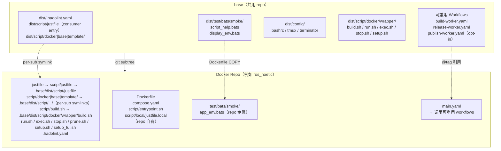
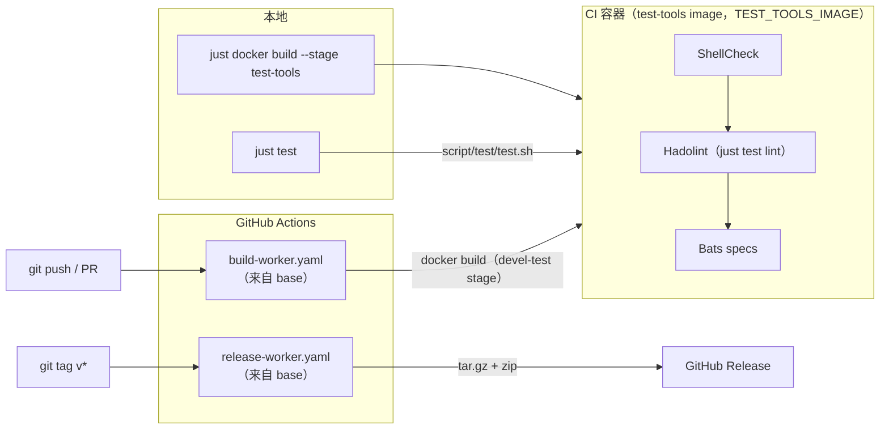

<!-- sync: base e5eb312a5446 456381313862 -->
# base

[](https://github.com/ycpss91255-docker/base/actions/workflows/self-test.yaml)


[](../../LICENSE)

[ycpss91255-docker](https://github.com/ycpss91255-docker) 组织下所有 Docker 容器 repo 的共用模板。

**[English](../../README.md)** | **[繁體中文](README.zh-TW.md)** | **[简体中文](README.zh-CN.md)** | **[日本語](README.ja.md)**

---

<!-- sync: table-of-contents e989d6153818 e523936b7cf0 -->
## 目录

- [TL;DR](#tldr)
- [必要条件](#必要条件)
- [概述](#概述)
- [快速开始](#快速开始)
- [CI Reusable Workflows](#ci-reusable-workflows)
- [本地运行测试](#本地运行测试)
- [测试](#测试)
- [目录结构](#目录结构)

---

<!-- sync: tldr b4f9c41522da c6783a1b0113 -->
## TL;DR

```bash
# 从零开始的新 repo：首个 commit + subtree + 一次性 bootstrap
mkdir <repo_name> && cd <repo_name>
git init
git commit --allow-empty -m "chore: initial commit"
git subtree add --prefix=.base \
    https://github.com/ycpss91255-docker/base.git vX.Y.Z --squash
./.base/dist/script/base/init.sh   # 一次性 bootstrap；之后用 just base init

# 升级到最新版
just base update   # 检查
just base upgrade         # pull + 更新版本文件 + workflow tag

# 运行 CI
just test   # ShellCheck + Bats + Kcov
just                       # 列出所有 recipe
```

<!-- sync: prerequisites 71356c1216b6 f87cc1db3c62 -->
## 必要条件

容器操作透过 [`just`](https://github.com/casey/just)（command runner）搭配
Docker 执行。使用 `just <verb>` 入口前，请先在 host 安装两者：

- **Docker** + Docker Compose v2（`docker compose`）。
- **just** -- 任何近期版本皆可（recipe 仅用到 variadic 参数，早期版本即支持）。
  通过包管理器或官方安装程序安装：

  ```bash
  apt install just         # Debian 13+ / Ubuntu 24.04+
  brew install just        # macOS / Linuxbrew
  cargo install just       # 从 crates.io
  # 或官方预编译 binary 安装程序：
  curl --proto '=https' --tlsv1.2 -sSf https://just.systems/install.sh \
      | bash -s -- --to ~/.local/bin
  ```

  完整方式见[官方安装指南](https://github.com/casey/just#installation)。若
  `just` 不可用，每个 recipe 都有 raw fallback（`./script/<verb>.sh`、
  `./.base/dist/script/base/upgrade.sh`）-- 见[快速开始](#快速开始)。

<!-- sync: overview 435906a68746 73d9fe303411 -->
## 概述

此 repo 集中管理所有 Docker 容器 repo 共用的脚本、测试和 CI workflow。各 repo 通过 **git subtree** 拉入此模板，并使用 symlink 引用共用文件。

<!-- sync: architecture 2660c8dea634 5d6c062768ac -->
### 架构



<!-- sync: cicd-flow 5bd0f36f76ac e672c33be923 -->
### CI/CD 流程



<!-- sync: whats-included 68cb068c2b9f 6334b6e449e0 -->
### 包含内容

| 文件 | 说明 |
|------|------|
| `build.sh` | 构建容器（`--setup` 有 TTY 时启动 `setup_tui.sh`，否则调用 `setup.sh`） |
| `run.sh` | 运行容器（支持 X11/Wayland；`--setup` 语义与 `build.sh` 相同） |
| `exec.sh` | 进入运行中的容器 |
| `stop.sh` | 停止并移除容器 |
| `prune.sh` | 清理容器 / image / 构建缓存 |
| `setup_tui.sh` | 交互式 setup.conf 编辑器（dialog / whiptail 前端） |
| `dist/script/docker/wrapper/setup.sh` | 自动检测系统参数并生成 `.env` + `compose.yaml` |
| `dist/script/docker/lib/_lib.sh` | 核心 wrapper helper（env 加载、compose 调用、project 命名） |
| `dist/script/docker/lib/bootstrap.sh` | 共用 wrapper 初始化与参数解析 |
| `dist/script/docker/lib/compose.sh` | Docker Compose YAML 生成与处理 |
| `dist/script/docker/lib/conf.sh` | INI 解析器与 section 合并器 |
| `dist/script/docker/lib/conf_logging.sh` | Logging 配置 helper |
| `dist/script/docker/lib/env.sh` | 环境变量设置与默认值 |
| `dist/script/docker/lib/gitignore.sh` | Gitignore 文件管理 |
| `dist/script/docker/lib/hook.sh` | 每个 wrapper 的 pre/post hook 调用 |
| `dist/script/docker/lib/i18n.sh` | 语言检测与本地化 |
| `dist/script/docker/lib/log.sh` | 统一日志与输出 helper |
| `dist/script/docker/lib/config_summary.sh` | runtime 配置摘要 |
| `dist/script/docker/lib/_tui_backend.sh` | TUI 用的 dialog / whiptail 包装函数 |
| `dist/script/docker/lib/_tui_conf.sh` | TUI 的 INI validator + 读写逻辑 |
| `dist/script/docker/runtime/entrypoint.sh` | 模板 entrypoint helper |
| `dist/script/docker/runtime/logging.sh` | host 端 log tee helper（per-start 文件 + 稳定 symlink） |
| `dist/script/docker/runtime/logrotate.sh` | 共用 rotate/symlink/prune primitives（tee + transcript 共用） |
| `dist/script/docker/runtime/smoke.sh` | runtime 安装检查 smoke |
| `script/test/test.sh` | base 自测调度器（本地 + container 内） |
| `script/test/drivers/` | 每个工具一个 driver — `bats.sh` / `shellcheck.sh` / `hadolint.sh` |
| `script/test/lint_bare_stderr.sh` | Bare stderr lint 检查器 |
| `config/` | Container 内部 shell 配置文件（bashrc、tmux、terminator） |
| `setup.conf` | 单一 per-repo runtime 配置（image / build / deploy / gui / network / volumes） |
| `dist/test/bats/smoke/` | 共用 smoke 测试 + runtime assertion helpers（见下方） |
| `test/bats/unit/` | base 自测，unit（bats + kcov） |
| `test/bats/integration/` | base 自测，init/upgrade 端到端 |
| `test/bats/system/` | base 自测，System 层／Regression（runtime smoke gate，opt-in） |
| `test/bats/acceptance/` | base 自测，Acceptance 层（UAT/OAT；保留，S5 #785） |

测试内容采用 **tool-first** 布局 — spec 放 `test/<tool>/<category>/`
（如 `test/bats/unit/`），linter 放 `test/lint/<tool>/` — 加一个工具就
是新增一个目录，而不是新增一个命令面。见
[ADR-00000012](../adr/00000012-tool-first-test-layout.md)（取代 category-first
的 ADR-00000004）。consumer 出货自己的 `test/bats/smoke/`；base 出货自己的
`test/bats/{unit,integration,system,acceptance}/`。

| `.hadolint.yaml` | 共用 Hadolint 规则 |
| `justfile`（→ `script/justfile`） | Repo 命令入口 — 分层 namespace recipe（`just docker build`、`just docker run`、`just test`、`just base upgrade` 等）。sub-cmd 与 flag 透过 `{{args}}` 直接透传（`just docker build --no-cache --stage test-tools`）；裸 `just` 列出所有 namespace。 |
| `dist/script/docker/justfile.docker` | `docker` namespace — 容器操作（`just docker build/run/exec/stop/prune/setup/setup-tui`）。 |
| `dist/script/base/justfile.base` | `base` namespace — 管理 `.base` subtree（`just base init/update/upgrade/completions`）。 |
| `dist/script/base/init.sh` | 首次初始化 symlinks + 新 repo 骨架生成（bootstrap：`./.base/dist/script/base/init.sh`；之后用 `just base init`）。 |
| `dist/script/base/upgrade.sh` | Subtree 版本升级（`just base upgrade [vX.Y.Z]`）。 |
| `script/test/justfile.test` | base 自测入口（`just test`、`just test lint`、`just test coverage` …）。 |
| `script/release/justfile.release` | base `release` namespace（release / publish 工具）。 |
| `dist/dockerfile/Dockerfile` | 新 repo 的多阶段 Dockerfile 模板 |
| `dockerfile/Dockerfile.test-tools` | 预构建 lint/test 工具 image（shellcheck、hadolint、bats、bats-mock） |
| `.github/workflows/` | 可重用 CI workflows（build + release） |

<!-- sync: dockerfile-stages-convention cfa1ef92737a 5d296bbd0e54 -->
### Dockerfile 分层（约定）

下游 repo 遵循标准多阶段配置，定义于 `dist/dockerfile/Dockerfile`。
所有阶段共用 `ARG BASE_IMAGE` 指定的基础镜像。

| 阶段 | 父阶段 | 用途 | 是否出货 |
|------|--------|------|---------|
| `sys` | `${BASE_IMAGE}` | 用户/用户组、locale、时区、APT mirror | 中间 |
| `devel-base` | `sys` | 开发工具与语言套件 | 中间 |
| `devel` | `devel-base` | 应用专属工具、entrypoint、config 分层 | **是**（主要产物） |
| `devel-test` | `devel` | ShellCheck + Hadolint + Bats smoke（短暂：测试后丢弃） | 否（build 完即丢） |
| `runtime-base`（可选） | `sys` | 最小 runtime 依赖（sudo、tini） | 中间 |
| `runtime`（可选） | `runtime-base` | 仅含安装产物的精简 runtime 镜像 | 启用时出货 |
| `runtime-test`（可选） | `runtime` | runtime 安装检查 smoke（短暂） | 否 |

说明：
- 只出货 developer image 的 repo（`env/*`）会跳过 `runtime-base` /
  `runtime`——该 section 在 `Dockerfile` 保持注释状态。
- `devel-test` 总是从 `devel` 继承，所以 `test/bats/smoke/<repo>_env.bats` 中的
  runtime assertion 所看到的二进制与文件，就是用户 `docker run ...
  <repo>:devel` 后会看到的内容。
- `Dockerfile.test-tools` 构建 lint/test 工具集（bats + shellcheck + hadolint）。下游 `devel-test` 阶段通过 `ARG TEST_TOOLS_IMAGE` build arg 引用 — 默认 `test-tools:local`（对应本地 `./build.sh` 流程,把 `Dockerfile.test-tools` 构建到 host Docker daemon）。CI 则覆盖成 `ghcr.io/ycpss91255-docker/test-tools:vX.Y.Z`（由 `.github/workflows/release-test-tools.yaml` 在每次 tag 推的预构建 multi-arch image）,buildx 直接从 registry 拉对应架构的 bats / shellcheck / hadolint binary,避开 `docker-container` buildx driver 跨 step 不共享 image store 的问题。

<!-- sync: baked-artifacts-live-at-opt-not-home eb898d65e2e1 2b1cd08fd898 -->
#### 自建产物放在 `/opt`，不要放 `$HOME`

容器用户是在 **build** 时期烘进 image 的：`sys` 阶段吃
`USER_NAME` / `USER_UID` / `USER_GID` build arg，`devel` 接着设置
`ENV HOME="/home/${USER_NAME}"`。`just build` 注入本机 host 的用户，
CI 与 release 路径则烘 `user`（UID 1000）——所以同一个 commit 构建出来的两个
image，`$HOME` 可能不一样。

因此凡是 image 烘在 **`$HOME` 底下** 的东西，都与 build 时期的用户名绑死，
而且只有在部署时才会爆：用不同 `USER_NAME` 跑预构建 / GHCR /
`docker save`+`load` 的 image（或用不同 `USER_NAME` 重建），每个相对于 home 的
路径就指到另一个**空的** `/home/<other>/...`。烘好的 workspace 看不见，
`source ~/some_ws/install/setup.bash` 直接失败。绝对路径 `/opt/...` 则免疫 ——
根本没有 `$HOME` 这层间接。

这个约定写在你会实际打开的那份 `Dockerfile` 里：

1. 自建产物（colcon workspace、SDK、自行编译的工具）安装到绝对路径
   `/opt/<name>`。`$HOME` 只留给 dotfile 与方便用的 symlink。
2. entrypoint / bashrc 一律 source **绝对路径**，不要用 `~` 或 `$HOME`。
   在 per-user `RUN` 区块建立 `~/<name> -> /opt/<name>` symlink 是鼓励的
   （方便交互时查找），但任何东西都不可以去 *source* 它。
3. 路径里永远不要写死具体用户名 —— 用 `${HOME}` / `${USER_NAME}`。

第 3 条是机械式规则，因此有 gate：`home-literal` lint
（`just test lint --home-literal`，CI job `lint-static (home-literal)`）会在
`dist/` 或 `dockerfile/` 底下任何 home 路径出现具体用户名时失败。
第 1、2 条属于判断题，grep 判不出来。设计理由见
[ADR-00000024](../adr/00000024-bake-artifacts-at-opt-not-home.md)。

<!-- sync: adding-extra-stages-215 2da5b4c5cc6a 8e46b490ed24 -->
#### 添加额外 stage（#215）

任何在 baseline blocklist `{sys, devel-base, devel, runtime-test}`
之外的（v0.21.x 过渡期同时接受旧名 `{base, test}`）
`FROM <base> AS <stage>`，会被自动 emit 成一个 compose 服务 —
`extends: devel`（继承 volumes / network / GPU / GUI / cap_add /
additional_contexts），仅 override `build.target` / `image` /
`container_name` / `stdin_open` / `tty` / `profiles`。典型用例是
entrypoint 变体，如 NVIDIA Isaac Sim 在 `devel` 之上的
`headless` + `gui` 两种启动模式。

User 操作流程：

```dockerfile
# Dockerfile 加新 stage（不用动 setup.conf）
FROM devel AS headless
ENTRYPOINT ["/isaac-sim/runheadless.sh"]
CMD ["-v"]

FROM devel AS gui
ENTRYPOINT ["/isaac-sim/runapp.sh"]
```

```bash
just docker build                            # 重新生成 compose.yaml，build 所有 stages
just docker run -t headless                  # 跑 headless 变体
just docker run -t gui                       # 跑 gui 变体
just docker exec -t headless bash            # 进入 running 的 headless container

# Kit 风格的 `=` 参数可以直接传递：
just docker exec -t headless-stream /isaac-sim/runheadless.sh -v --/app/livestream/port=49100

# 等效直接 .sh 写法：
./build.sh
./run.sh -t headless
./exec.sh -t headless bash
```

约束：

- Stage 名必须符合 `^[a-z][a-z0-9_-]*$` — 大写 / 数字开头 / 点号
  等会被拒（WARN + 跳过，其他 stage 继续解析）。
- 撞到 baseline `{sys, devel-base, devel, runtime-test}`（v0.21.x
  过渡期亦同时接受旧名 `{base, test}`）时，`setup.sh apply` hard error
  退出 1。撞到 template 控制的 image tag namespace（`latest`、
  `v[0-9]*`）也是 hard error。`devel-test` **不在**该集合里，也**不算**
  撞名 — 它会通过 per-stage 模型 emit 成 `test` service（#493），这正是
  `[stage:devel-test]` 有 runtime 控制面的原因。
- 添加 / 移除 stage 会触发 `setup.sh check-drift`（通过 `.env.generated` 内
  的 `SETUP_DOCKERFILE_HASH`），下次 wrapper 跑会自动 regen
  `compose.yaml`。其他 `RUN apt-get install` 等修改**不会**触发 drift。

<!-- sync: per-stage-setupconf-overrides-220 a5064ca6a91f b255b4c2085f -->
#### Per-stage `setup.conf` overrides（#220）

#215 auto-emit 出的 stage 默认共用 devel 的 runtime 设置
（volumes / GPU / network / GUI）。当某 stage 需要不同的 runtime
设置 — 例如 NVIDIA Isaac Sim 的 `headless` 跑 WebRTC livestream
要 `network=bridge` + 一个 port mapping + `gui=off`，但 `devel` 跟
`gui` 维持 `network=host` + X11 — 在 repo 的 `setup.conf` 加上
`[stage:<name>]` section：

```ini
[gui]
mode = auto

[network]
mode = host

[stage:headless]
gui.mode = off
network.mode = bridge
network.port_1 = 8080:80
deploy.gpu_capabilities = gpu compute utility graphics video
```

也可以用 `./setup_tui.sh` 走交互式编辑：

- **Advanced → Per-stage overrides**：直接进编辑器；该 entry 仅
  在 Dockerfile 有至少一个非 baseline stage 时才显示。
- **Features → Per-stage overrides**（#221）：永久可见的功能总
  览入口；条件已满足时点击等同上述 Advanced 路径，未满足时会
  弹 msgbox 说明如何启用。

允许 override 的 key（v1）：

| Section | Keys |
|---|---|
| `[deploy]` | `gpu_mode`, `gpu_count`, `gpu_capabilities`, `gpu_runtime`（旧名 `runtime` 仍接受） |
| `[gui]` | `mode` |
| `[network]` | `mode`, `ipc`, `pid`, `network_name`, `port_<N>`, `port_inherit` |
| `[security]` | `privileged`, `cap_add_<N>`, `cap_add_inherit`, `cap_drop_<N>`, `cap_drop_inherit`, `security_opt_<N>`, `security_opt_inherit` |
| `[volumes]` | `mount_<N>`, `mount_inherit` |
| `[environment]` | `env_<N>`, `env_inherit` |

List 字段（`mount_*` / `port_*` / `env_*` / `cap_add_*` / `cap_drop_*` /
`security_opt_*`）采 **append-default**：stage 的项目附加在 top-level
之后。要完全取代 top-level，设 `<list>_inherit = false`（例：
`volumes.mount_inherit = false`，或 `security.cap_add_inherit = false`
清掉某 stage 继承的 caps —— #526：只读 probe stage 可清掉 flash stage
的 `SYS_ADMIN`）。

注意事项：

- `[stage:devel]` 是**保留**的 (v1 no-op + WARN)。要调 devel 直接
  改 top-level section。v2 会重新评估。
- `[stage:sys|base|test]` 是 **hard error**（baseline collision）。
- `[stage:foo]` 对应的 stage 在 Dockerfile 不存在 → **WARN + 跳过**
  （`setup.sh apply` 其他流程继续）。
- 不在 allowlist 内的 override key → **WARN + 跳过该 key**。

<!-- sync: smoke-test-helpers-for-downstream-repos 86bd640f4dd5 3dc1ca61df98 -->
### Smoke test helpers（供下游 repo 使用）

`test/bats/smoke/test_helper.bash`（每个 smoke spec 通过
`load "${BATS_TEST_DIRNAME}/test_helper"` 加载）提供一组 runtime
assertion helpers。下游 repo 应优先使用这些 helper 而非原生的
`[ -f ... ]` / `command -v`，失败时会输出 decorated 诊断信息直指缺少
的工件。

| Helper | 用法 |
|--------|------|
| `assert_cmd_installed <cmd>` | `<cmd>` 不在 `PATH` 上时失败 |
| `assert_cmd_runs <cmd> [flag]` | `<cmd> <flag>` 非 0 时失败（flag 默认 `--version`） |
| `assert_file_exists <path>` | `<path>` 非 regular file 时失败 |
| `assert_dir_exists <path>` | `<path>` 非目录时失败 |
| `assert_file_owned_by <user> <path>` | `<path>` 所有者不是 `<user>` 时失败 |
| `assert_pip_pkg <pkg>` | `pip show <pkg>` 非 0 时失败 |

<!-- sync: what-stays-in-each-repo-not-shared 5cff28619497 6e52231828ca -->
### 各 repo 自行维护的文件（不共用）

- `Dockerfile`
- `compose.yaml`
- `script/` — repo 本地的 **runtime helpers**（在 container 内被 `ENTRYPOINT` / `CMD` 或人工调用）
  - `script/entrypoint.sh`（canonical）
  - 任何 ros / app 启动 helper 等
- `script/docker/` — repo 本地的 **Dockerfile-internal build helpers**（在 Dockerfile `RUN` 阶段调用，container 启动后不会用到；范例与 lint COPY 见 `dist/dockerfile/Dockerfile`，#275）
- `doc/` 和 `README.md`
- Repo 专属的 smoke test

<!-- sync: per-repo-runtime-configuration b02fd5d770dc f774a426a6e2 -->
## 各 repo runtime 配置

每个下游 repo 通过一个 `setup.conf` INI 文件驱动自己的 runtime 配置
（GPU 保留、GUI env/volumes、network mode、额外 volume mounts）。
`setup.sh` 读它 + 系统检测后重新生成 `.env.generated` 和 `compose.yaml`，
这两个衍生文件用户不用动手编辑。手写的 `.env` overlay 是另一个文件：
setup 只在第一次 scaffold，之后永不覆写。

<!-- sync: one-conf-15-sections 825dbace1f47 2fc4b1c686f7 -->
### 单一 conf、15 个 section

下面这份 section 清单不是散文，而是 `SCHEMA_SECTIONS`
（`dist/script/docker/lib/schema.sh`）— “有哪些 section、顺序为何”的唯一
来源。这个区块或它的数量一旦与代码不一致，`derived-figures` lint 会失败。

```
[project]  name — 这个 checkout 运行时所属的 compose project（留空 =
           推导出 <DOCKER_HUB_USER>-<IMAGE_NAME>）。想同时跑两个
           checkout，就在 .setup.conf.local 按 WORKTREE 各自设定
[image]    rules = prefix:docker_, suffix:_ws, @default:unknown
[build]    apt_mirror_ubuntu、apt_mirror_debian            # Dockerfile build args
[deploy]   gpu_mode (auto|force|off)、gpu_count、gpu_capabilities
           dri_groups (auto|off) — GUI service 上 iGPU /dev/dri 的 group_add
[lifecycle] restart (no|always|unless-stopped|on-failure|on-failure:N)
           默认 unless-stopped;属于 DEPLOY 范畴 — 只 emit 在 deployable
           stage 的 service 上，devel 与任何 *-test stage 由 emitter 清空，
           因此 devel 上不会有 restart: 让 extends:devel 继承。详见英文版
           README 的 “Restart policy is deploy-scoped”。
           init (true|false) — Docker init/PID1 reaper;默认 true。
           watchdog_* — 容器内健康检查（opt-in）
[gui]      mode (auto|force|off)
[network]  mode (host|bridge|none)、ipc、pid (host|private)、privileged
           port_N = host:container（只有 bridge 模式才会 publish）
[security] privileged（false）、cap_add_N、cap_drop_N、security_opt_N
           （以及对应的 *_inherit 开关;默认精简，要用才开）
[resources] shm_size
[environment] env_N = KEY=VALUE — set-once 默认值，会 bake 成 deployable
           stage 的 ENV;每次任务都会变的变量请放 .env
[tmpfs]    tmpfs_N = /path[:size=N] — RAM-backed 挂载点
[devices]  device_N = host:container，以及 cgroup rule（要用才开）
[volumes]  mount_1（workspace，首次运行时自动填入）
           mount_2..mount_N（额外 host mount；设备走 /dev path）
[additional_contexts] context_N = name=source — 额外的具名 build context
[logging]  driver（默认 json-file）、max_size、max_file、compress
           local_path（host 端 log 目录；bind-mount 到 /var/log/<repo>）
           container_log_keep (20)、container_log_days (14)（每次启动的
           容器 log 保留策略；keep-count 与 age 两者取严）
           wrapper_transcript（把 verb 输出 tee 到 log/<verb>/；默认 true）、
           wrapper_transcript_keep (20)、wrapper_transcript_days (14)
           [logging.<svc>] 可对单一 service 做 key-level override
```

Template default 在 `.base/dist/.setup.conf`；per-repo 覆盖放 repo 根目录的
dotfile `<repo>/.setup.conf`（由 `just setup` 工具管理，刻意不放进手动编辑的
`config/` 界面）。Section-level **replace** 策略：上层若有该 section 就整段
取代下层；没写的 section 则往下层落。

<!-- sync: three-layers-the-third-is-yours-setupconflocal d6b292a21a41 f3d9fc0a929b -->
#### 三层配置，第三层是你的（`.setup.conf.local`）

| 层 | 是否进版本控制 | 属于谁 |
|---|---|---|
| `.base/dist/.setup.conf` | 随 subtree 出厂 | base 的默认 |
| `<repo>/.setup.conf` | 已 commit | repo 的 —— CI 与其他所有 checkout 用的就是它 |
| `<repo>/.setup.conf.local` | **gitignored** | 你的，只在这台机器、这个 worktree |

三层共用同一套语法、同一条 section-replace 规则。第三层用 `--local` 写：

```bash
./setup.sh set --local project.name myrepo-wt2
```

为什么是整段取代而不是逐键合并：上面的 section 有八个是 `<prefix>_N` 有序
列表。只覆盖 `port_2` 会把两层拼成同一份有序列表，你永远无法「移除」某一
项，要新增又得知道你看不到的那层当前最大的 `N`。相关键之间也互相制约
（`[network] mode` 决定 `port_N` 会不会被 emit），半套覆盖会产生哪一层都
没写过的组合。

由此衍生三件事，而且全都会出声、不会默默发生：

- `.setup.conf.local` 已定义某 section 时，用普通的 `set` 写该 section 会
  **警告**并指名该 section。不会拒绝 —— 那个值仍然是 CI 与其他 checkout
  会用的 committed 值 —— 但它在这台机器上不会有任何效果。
- 每个 wrapper 执行前的摘要都会多一行 `local override:`，列出文件与被它
  取代的 section。
- `just docker setup deploy` 只要该文件存在就**拒绝执行**（见
  [Field 部署](#field-部署just-docker-setup-deploy)）。

<!-- sync: running-two-worktrees-at-once efccbe6e6686 33a1b8abe2f5 -->
#### 同时跑两个 worktree

每个 checkout 都在某个 compose project name 之下运行，它创建的一切
—— container、network、volume —— 都以此命名。两个 checkout 若解析出同一个
名字就会撞在一起：第二次 `run` 会直接沿用第一个的 container。

`[project] name` 就是这个名字。它出厂时是**空的**，意思是「照旧推导
`<DOCKER_HUB_USER>-<IMAGE_NAME>`」，所以在你设置之前什么都不会变。请设在
*local* 那层，因为 per-worktree 的名字是你的、不是 repo 的：

```bash
cd ~/work/myrepo-wt2
./setup.sh set --local project.name myrepo-wt2
just build            # 重新生成；两个 worktree 从此可并行
```

这个值只解析一次，写进 `.env.generated` 的 `PROJECT_NAME`，两边都从那里读：
wrapper 的 `docker compose -p`，以及生成出来的 `compose.yaml` 里的
`name: ${PROJECT_NAME}`（所以 `lazydocker`、`docker compose ps` 和 IDE 面板
看到的会跟 wrapper 一致）。值的规则：小写英文字母、数字、`-`、`_`，开头必须
是字母或数字 —— 就是 docker compose 自己的规则。

改这个值**不会**动到 image tag。那是 `[image]` / `DOCKER_HUB_USER`，刻意分
成两个轴：一次运行拥有哪些 container、和它 build 出哪个 image，是两个问题。

**权限默认关闭、要用才开**（#466）：template 出厂的 `[security]`
（`privileged = false`，没有 `cap_add` / `security_opt`）与 `[devices]`
（没有 `/dev:/dev`）都是精简默认，让轻量 repo 和工具 stage 保持干净。容器
需要什么就开什么：走 `setup_tui.sh`（security / devices 页）、
`setup.sh add security.cap_add SYS_ADMIN`，或把 template 里的示例取消注释。

首次运行 `setup.sh`（尚无 per-repo setup.conf）时，template 文件会被
复制到 repo，并把检测到的 workspace 写入 `[volumes] mount_1`。后续
运行以 `mount_1` 为真实来源 — 清空该项即可放弃挂载 workspace。编辑方式：

```bash
./setup_tui.sh                      # 交互式 dialog/whiptail 编辑器
./setup_tui.sh volumes              # 直接跳到指定 section
./build.sh --setup            # 有 TTY 时启动 setup_tui.sh；无 TTY 时执行 setup.sh
./.base/dist/script/base/init.sh --gen-conf # 单纯复制 .base/dist/.setup.conf 到 <repo>/.setup.conf
```

<!-- sync: logging-output-to-host df27d24459b2 6cba8f1add7d -->
### 输出 log 到 host

设 `[logging] local_path`，容器 stdout/stderr 会 tee 一份到 host 上的
文件，docker daemon 原本的 json-file log 同时保留：

```ini
[logging]
local_path = ./log/     # 相对 repo 根；或 /abs/、~/dir/ 也可
container_log_keep = 20  # 最多保留 N 份最近的 per-start 文件
container_log_days = 14  # 且丢掉超过 D 天的文件（两者取严）
```

跑任何 wrapper 重新生成 `compose.yaml`。每次容器启动，tee 会写一份
per-start 文件 `<local_path>/<svc>_<ts>.log`，并把稳定的 symlink
`<local_path>/<svc>.log` 重新指向它（glog 风格）：`tail <svc>.log`
永远看得到当前这次运行，先前几次则留在磁盘上。旧的 per-start 文件
按 `container_log_keep`（保留最近几份）与 `container_log_days`
（保留几天）两者取严清掉，symlink 本身不会被清。`docker logs <ct>`
行为不变（json-file 维持 rolling 历史）。

**新 repo**：用本版本之后的 `init.sh` 生成时，`script/entrypoint.sh`
已内建 helper source，设 `[logging] local_path` 是唯一一步。
**已有 repo**：在 `script/entrypoint.sh` 的最终 `exec` 之前加一行做
一次性迁移：

```bash
. /usr/local/lib/base/logging.sh
```

Helper 由 `Dockerfile` 的 devel stage COPY 到 image 内稳定路径
`/usr/local/lib/base/logging.sh`（refs #368），连同它的 `logrotate.sh`
同伴文件（refs #805），所以这条 source line 在 build-time 与 runtime、
各种 workspace 结构下都能 work — 不需要 `$USER`，也不依赖 workspace
bind mount。

疑难排查：`local_path` 设了但 host 文件没东西 → 确认
`script/entrypoint.sh` 真的有那行 source
（`grep logging.sh script/entrypoint.sh`）。

<!-- sync: interactive-tui 23df6f6f09ab 7cbfc4b1f489 -->
### 交互式 TUI

`./setup_tui.sh` 打开主菜单。底层是 `dialog` 或 `whiptail`（两者
都缺时会打印 `sudo apt install dialog` 提示并退出）。按 Cancel /
Esc 不存档离开；存档后会自动调用 `setup.sh` 重新生成 `.env.generated` +
`compose.yaml`。

`./setup_tui.sh <SECTION>` 可直接跳到某个编辑器。`[deploy]` section 只设置
GPU 预留 —— 名称沿用 Compose 的 `deploy:` key，和会打包 field bundle 的
`./setup.sh deploy` 无关。因此本编辑器没有歧义的名称是 `gpu`
（`just docker setup-tui gpu`）；`deploy` 仍可用，并会先弹出说明是哪一个。

主菜单结构（#221）：

```
Main
├─ image            IMAGE_NAME 检测规则
├─ build            APT mirrors + Dockerfile build args
├─ Runtime  ──→     network / deploy（GPU）/ gui / environment / logging
├─ Mounts   ──→     volumes / devices / tmpfs
├─ Advanced ──→     security / additional_contexts
│                   / per_stage（条件式）/ Reset
├─ Features         条件式 / 进阶使用功能总览（含 per_stage 状态）
└─ Save & Exit
```

`./setup_tui.sh <section>` 仍可直接跳到任意 section 的编辑器
（如 `./setup_tui.sh volumes`），不必走主菜单。

<!-- sync: when-setupsh-runs 78e1acddfeef a057b51d2359 -->
### setup.sh 什么时候运行

`setup.sh` 仅在显式触发时才执行 — 并不会在每次 build / run 都重跑：

- **`just base init` / `./.base/dist/script/base/init.sh`** 建完骨架自动运行一次
- **`just base upgrade` / `./.base/dist/script/base/upgrade.sh`** subtree pull 后通过 init.sh
  再跑一次，所以升级总是会用新版 baseline 重新生成 `.env` / `compose.yaml`
- **`./build.sh --setup` / `./run.sh --setup`**（或 `-s`）— 用户手动触发重跑；
  有 TTY 时先启动 `setup_tui.sh` 让用户修改 `setup.conf`，无 TTY 时直接调用 `setup.sh`
- **首次 bootstrap**：`./build.sh` / `./run.sh` 首次执行（`.env` 尚未存在，
  例如 CI 新 clone）会自动走相同的 TTY-aware 流程，不用带 `--setup`

> **Fresh-clone lint 覆盖率（#216）**：`./run.sh` 在本机没 image
> cached 时会走 Compose auto-build — 但 auto-build **只 build
> `target: devel`**（或 `-t` 指定的 target），会跳过 `target:
> devel-test`（pre-#243 该 stage 名为 `test`）那层的 ShellCheck /
> Hadolint / Bats smoke。`run.sh` 检测到这个情况
> 会在 `compose up` 前打印一段 `[run] INFO:` 提示（只在 TTY 环境）。
> 想要一次取得跟 CI 同样的完整验证，加 `--build` flag：
>
> ```bash
> just docker build test                   # 显式跑 lint + smoke
> just docker run --build                  # 跑完 lint + smoke 再 compose up
> just docker run                          # 默认 — 快速路径，跳过 lint/smoke
> ```

`setup.sh apply` 每次都会从头重新生成 `compose.yaml`，但会保留既有 `.env`
中的 `WS_PATH` / `APT_MIRROR_UBUNTU` / `APT_MIRROR_DEBIAN`，所以手动调过
的 workspace 路径或 apt mirror 升级时不会被覆盖。

<!-- sync: drift-detection 25d3585b5c5f 4249d9acd687 -->
### Drift 检测

`setup.sh` 把 `SETUP_CONF_HASH`、`SETUP_GUI_DETECTED`、`SETUP_TIMESTAMP`
写到 `.env`。每次 `./build.sh` / `./run.sh` 进入时会比对 `setup.conf`
当前 hash + 系统检测值，以下任一项改变时打印 `[WARNING]`（但不阻止执行）：

- `setup.conf` 内容（conf hash）
- GPU / GUI 检测结果
- `USER_UID`（用户身份）

带 `--setup` 重跑以重新生成 `.env.generated` + `compose.yaml`。

<!-- sync: field-deployment-just-docker-setup-deploy 66110bfc975b 32674f0aa7b6 -->
### Field 部署（`just docker setup deploy`）

`just docker setup deploy`（或直接调用 `./setup.sh deploy`）用同一份 `setup.conf` 打包出自带式的 field 部署**目录** —— 即上述路由模型的 deploy 半边（[ADR-00000023](../adr/00000023-config-field-override-and-field-deploy-contract.md)，修订 [ADR-00000003](../adr/00000003-env-vs-workload-param-boundary.md)；[PRD invariant 8](../PRD.md)）。它针对 *field 导向* 的 stage（默认 `runtime`；**绝不**是 `devel` 或任何 `*-test` stage），产出的目录带齐目标主机需要的一切 —— field 主机不会看到 base 的工具链、源码树或 `setup.conf`。

```bash
just docker setup deploy                      # 打包 runtime bundle（会先确认）
just docker setup deploy --stage runtime      # 显式指定 field stage
just docker setup deploy --dry-run            # 只打印 build plan，不实际 build
just docker setup deploy --stage runtime -y   # 跳过确认提示
just docker setup deploy -o /tmp/robot-bundle # 自定义输出目录
```

Bundle 落在 `deploy/<repo>-<stage>-<version>/`（repo 根的 `deploy/` 目录已被 gitignore；`<version>` = `git describe --tags --always --dirty`，镜像 tag 为 `<repo>:<stage>-<version>`，所以同一台主机加载多个 field 版本不会互相冲突）。内含：

| 文件 | 是什么 |
|---|---|
| `image.tar.xz` | `xz` 压缩过的镜像（`deploy.sh` 会 `docker load` 它） |
| `compose.yaml` | 完全解析、自带式的 compose —— 全是字面值、**没有 `${VAR}` 插值**（GUI stage 的 `${DISPLAY}` host passthrough 除外），不依赖 `setup.conf` / `.env`；带 `restart: unless-stopped` |
| `config/` | 每个可由操作者调整之文件的可编辑副本（见下） |
| `deploy.sh` | 轻量的 `up` / `down` / `logs` 启动器 |
| `README` | 给 field 操作者的说明 |

依序做这些事：

1. 把 `[environment]` 默认烤成镜像的真 `ENV`（S3），有 `config/app/` 就 `COPY` 进镜像（S4）—— 使 field 镜像自带（不带 env 文件、不带 config bind）；
2. `docker build --target <stage>` 出不可变镜像，tag 为 `<repo>:<stage>-<version>`；
3. `docker save | xz` 成 `image.tar.xz`；
4. 写出完全解析的 `compose.yaml`（与 `apply` 共用同一套 resolver，所以 field 永远不会跟 dev 漂移）、`deploy.sh` 启动器与 `README`，再把每个可调整文件 baked 的默认抽出来放进 `config/`。

build 前会打印解析后的 `compose.yaml`，让你逐项检视每个解析后的参数再确认（`-y` 跳过；`--dry-run` 只打印 plan 不 build；非交互 shell 未带 `-y` 会拒绝）。

**只要 `<repo>/.setup.conf.local` 存在，它就直接拒绝。** 该文件是 gitignored 的，因此从干净 checkout 无法重现用它 build 出来的 bundle —— 而 bundle 本身不会有任何说明（[PRD invariant 8](../PRD.md)、[ADR-00000025](../adr/00000025-per-worktree-setup-conf-local-override.md)）。拒绝发生在预览之前、任何 build 步骤之前，所以 `--dry-run` 也会报告。`--allow-local-override` 会照样 build，并把取自那个未进版本控制文件的 section 记进 bundle 自己的 `README` —— 因为在 field 运行这个 bundle 的人，不是当初决定绕过这道关卡的人。

**在 field 机器上** —— 把整个目录复制过去，再用 `deploy.sh` 启动器操作（它会加载镜像并驱动 `docker compose`；不用 `docker run`、不用 `setup.conf`、不用 base 工具链）：

```bash
cd <repo>-runtime-<version>
./deploy.sh up      # unxz | docker load 镜像，再 docker compose up -d
./deploy.sh logs    # docker compose logs（加 -f 可跟随）
./deploy.sh down    # docker compose down
```

`restart: unless-stopped` 表示主机重启后容器会自动起来；要停掉请用 `./deploy.sh down`。

**在 field 调整配置（免 rebuild）**：组件在 committed 的 `config/<component>/deploy.manifest`（INI-lite，每个 stage 一个 section，各自列出容器内绝对路径）声明哪些容器内路径允许 field 操作者重新调整。Bundle 会为每个声明的文件附上一份可编辑副本放在 `config/`，解析后的 `compose.yaml` 再把它 bind mount 盖过镜像里 baked 的默认（**mount-wins**）。改完 `config/` 下的文件，重跑 `./deploy.sh up` 即可 —— 挂载的副本胜出，不用 rebuild。**没有**声明的路径维持只有 baked 版本。镜像必须在每个声明的路径都 bake 一份默认文件，否则 deploy 生成阶段会明确报错并给出可行的修法。

这些 bind **默认是只读（`:ro`）**：由操作者在 host 上编辑、容器只负责读。要让容器可写，必须在路径后面明确加上 `rw` flag，让例外变成可 review 的数据而不是一律放行：

```ini
[runtime]
/etc/myapp/camera.yaml                  # 只读，默认值
/var/lib/myapp/calibration.yaml rw      # 这一个容器可以写
```

路径后面出现其他东西（打错字、多一个 token）一律视为 manifest 格式错误，明确报错并指出文件名与行号 —— 不会静默跳过，也不会静默退回只读。默认不放宽的理由是：「操作者调整某个值」本来就不需要容器写入，而可写的 mount 会悄悄依赖容器 build 时 bake 的 user id 刚好等于在 field 主机解开 bundle 的人：读都没问题，写则会在最要命的那台机器上失败。改成只读后，这件事会在开发阶段就立刻、明显地失败，同时把 user id 的问题限缩在真正声明 `rw` 的那几个路径（见 [#870](https://github.com/ycpss91255-docker/base/issues/870)）。

workload 环境变量以 baked `ENV` 默认的形式随镜像走（GUI stage 另外会从 field 主机自己的 shell 读 `${DISPLAY}` / `${XAUTHORITY}` 等）；dev 的 workspace bind 刻意舍弃（field 镜像自带代码）。`--group-add` 的 GID（iGPU `/dev/dri`）读自生成主机，换到不同 field 机器可能需调整。

**持续部署（CD）**：deploy 工具只诚实标记、从不阻挡 —— 它会盖上 `-dirty` / short-commit 的 `<version>`，所以任何树状态都能做 review 部署。自动化 CD 请先调用 base 出货的 guard：`./.base/dist/deploy/cd-guard.sh` 在工作树不干净**或** HEAD 不在 tag 上时会拒绝部署，确保出货的 field bundle 永远可以追溯到某个已发布版本。

<!-- sync: setupsh-subcommands-v0110 eb459a5fdd40 cbd301cfe9db -->
### setup.sh 子命令（v0.11.0+）

`setup.sh` 是 git 风格的后端，提供明确的子命令。build / run / TUI 脚本会代为调用；直接调用适合脚本化 / 非交互场景：

| 子命令 | 用途 |
|---|---|
| `apply` | 从 setup.conf + 系统检测重新生成 `.env.generated` + `compose.yaml`（不会动手写的 `.env` overlay） |
| `check-drift` | 同步返回 0、漂移返回 1（漂移描述输出到 stderr） |
| `set <section>.<key> <value>` | 写入单个键值。`--local` 改写 gitignored 的 `.setup.conf.local` 而非已 commit 的 `.setup.conf`；不加时，若写的 section 已被 `.setup.conf.local` 定义会指名警告 |
| `show <section>[.<key>]` | 读取单键或整个 section |
| `list [<section>]` | INI 风格 dump |
| `add <section>.<list> <value>` | 加到列表型 section（`mount_*` / `env_*` / `port_*` …）；优先填空 slot，否则用 `max+1`。可加 `--local` |
| `remove <section>.<key>` / `<section>.<list> <value>` | 按 key 或按值删除。可加 `--local` |
| `reset [-y\|--yes]` | 恢复 template 默认；旧 `.setup.conf` → `.setup.conf.bak`、旧 `.env` → `.env.bak` |
| `deploy [--stage S] [--output F] [--dry-run] [-y] [--allow-local-override]` | 打包自带式的 field 部署**目录**（`image.tar.xz` + 完全解析的 `compose.yaml` + 可编辑的 `config/` + `up`/`down`/`logs` 的 `deploy.sh` + `README`），field stage `S` 默认 `runtime`（不可为 `devel` / `*-test`）；build 前先预览解析后的 `compose.yaml` 并确认。`.setup.conf.local` 存在时会拒绝，除非加 `--allow-local-override`。见 [Field 部署](#field-部署just-docker-setup-deploy) |

带类型的键会走 `_tui_conf.sh` 的 validator（与 TUI 同一套）。`set` / `add` / `remove` / `reset` **不**会自动重新生成 `.env.generated` — 需要时自行接 `apply`，或下次 `build.sh` / `run.sh` 检测到 drift 也会自动重新生成。

<!-- sync: migration-from-v010x-breaking 6bd85945e2d2 e3b0aa4e832d -->
#### v0.10.x 升级（BREAKING）

`setup.sh`（无参数）与 `setup.sh --base-path X --lang Y`（无子命令）以前会 silently 走到 `apply`。v0.11.0 移除这个 fall-through：

| 调用方式 | v0.11 之前 | v0.11+ |
|---|---|---|
| `setup.sh` | 跑 apply | 打印 help，exit 0 |
| `setup.sh --base-path X --lang Y` | 跑 apply | exit 1「Unknown subcommand」 |
| `setup.sh apply [...]` | 跑 apply | 跑 apply（不变） |

下游 repo 若有自定脚本直接调用 `setup.sh`，前面加 `apply`。template 内附的 `build.sh` / `run.sh` / `init.sh` / `setup_tui.sh` 都已更新。

<!-- sync: derived-artifacts-gitignored 9135501a7168 5bac08ab864c -->
### 衍生文件（gitignored）

- `.env.generated` — runtime 变量（含解析后的 `PROJECT_NAME`）+ `SETUP_*` drift metadata
- `compose.yaml` — 含 baseline 与条件区块的完整 compose

任何时候打开 `compose.yaml` 都能看到当下完整 runtime 配置。每次
`just base upgrade` 都会重新生成这两个文件（init.sh 在 subtree pull 后重跑
`setup.sh apply`）— 不要手改，需要 override 写到 `setup.conf`。

`.env` 同样被 gitignore，但**不是**衍生文件：它是手写的 workload overlay，
第一次 apply 时 scaffold 一次，之后永不覆写。可以放心编辑，跑 setup 也
不会覆盖。

`.setup.conf.local` 在上一层是同样的形状：gitignored、属于你、工具永不改写。
它是配置的*输入*而不是产物 —— 见
[三层配置](#三层配置第三层是你的setupconflocal)。

<!-- sync: per-wrapper-hooks-440 3f5c5d24592f 1aedc627edbc -->
### 每个 wrapper 的 pre/post hook（#440）

每个 wrapper（`run` / `build` / `exec` / `stop` / `prune` / `setup` /
`setup_tui`）会检测以下两个可选的 repo-local script：

```
script/hooks/pre/<wrapper>.sh    # env 准备完成后、主逻辑前
script/hooks/post/<wrapper>.sh   # 主逻辑后（run.sh 则在 EXIT trap 内）
```

`init.sh` 自动创建 14 个 executable stub（默认 `exit 0`），所以
hook 框架开箱即用。把 `exit 0` 换成你的 host-side 步骤（如
`multiarch/qemu-user-static` binfmt 注册、mount 目录创建、硬件预检）。
Stub 对 upgrade 幂等 — pre-#440 的 template 跑 `just base upgrade` 后自动
补齐 scaffolding。

**Contract：**

| 方面 | 行为 |
|---|---|
| 参数 | 跟 wrapper 收到的 `"$@"` 一样 |
| 执行位置 | 主机（**不是** container 内） |
| `pre` 非零 | abort wrapper |
| `post` 非零 | override wrapper exit code；cleanup 照跑（run.sh） |
| 非 executable | hard fail + `chmod +x` 提示 |
| `--dry-run` | 两个 hook 都 silent skip |

**示例 — jetson_sdk_manager binfmt 注册：**

```bash
# script/hooks/pre/run.sh
#!/usr/bin/env bash
if [ ! -f /proc/sys/fs/binfmt_misc/qemu-aarch64 ]; then
  docker run --rm --privileged \
    multiarch/qemu-user-static --reset -p yes
fi
```

<!-- sync: naming-scheme-three-namespaces-two-user-identities 66fe689054d6 7eb0fb0c8f90 -->
### 命名规则：三个 namespace、两个 user 身份

`setup.sh` 会在 `.env` / `compose.yaml` 产生三个名称。它们在单人
开发机上看起来很像，但其实分布在**三个独立的 namespace**，并使用
两个**不同的 user 身份**作前缀。多 user 共用主机的场景下这层差异
会浮现；个人开发机上两个身份通常一致可以不必深究。

| 名称 | 格式 | Namespace | User 前缀 |
|---|---|---|---|
| `image:` | `${DOCKER_HUB_USER:-local}/<repo>:<tag>` | **Registry**（Docker Hub） | `DOCKER_HUB_USER` |
| `container_name:` | `${USER_NAME}-<repo>` | **本地 daemon**（同 docker daemon 内 flat 全局） | `USER_NAME`（OS user，refs #322） |
| compose project name | `${DOCKER_HUB_USER}-<repo>` | **本地 daemon**（影响默认 network / volume label） | `DOCKER_HUB_USER` |

- `DOCKER_HUB_USER` — 你的 Docker Hub 账号，用于在 registry 端把
  image 加上命名空间。即使从未实际 push，image tag 也以这个
  identity 拼成 `<DOCKER_HUB_USER>/<repo>:<tag>`。
- `USER_NAME` — 主机 OS user（`id -un`），用来防止同一台机器上
  不同 OS user 在 daemon 的 flat container 命名空间内互撞。

刻意把两个身份分开。Image 用 Docker Hub 身份是因为 image 是会在
registry 上被定址的；如果以 OS user 做前缀，buildx cache 与
Docker Hub layer 共享会直接失效。Container name 用 OS 身份是
因为它解决的冲突（同 host 两个 user 跑同一个 repo）是 daemon 端
问题、与 registry 无关。

Project name 用 `DOCKER_HUB_USER` 是 #322 之前的决定，未变：在单
人开发机上两个身份重合，与 `container_name` 视觉对齐；多人共用机
上 `DOCKER_HUB_USER` 通常也不同，所以 project name 同样能避开
跨 user 冲突。`#322` CHANGELOG 写的「对齐 container-level 与
project-level naming」在「单人机」假设下成立 — 两者都带 user
前缀，差别只在「同一个 var 还是两个 var」；多人机场景下两个前缀
不是同一字符串。

base 是**单一 instance**（#600）：每个 repo 只有一组固定名字的
container / project。Multi-instance 编排（把同一个 repo 跑成 N 个
并行 container，各有独立 project name 与 port override）属于 compose
那一层，就像 `docker` 本身没有 project 概念、`-p` 归 `docker compose`
管一样 — base 完全不碰 multi。

同一个 repo 的两个 *checkout* 是另一个问题，而这个 base 有解：用
`.setup.conf.local` 的 `[project] name` 给每个 checkout 自己的
project name — 见[同时跑两个 worktree](#同时跑两个-worktree)。

示例。OS user `alice`、Docker Hub user `alice-hub`、repo
`claude_code`：

```
image:          alice-hub/claude_code:devel
container_name: alice-claude_code
project name:   alice-hub-claude_code
```

第二位 OS user `bob` 在同台机器上：

```
image:          bob-hub/claude_code:devel          (不同 registry tag,无 cache 共用)
container_name: bob-claude_code
project name:   bob-hub-claude_code
```

若 `alice` 与 `bob` 共用同一个 `DOCKER_HUB_USER`（例如共用 CI
service 账号），`image` 会在 Docker Hub 端撞名，但 `container_name`
仍能区隔 — registry pull 共用 cached image、host 内 daemon 仍
彼此隔离。

<!-- sync: quick-start 629a4900e292 af008f0c036e -->
## 快速开始

<!-- sync: adding-to-a-new-repo 9d28519b56a5 4e22102bf728 -->
### 添加到新 repo

```bash
# 1. 初始化空的 repo（若已有 repo 且至少一个 commit 则跳过）
mkdir <repo_name> && cd <repo_name>
git init
git commit --allow-empty -m "chore: initial commit"

# 2. 添加 subtree（钉到指定的 release tag，不要用会移动的 branch）
git subtree add --prefix=.base \
    https://github.com/ycpss91255-docker/base.git vX.Y.Z --squash

# 3. 初始化 symlinks（一次性 bootstrap；底层会跑 setup.sh）。
#    之后改用 `just base init`（symlink 后的入口）。
./.base/dist/script/base/init.sh
```

> `git subtree add` 需要 `HEAD` 存在。在刚 `git init` 且没有任何 commit 的 repo 上会报错 `ambiguous argument 'HEAD'` 与 `working tree has modifications`。用空 commit 建立 `HEAD`，subtree 才能 merge 进来。

<!-- sync: updating 7ffccdece8ee 215282fc357a -->
### 升级

前置条件：`git config user.name` / `user.email` 必须有设置，working tree
不能在进行中的 merge / rebase / cherry-pick / revert — upgrade.sh 会
fail-fast 并打印可操作信息，避免半套 pull。

```bash
# 检查是否有新版
just base update

# 升级到最新（subtree pull + 版本文件 + workflow tag）
just base upgrade

# 或指定版本
just base upgrade v0.3.0
# 指定的版本若比目前 local 还旧（例如从 v0.12.0-rc1 退回 v0.11.0）会被
# 视为隐式 downgrade 拒绝（依 SemVer §11）。如果是刻意要 rollback，自
# 行手改 .base/.version。

# 没有 just 时的 fallback
./.base/dist/script/base/upgrade.sh v0.3.0
```

`upgrade.sh` 一次完成。**它会写入你的 repo，而且其中一部分写的是你自己的
文件** — 如果这个 repo 有正在跑的 field 部署，请先读下一小节。流程：

0. **Migration，在所有步骤之前执行，各自独立 commit。** 见
   [upgrade.sh 会改写你 repo 里的哪些文件](#upgradesh-会改写你-repo-里的哪些文件)。
1. `git subtree pull --prefix=.base ... --squash`
2. Post-pull 完整性检查 — subtree marker（`.base/.version`、
   `.base/dist/script/base/init.sh`、`.base/dist/script/docker/wrapper/setup.sh`）若不见了会
   `git reset --hard` rollback（防旧版 `git-subtree.sh` destructive FF）
3. `./.base/dist/script/base/init.sh` 重跑：重整 root symlinks（`build.sh` / `run.sh`
   / `justfile` …）、把 `.gitignore` 同步到 canonical entry set、
   `git rm --cached` 已经变成 derived artifact 的旧 tracked 文件
   （`.env.generated`、`compose.yaml`、…），最后调用 `setup.sh apply`
   重新生成 `.env.generated` + `compose.yaml`
4. `sed` 改写 `.github/workflows/main.yaml` 的
   `build-worker.yaml@vX.Y.Z` / `release-worker.yaml@vX.Y.Z`
5. `apply_migrations`（`lib/dockerfile_migrate.sh`）修补 **repo 根目录的
   `Dockerfile`** 与 **`script/entrypoint.sh`**（base contract 在它们底下
   改变时），并把结果放进与步骤 3-4 同一个 commit

不要手动 `git subtree pull` — 完整性检查、init.sh resync、sed 与 migration
步骤容易漏掉。

<!-- sync: pointing-base-at-a-different-upstream 46d9dded3008 86c69973b62d -->
#### 把 `.base` 指向别的 upstream

`TEMPLATE_REMOTE` 是所有 `.base` 操作读的 git remote：查「有没有新 tag」
以及那个会改写你 working tree 里 `.base/` 的 `git subtree pull`。默认是
`https://github.com/ycpss91255-docker/base.git` — 用 HTTPS，所以刚 clone
的环境、CI runner、第一次贡献而没有 SSH key 的人都能直接跑。这个默认值只
定义在一个地方：`.base/dist/script/base/upstream.sh`；`TEMPLATE_REMOTE`
则是逐次调用的覆写。

```bash
# 改用 SSH（agent 认证，或只能用 SSH 连到的 fork）
TEMPLATE_REMOTE=git@github.com:ycpss91255-docker/base.git just base upgrade

# 你自己维护的 private fork：这个 repo 追的是「你的」base
TEMPLATE_REMOTE=git@github.com:acme/base.git just base upgrade v1.2.0
```

**`.base/dist/` 底下的每个文件都是从这个 URL 抓下来、然后被执行的** —
wrapper、lib、Dockerfile、entrypoint 都是。只把它指向你信任程度等同自己
repo 的来源：控制那个 repo 的人，就控制了你下次 `just build` 跑的东西。
这也是它被设计成逐次调用的环境变量、而不是 conf key 的原因 — 改指向这件事
会留在你看得到的那行命令里，而不是躺在某个文件里默默影响之后每一次升级。
长期维护的 fork 应该明确写进你自己的工具链，而不是在 shell profile 里
export。

每周的升级「提醒」（`check-base-version.sh`）读的是另一个变量 `BASE_REPO`；
见 [CONTEXT.md](../../CONTEXT.md) 的 base version monitor。

<!-- sync: what-upgradesh-rewrites-in-your-repo 8c9b33aec195 867dc9de45ca -->
#### upgrade.sh 会改写你 repo 里的哪些文件

`.base/` 是 base 的，其他都是你的。即使如此，升级对 `.base/` 以外**并非**
只读：无法在 subtree 内部吸收的 base contract 变更，会改在你的文件上修补，
而且 upgrade.sh 是用 **commit** 的方式做，所以这些变更会以你的名义进入你的
history。过程都会打印到 stdout，不是静默的 — 但信息会滚过去，所以完整清单如下。

| 时机 | 改写什么 | Commit 信息 |
|---|---|---|
| 步骤 1 之前 | `config/docker/setup.conf` → `.setup.conf`（`git mv`；若两者都存在则拒绝改动并提示，以根目录的文件为准） | `chore: relocate setup.conf override to repo-root .setup.conf` |
| 步骤 1 之前 | `.setup.conf` 的 `[lifecycle] restart = no` → `unless-stopped` | `chore: migrate [lifecycle] restart default to unless-stopped` |
| 步骤 3 | `.gitignore` canonical entry；`git rm --cached` 已变成 derived 的文件 | 并入步骤 4 的 commit |
| 步骤 4 | `.github/workflows/main.yaml` 的 worker `@tag` | `chore: update template references to <version>` |
| 步骤 5 | repo 根目录的 `Dockerfile`、`script/entrypoint.sh` | 并入步骤 4 的 commit |

> **restart 这条 migration 会改变 runtime 行为。** `[lifecycle] restart`
> 以前属于 devel 范畴、template 默认是 `no`，而 `init.sh --gen-conf` 会整份
> 复制 template，所以几乎每个 repo 都带着一个没有人真的选过的
> `restart = no`。这个 key 现在属于 deploy 范畴（见英文版 README 的
> “Restart policy is deploy-scoped”），那个被复制过来的 `no` 因此在结构上
> 就是过期的。所以它会被改写 — **原本 host 重启后不会自己起来的
> deployable stage 容器，之后会自己起来。** 若这不是你要的，升级后把它改回
> `no`；migration 从此不会再动它。
>
> 它只会在跨越这次 rescope 的那一次升级触发（判断依据是 *pull 之前*
> vendored 的 template 仍然出货 `restart = no`），只在你的值刚好是 `no` 时
> 触发，选过其他值的 repo 一律不动。

**升级后想确认到底动了哪些文件：**

```bash
git log --oneline <升级前的 sha>..HEAD          # 按名称列出 migration commit
git diff <升级前的 sha>..HEAD -- . ':!.base'    # .base/ 以外的所有变更
```

upgrade.sh **不会**动的：`.setup.conf` 里除了那一行 `[lifecycle] restart`
以外的内容，以及 `<repo>/config/`（bashrc / tmux / terminator …）完全不动 —
若上游 `.base/dist/config/` 或 `.base/dist/.setup.conf` 自上次 pull 后有变动，
upgrade.sh 会打印 `diff -ruN .base/dist/config config` 提示，由你自行
reconcile，而不是替你合并。

<!-- sync: automated-version-bumps-optional 7a8394ea238f fbbb90caed03 -->
#### 自动升版（可选）

下游 repo 可以让 Dependabot 在 `base` 出新 tag 时自动开 PR。加入 `.github/dependabot.yml`：

```yaml
version: 2
updates:
  - package-ecosystem: "github-actions"
    directory: "/"
    schedule:
      interval: "weekly"
```

Dependabot 会读 `main.yaml` 里的 `uses: ycpss91255-docker/base/...@vX.Y.Z` ref，比对 base 最新 tag 后开 PR。subtree 本身仍需在本地跑 `just base upgrade vX.Y.Z` — Dependabot 只负责 workflow ref。

<!-- sync: ci-reusable-workflows 037f8d72c0f1 ff9a12c82cb8 -->
## CI Reusable Workflows

各 repo 将本地的 `build-worker.yaml` / `release-worker.yaml` 替换为调用此 repo 的 reusable workflows：

```yaml
# .github/workflows/main.yaml
jobs:
  call-docker-build:
    uses: ycpss91255-docker/base/.github/workflows/build-worker.yaml@v1
    with:
      image_name: my_app
      build_args: |
        BASE_IMAGE=python:3.11-slim
        APP_VERSION=1.0
        DEBIAN_CODENAME=bookworm

  call-release:
    needs: call-docker-build
    if: startsWith(github.ref, 'refs/tags/')
    uses: ycpss91255-docker/base/.github/workflows/release-worker.yaml@v1
    with:
      archive_name_prefix: my_app
```

<!-- sync: build-workeryaml-inputs 9f38b2b745d2 b09f502616fc -->
### build-worker.yaml 参数

| 参数 | 类型 | 必填 | 默认值 | 说明 |
|------|------|------|--------|------|
| `image_name` | string | 是 | - | 容器镜像名称 |
| `build_args` | string | 否 | `""` | 多行 KEY=VALUE 构建参数 |
| `build_runtime` | boolean | 否 | `true` | 是否构建 runtime stage |
| `platforms` | string | 否 | `"linux/amd64"` | 逗号分隔的目标平台；每个在原生 runner 上并行运行（`linux/amd64` → ubuntu-latest、`linux/arm64` → ubuntu-24.04-arm） |
| `test_tools_version` | string | 否 | `"latest"` | `ghcr.io/ycpss91255-docker/test-tools:<tag>` 的 tag，下游可固定到所升级的 template release 以保证可复现 |

<!-- sync: release-workeryaml-inputs 018ae0329ece 644e746de083 -->
### release-worker.yaml 参数

| 参数 | 类型 | 必填 | 默认值 | 说明 |
|------|------|------|--------|------|
| `archive_name_prefix` | string | 是 | - | Archive 名称前缀 |
| `extra_files` | string | 否 | `""` | 额外文件（空格分隔） |

<!-- sync: running-template-tests 961bde4ce2e8 5ffd1af67fe7 -->
## 本地运行测试

base 自测入口 `just test`：
```bash
just test        # 完整 CI（ShellCheck + Bats + Kcov）通过 docker compose
just test lint        # 只运行 ShellCheck
just test clean       # 清除覆盖率报告
just                            # 显示 repo 命令
just --list        # 显示 CI 命令
```

或直接运行：
```bash
./script/test/test.sh          # 完整 CI（通过 docker compose）
./script/test/test.sh --ci     # 在容器内运行（由 compose 调用）
```

<!-- sync: tests 4b88c3ca9f6c d9fbea9d8010 -->
## 测试

详见 [TEST.md](../test/TEST.md) 测试索引（各类型清单：
[unit](../test/unit.md) / [integration](../test/integration.md) /
[system](../test/system.md) / [acceptance](../test/acceptance.md) /
[smoke](../test/smoke.md)）。

<!-- sync: directory-structure 25353d9e9485 676e1b74dadc -->
## 目录结构

```
.base/                                  # subtree 固定在 consumer 的 <repo>/.base/
├── .version                            # 锁定的 base release tag
├── justfile                            # base 自身的自测/release 入口（mods test + release）
├── compose.yaml                        # base CI runner（test-tools services）
├── .dockerignore                       # canonical ignore set（同步进 consumers）
├── dist/                         # 出货的工具 + 内容（单一来源）
│   ├── .hadolint.yaml                  # 共用 Hadolint 规则（symlink 进 consumers）
│   ├── .setup.conf                     # Template runtime 配置默认（生成 <repo>/.setup.conf）
│   ├── dockerfile/
│   │   └── Dockerfile                  # 新 repo 的多阶段 Dockerfile 模板
│   ├── config/                         # Container 内部 shell/工具配置（可手改）
│   │   └── shell/
│   │       ├── bashrc
│   │       ├── bashrc.d/               # 交互式 shell bootstrap drop-ins
│   │       ├── terminator/             # setup.sh + config
│   │       └── tmux/                   # setup.sh + tmux.conf + README.adoc
│   ├── script/                         # 通用工具（consumers 逐 sub symlink）
│   │   ├── justfile                    # Consumer 容器操作入口（mods docker/base/template）
│   │   ├── docker/                     # `docker` namespace
│   │   │   ├── justfile.docker         # just docker build/run/exec/stop/prune/setup/setup-tui
│   │   │   ├── wrapper/                # build.sh / run.sh / exec.sh / stop.sh / prune.sh
│   │   │   │                           #   / setup.sh / setup_tui.sh
│   │   │   ├── lib/                    # 共用 helper 模块（_lib / compose / conf / log
│   │   │   │                           #   / i18n / hook / wrapper / schema / transcript / ...）
│   │   │   └── runtime/                # Container 内：entrypoint.sh / logging.sh / smoke.sh
│   │   ├── base/                       # `base` namespace（管理 .base subtree）
│   │   │   ├── justfile.base           # just base init/update/upgrade/completions
│   │   │   ├── init.sh                 # 首次 bootstrap + symlink/.gitignore resync
│   │   │   ├── upgrade.sh              # Subtree 版本升级（向上找到 .base root）
│   │   │   └── completions.sh          # opt-in shell tab-completion installer
│   │   └── template/                   # `template` namespace（scaffold repo-local groups）
│   │       ├── justfile.template       # just template new <name>
│   │       ├── new.sh
│   │       └── skel/                   # justfile.skel + skel.sh
│   └── test/
│       └── bats/
│           └── smoke/                  # Build-time smoke spec，每个 `-test` stage 一个目录
│               ├── shared/             # 每个 `-test` stage 都会跑
│               │   ├── test_helper.bash #  assert_cmd_installed / _runs / file / dir / ...
│               │   └── entrypoint.bats
│               ├── devel-test/         # 只在 devel-test 跑的断言
│               │   ├── script_help.bats
│               │   └── display_env.bats
│               └── runtime-test/       # 只在 runtime-test 跑的断言（默认为空）
├── script/                             # base 自身的自测/release 工具（不 symlink）
│   ├── test/
│   │   ├── justfile.test               # just test / lint / coverage / system
│   │   ├── test.sh                     # 调度器（本地 + container 内）
│   │   ├── lint_bare_stderr.sh
│   │   └── drivers/                    # 每个 lint/test 工具一个 driver（bats / shellcheck / hadolint
│   │                                   #   / issueref / adr_numbering / stale_setup_conf / readme_sync
│   │                                   #   / doc_counts / home_literal / derived_figures / coverage_gate）
│   └── release/
│       └── justfile.release            # just release <recipe>
├── dockerfile/
│   └── Dockerfile.test-tools           # 预构建 lint/test 工具 image（shellcheck/hadolint/bats）
├── test/                               # base 自身的 specs（tool-first：test/<tool>/<category>/）
│   └── bats/
│       ├── unit/                       # Unit 层 spec + bash helper（bats + kcov）
│       ├── integration/                # Integration 层 init/upgrade 端到端 spec
│       ├── system/                     # System 层／Regression（opt-in；runtime-test smoke + deploy bundle e2e）
│       └── acceptance/                 # Acceptance 层（UAT/OAT；保留，S5 #785）
├── .github/
│   ├── dependabot.yml
│   └── workflows/
│       ├── self-test.yaml              # base CI（ShellCheck + Bats + Kcov 覆盖率 gate）
│       ├── build-worker.yaml           # 可重用 build + smoke-test workflow
│       ├── release-worker.yaml         # 可重用 release（source archive）workflow
│       ├── publish-worker.yaml         # 可重用 image publish workflow（opt-in）
│       ├── multi-distro-build-worker.yaml # Multi-distro build workflow
│       └── release-test-tools.yaml     # base 自身的 test-tools image release
├── doc/
│   ├── readme/                         # README 翻译（zh-TW / zh-CN / ja）
│   ├── adr/                            # Architecture Decision Records（00000001 … 00000024）
│   ├── test/
│   │   ├── TEST.md                     # 测试索引（总计 + 各类型链接）
│   │   ├── unit.md                     # 单元测试清单
│   │   ├── integration.md             # 集成测试清单
│   │   ├── system.md             # System／Regression 测试清单
│   │   ├── acceptance.md         # Acceptance 测试清单（保留，S5 #785）
│   │   └── smoke.md                   # smoke 测试清单
│   ├── changelog/
│   │   └── CHANGELOG.md
│   └── deprecations.md
├── CONTEXT.md
├── .gitignore
├── LICENSE
└── README.md
```


<!-- Sections of the English README.md that this abridged translation
     deliberately does not carry. Declared, not forgotten: the sync guard
     (just test sync-readme, and the lint inside just test) reports any
     English section that is neither translated nor listed below.
     Translate one and its entry becomes a sync marker above the new
     translated heading. -->
<!-- sync-skip: getting-help-namespace-vs-recipe -- untranslated: the localized READMEs are abridged; README.md is authoritative -->
<!-- sync-skip: wrapper-ux-cheat-sheet-291 -- untranslated: the localized READMEs are abridged; README.md is authoritative -->
<!-- sync-skip: network-mode-host-default-bridge-opt-in-794 -- untranslated: the localized READMEs are abridged; README.md is authoritative -->
<!-- sync-skip: restart-policy-is-deploy-scoped-841 -- untranslated: the localized READMEs are abridged; README.md is authoritative -->
<!-- sync-skip: container-init-pid1-reaper-792 -- untranslated: the localized READMEs are abridged; README.md is authoritative -->
<!-- sync-skip: watchdog-supervised-restart-797 -- untranslated: the localized READMEs are abridged; README.md is authoritative -->
<!-- sync-skip: where-each-parameter-lives-env-vs-workload -- untranslated: the localized READMEs are abridged; README.md is authoritative -->
<!-- sync-skip: wrapper-transcripts -- untranslated: the localized READMEs are abridged; README.md is authoritative -->
<!-- sync-skip: host-detection-overrides -- untranslated: the localized READMEs are abridged; README.md is authoritative -->
<!-- sync-skip: publish-workeryaml-inputs-opt-in-foundational-image-repos -- untranslated: the localized READMEs are abridged; README.md is authoritative -->
