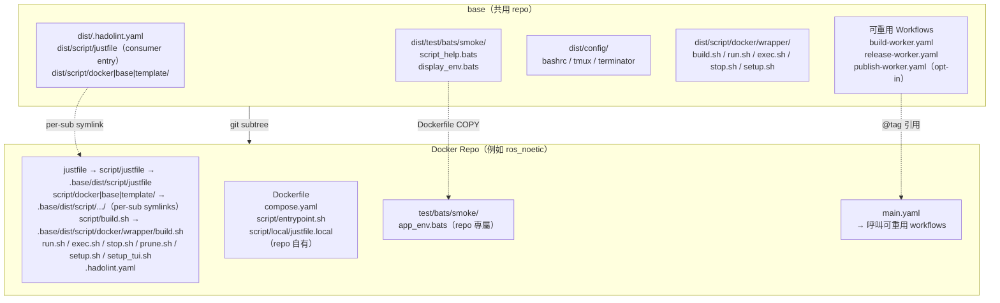
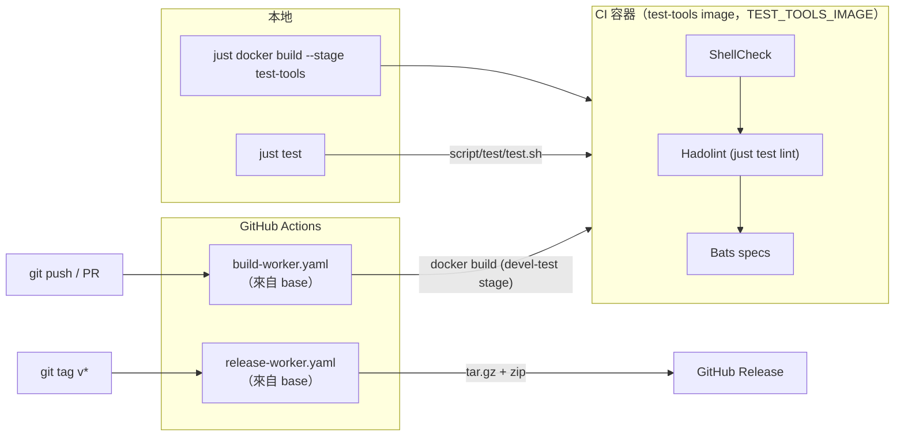

<!-- sync: base e5eb312a5446 90ec11665567 -->
# base

[](https://github.com/ycpss91255-docker/base/actions/workflows/self-test.yaml)


[](../../LICENSE)

[ycpss91255-docker](https://github.com/ycpss91255-docker) 組織下所有 Docker 容器 repo 的共用模板。

**[English](../../README.md)** | **[繁體中文](README.zh-TW.md)** | **[简体中文](README.zh-CN.md)** | **[日本語](README.ja.md)**

---

<!-- sync: table-of-contents e989d6153818 da5d6707c0b1 -->
## 目錄

- [TL;DR](#tldr)
- [必要條件](#必要條件)
- [概述](#概述)
- [快速開始](#快速開始)
- [CI Reusable Workflows](#ci-reusable-workflows)
- [本地執行測試](#本地執行測試)
- [測試](#測試)
- [目錄結構](#目錄結構)

---

<!-- sync: tldr b4f9c41522da 4c6cd6c3ddd0 -->
## TL;DR

```bash
# 從零開始的新 repo：首個 commit + subtree + 一次性 bootstrap
mkdir <repo_name> && cd <repo_name>
git init
git commit --allow-empty -m "chore: initial commit"
git subtree add --prefix=.base \
    https://github.com/ycpss91255-docker/base.git vX.Y.Z --squash
./.base/dist/script/base/init.sh   # 一次性 bootstrap；之後用 just base init

# 升級到最新版
just base update   # 檢查
just base upgrade         # pull + 更新版本檔 + workflow tag

# 執行 CI
just test   # ShellCheck + Bats + Kcov
just                       # 列出所有 recipe
```

<!-- sync: prerequisites 71356c1216b6 3c7cd6c4b7f2 -->
## 必要條件

容器操作透過 [`just`](https://github.com/casey/just)（command runner）搭配
Docker 執行。使用 `just <verb>` 入口前，請先在 host 安裝兩者：

- **Docker** + Docker Compose v2（`docker compose`）。
- **just** -- 任何近期版本皆可（recipe 僅用到 variadic 參數，早期版本即支援）。
  透過套件管理器或官方安裝程式安裝：

  ```bash
  apt install just         # Debian 13+ / Ubuntu 24.04+
  brew install just        # macOS / Linuxbrew
  cargo install just       # 從 crates.io
  # 或官方預編譯 binary 安裝程式：
  curl --proto '=https' --tlsv1.2 -sSf https://just.systems/install.sh \
      | bash -s -- --to ~/.local/bin
  ```

  完整方式見[官方安裝指南](https://github.com/casey/just#installation)。若
  `just` 不可用，每個 recipe 都有 raw fallback（`./script/<verb>.sh`、
  `./.base/dist/script/base/upgrade.sh`）-- 見[快速開始](#快速開始)。

<!-- sync: overview 435906a68746 387314a6a639 -->
## 概述

此 repo 集中管理所有 Docker 容器 repo 共用的腳本、測試和 CI workflow。各 repo 透過 **git subtree** 拉入此模板，並使用 symlink 引用共用檔案。

<!-- sync: architecture 2660c8dea634 54ad1436ee10 -->
### 架構



<!-- sync: cicd-flow 5bd0f36f76ac c42a240330dc -->
### CI/CD 流程



<!-- sync: whats-included 68cb068c2b9f de3d03adc7b5 -->
### 包含內容

| 檔案 | 說明 |
|------|------|
| `build.sh` | 建置容器（`--setup` 有 TTY 時啟動 `setup_tui.sh`，否則呼叫 `setup.sh`） |
| `run.sh` | 執行容器（支援 X11/Wayland；`--setup` 語意與 `build.sh` 相同） |
| `exec.sh` | 進入執行中的容器 |
| `stop.sh` | 停止並移除容器 |
| `prune.sh` | 清理容器 / image / build cache |
| `setup_tui.sh` | 互動式 setup.conf 編輯器（dialog / whiptail 前端） |
| `dist/script/docker/wrapper/setup.sh` | 自動偵測系統參數並產生 `.env` + `compose.yaml` |
| `dist/script/docker/lib/_lib.sh` | 共用 helper（`_load_env`、`_compose`、`_compose_project` 等） |
| `dist/script/docker/lib/bootstrap.sh` | wrapper 共用初始化與參數解析 |
| `dist/script/docker/lib/compose.sh` | Docker Compose YAML 產生與處理 |
| `dist/script/docker/lib/conf.sh` | INI 解析器與 section 合併 |
| `dist/script/docker/lib/conf_logging.sh` | logging 配置 helper |
| `dist/script/docker/lib/env.sh` | 環境變數設定與預設值 |
| `dist/script/docker/lib/gitignore.sh` | gitignore 檔案管理 |
| `dist/script/docker/lib/hook.sh` | 各 wrapper 的 pre/post hook 呼叫 |
| `dist/script/docker/lib/i18n.sh` | 語言偵測與在地化 |
| `dist/script/docker/lib/log.sh` | 統一 logging 與輸出工具 |
| `dist/script/docker/lib/config_summary.sh` | runtime 配置摘要 |
| `dist/script/docker/lib/_tui_backend.sh` | TUI 使用的 dialog / whiptail 包裝函式 |
| `dist/script/docker/lib/_tui_conf.sh` | TUI 的 INI validator + 讀寫 |
| `dist/script/docker/runtime/logging.sh` | host 端 log tee helper（per-start 檔案 + 穩定 symlink） |
| `dist/script/docker/runtime/logrotate.sh` | 共用 rotate/symlink/prune primitives（tee + transcript 共用） |
| `dist/script/docker/runtime/smoke.sh` | runtime install-check smoke |
| `dist/script/docker/runtime/entrypoint.sh` | template entrypoint helper |
| `script/test/test.sh` | base 自身測試 dispatcher（本地 + 容器內） |
| `script/test/drivers/` | 每個工具一支 driver — `bats.sh` / `shellcheck.sh` / `hadolint.sh` |
| `script/test/lint_bare_stderr.sh` | Bare stderr lint 檢查 |
| `config/` | Container 內部 shell 設定檔（bashrc、tmux、terminator、pip） |
| `setup.conf` | 單一 per-repo runtime 配置（image / build / deploy / gui / network / volumes） |
| `dist/test/bats/smoke/` | 共用 smoke 測試 + runtime assertion helpers（見下方） |
| `test/bats/unit/` | base 自身測試，unit（bats + kcov） |
| `test/bats/integration/` | base 自身測試，init/upgrade 端對端 |
| `test/bats/system/` | base 自身測試，System 層／Regression（runtime smoke gate，opt-in） |
| `test/bats/acceptance/` | base 自身測試，Acceptance 層（UAT/OAT；保留，S5 #785） |

測試內容採 **tool-first** 配置 -- spec 走 `test/<tool>/<category>/`
（例如 `test/bats/unit/`）、linter 走 `test/lint/<tool>/` --
新增一個工具就是開一個新資料夾，而非新增一個指令面。見
[ADR-00000012](../adr/00000012-tool-first-test-layout.md)（取代 category-first
的 ADR-00000004）。consumer 出貨自己的 `test/bats/smoke/`；base 出貨自己的
`test/bats/{unit,integration,system,acceptance}/`。

| `.hadolint.yaml` | 共用 Hadolint 規則 |
| `justfile`（→ `script/justfile`） | Repo 指令入口 — 分層 namespace recipe（`just docker build`、`just docker run`、`just test`、`just base upgrade` 等）。Sub-cmd 與 flag 透過 `{{args}}` 直接傳遞（`just docker build --no-cache --stage test-tools`）；無參的 `just` 列出所有 namespace。 |
| `dist/script/docker/justfile.docker` | `docker` namespace — 容器操作（`just docker build/run/exec/stop/prune/setup/setup-tui`）。 |
| `dist/script/base/justfile.base` | `base` namespace — 管理 `.base` subtree（`just base init/update/upgrade/completions`）。 |
| `dist/script/base/init.sh` | 首次初始化 symlinks + 新 repo 骨架產生（bootstrap：`./.base/dist/script/base/init.sh`；之後改用 `just base init`）。 |
| `dist/script/base/upgrade.sh` | Subtree 版本升級（`just base upgrade [vX.Y.Z]`）。 |
| `script/test/justfile.test` | base 自身測試入口（`just test`、`just test lint`、`just test coverage` …）。 |
| `script/release/justfile.release` | base `release` namespace（release / publish 工具）。 |
| `dist/dockerfile/Dockerfile` | 新 repo 的多階段 Dockerfile 範本 |
| `dockerfile/Dockerfile.test-tools` | 預建置 lint/test 工具 image（shellcheck、hadolint、bats、bats-mock） |
| `.github/workflows/` | 可重用 CI workflows（build + release） |

<!-- sync: dockerfile-stages-convention cfa1ef92737a 610a26e2f7b8 -->
### Dockerfile 分層（慣例）

下游 repo 遵循標準多階段配置，定義於 `dist/dockerfile/Dockerfile`。
所有階段共用 `ARG BASE_IMAGE` 指定的基礎映像。

| 階段 | 父階段 | 用途 | 是否出貨 |
|------|--------|------|---------|
| `sys` | `${BASE_IMAGE}` | 使用者/群組、sudo、時區、語系、APT mirror | 中介 |
| `devel-base` | `sys` | 開發工具與語言套件 | 中介 |
| `devel` | `devel-base` | 應用專屬工具 + `entrypoint.sh` + config layering | **是**（主要產物） |
| `devel-test` | `devel` | 短暫：ShellCheck + Hadolint + Bats smoke（均來自 `test-tools:local`） | 否（build 完即丟） |
| `runtime-base`（選用） | `sys` | 最小 runtime 相依（sudo、tini） | 中介 |
| `runtime`（選用） | `runtime-base` | 精簡 runtime 映像（只含 install artifacts） | 啟用時出貨 |
| `runtime-test`（選用） | `runtime` | 短暫：runtime install-check smoke | 否（build 完即丟） |

說明：
- 只出貨 developer image 的 repo（`env/*`）會跳過 `runtime-base` /
  `runtime`——該 section 在 `Dockerfile` 維持註解狀態。
- `devel-test` 永遠從 `devel` 繼承，所以 `test/bats/smoke/<repo>_env.bats` 裡的
  runtime assertion 所看到的二進位與檔案，就是使用者 `docker run ...
  <repo>:devel` 後會看到的內容。
- `Dockerfile.test-tools` 建置 lint/test 工具集（bats + shellcheck + hadolint）。下游 `devel-test` 階段透過 `ARG TEST_TOOLS_IMAGE` build arg 引用 — 預設 `test-tools:local`（對應本地 `./build.sh` 流程,把 `Dockerfile.test-tools` 建到 host Docker daemon）。CI 則覆寫成 `ghcr.io/ycpss91255-docker/test-tools:vX.Y.Z`（由 `.github/workflows/release-test-tools.yaml` 在每次 tag 推的預建 multi-arch image）,buildx 直接從 registry 拉對應架構的 bats / shellcheck / hadolint binary,避開 `docker-container` buildx driver 跨 step 不共享 image store 的問題。

<!-- sync: baked-artifacts-live-at-opt-not-home eb898d65e2e1 c521f31251e6 -->
#### 自建產物放在 `/opt`，不要放 `$HOME`

容器使用者是在 **build** 時期烘進 image 的：`sys` 階段吃
`USER_NAME` / `USER_UID` / `USER_GID` build arg，`devel` 接著設定
`ENV HOME="/home/${USER_NAME}"`。`just build` 注入本機 host 的使用者，
CI 與 release 路徑則烘 `user`（UID 1000）——所以同一個 commit 建出來的兩個
image，`$HOME` 可能不一樣。

因此凡是 image 烘在 **`$HOME` 底下** 的東西，都與 build 時期的使用者名稱綁死，
而且只有在部署時才會爆：用不同 `USER_NAME` 跑預建 / GHCR /
`docker save`+`load` 的 image（或用不同 `USER_NAME` 重建），每個相對於 home 的
路徑就指到另一個**空的** `/home/<other>/...`。烘好的 workspace 看不見，
`source ~/some_ws/install/setup.bash` 直接失敗。絕對路徑 `/opt/...` 則免疫 ——
根本沒有 `$HOME` 這層間接。

這個慣例寫在你會實際打開的那份 `Dockerfile` 裡：

1. 自建產物（colcon workspace、SDK、自行編譯的工具）安裝到絕對路徑
   `/opt/<name>`。`$HOME` 只留給 dotfile 與方便用的 symlink。
2. entrypoint / bashrc 一律 source **絕對路徑**，不要用 `~` 或 `$HOME`。
   在 per-user `RUN` 區塊建立 `~/<name> -> /opt/<name>` symlink 是鼓勵的
   （方便互動時尋找），但任何東西都不可以去 *source* 它。
3. 路徑裡永遠不要寫死具體使用者名稱 —— 用 `${HOME}` / `${USER_NAME}`。

第 3 條是機械式規則，因此有 gate：`home-literal` lint
（`just test lint --home-literal`，CI job `lint-static (home-literal)`）會在
`dist/` 或 `dockerfile/` 底下任何 home 路徑出現具體使用者名稱時失敗。
第 1、2 條屬於判斷題，grep 判不出來。設計理由見
[ADR-00000024](../adr/00000024-bake-artifacts-at-opt-not-home.md)。

<!-- sync: adding-extra-stages-215 2da5b4c5cc6a fcbff20c6669 -->
#### 新增額外 stage（#215）

任何在 baseline blocklist `{sys, devel-base, devel, runtime-test}`
之外的（v0.21.x 過渡期同時接受舊名 `{base, test}`）
`FROM <base> AS <stage>`，會被自動 emit 成一個 compose 服務 —
`extends: devel`（繼承 volumes / network / GPU / GUI / cap_add /
additional_contexts），只 override `build.target` / `image` /
`container_name` / `stdin_open` / `tty` / `profiles`。典型用例是
entrypoint 變體，如 NVIDIA Isaac Sim 在 `devel` 之上的
`headless` + `gui` 兩種啟動模式。

User 操作流程：

```dockerfile
# Dockerfile 加新 stage（不用動 setup.conf）
FROM devel AS headless
ENTRYPOINT ["/isaac-sim/runheadless.sh"]
CMD ["-v"]

FROM devel AS gui
ENTRYPOINT ["/isaac-sim/runapp.sh"]
```

```bash
just docker build                            # 重新產 compose.yaml，build 所有 stages
just docker run -t headless                  # 跑 headless 變體
just docker run -t gui                       # 跑 gui 變體
just docker exec -t headless bash            # 進入 running 的 headless container

# Kit 風格的 `=` 參數可直接傳遞：
just docker exec -t headless-stream /isaac-sim/runheadless.sh -v --/app/livestream/port=49100

# 等效直接 .sh 寫法：
./build.sh
./run.sh -t headless
./exec.sh -t headless bash
```

限制：

- Stage 名必須符合 `^[a-z][a-z0-9_-]*$` — 大寫 / 數字開頭 / 點號
  等會被拒（WARN + 跳過，其他 stage 繼續解析）。
- 撞到 baseline `{sys, devel-base, devel, runtime-test}`（v0.21.x
  過渡期亦同時接受舊名 `{base, test}`）時，`setup.sh apply` hard error
  退出 1。撞到 template 控制的 image tag namespace（`latest`、
  `v[0-9]*`）也是 hard error。`devel-test` **不在**該集合裡，也**不算**
  撞名 — 它會透過 per-stage 模型 emit 成 `test` service（#493），這正是
  `[stage:devel-test]` 有 runtime 控制面的原因。
- 加 / 移 stage 會觸發 `setup.sh check-drift`（透過 `.env.generated` 內的
  `SETUP_DOCKERFILE_HASH`），下次 wrapper 跑會自動 regen
  `compose.yaml`。其他 `RUN apt-get install` 等修改**不會**觸發 drift。

<!-- sync: per-stage-setupconf-overrides-220 a5064ca6a91f f41367af636b -->
#### Per-stage `setup.conf` overrides（#220）

#215 auto-emit 出來的 stage 預設共用 devel 的 runtime 設定
（volumes / GPU / network / GUI）。當某 stage 需要不同的 runtime
設定 — 例如 NVIDIA Isaac Sim 的 `headless` 跑 WebRTC livestream
要 `network=bridge` + 一個 port mapping + `gui=off`，但 `devel`
跟 `gui` 維持 `network=host` + X11 — 在 repo 的 `setup.conf` 加上
`[stage:<name>]` section：

```ini
[gui]
mode = auto

[network]
mode = host

[stage:headless]
gui.mode = off
network.mode = bridge
network.port_1 = 8080:80
deploy.gpu_capabilities = gpu compute utility graphics video
```

也可以用 `./setup_tui.sh` 走互動式編輯：

- **Advanced → Per-stage overrides**：直接進編輯器；該 entry 只在
  Dockerfile 有至少一個非 baseline stage 時才會出現。
- **Features → Per-stage overrides**（#221）：永久可見的功能總覽
  入口；條件已滿足時點下去等同上述 Advanced 路徑，未滿足時會跳
  msgbox 說明如何啟用。

允許 override 的 key（v1）：

| Section | Keys |
|---|---|
| `[deploy]` | `gpu_mode`, `gpu_count`, `gpu_capabilities`, `gpu_runtime`（舊名 `runtime` 仍接受） |
| `[gui]` | `mode` |
| `[network]` | `mode`, `ipc`, `pid`, `network_name`, `port_<N>`, `port_inherit` |
| `[security]` | `privileged`, `cap_add_<N>`, `cap_add_inherit`, `cap_drop_<N>`, `cap_drop_inherit`, `security_opt_<N>`, `security_opt_inherit` |
| `[volumes]` | `mount_<N>`, `mount_inherit` |
| `[environment]` | `env_<N>`, `env_inherit` |

List 欄位（`mount_*` / `port_*` / `env_*` / `cap_add_*` / `cap_drop_*` /
`security_opt_*`）採 **append-default**：stage 的項目附加在 top-level
之後。要完全取代 top-level，設 `<list>_inherit = false`（例：
`volumes.mount_inherit = false`，或 `security.cap_add_inherit = false`
清掉某 stage 繼承的 caps —— #526：唯讀 probe stage 可清掉 flash stage
的 `SYS_ADMIN`）。

注意事項：

- `[stage:devel]` 是**保留**的 (v1 no-op + WARN)。要調 devel 直接
  改 top-level section。v2 會重新評估。
- `[stage:sys|base|test]` 是 **hard error**（baseline collision）。
- `[stage:foo]` 對應的 stage 在 Dockerfile 不存在 → **WARN + 跳過**
  （`setup.sh apply` 其他流程繼續）。
- 不在 allowlist 內的 override key → **WARN + 跳過該 key**。

<!-- sync: smoke-test-helpers-for-downstream-repos 86bd640f4dd5 b4e9d59f54b6 -->
### Smoke test helpers（供下游 repo 使用）

`test/bats/smoke/test_helper.bash`（每個 smoke spec 透過
`load "${BATS_TEST_DIRNAME}/test_helper"` 載入）提供一組 runtime
assertion helpers。下游 repo 應優先使用這些 helper 而非原生的
`[ -f ... ]` / `command -v`，失敗時會輸出 decorated 診斷訊息直指缺少
的工件。

| Helper | 用法 |
|--------|------|
| `assert_cmd_installed <cmd>` | `<cmd>` 不在 `PATH` 上時失敗 |
| `assert_cmd_runs <cmd> [flag]` | `<cmd> <flag>` 非 0 時失敗（flag 預設 `--version`） |
| `assert_file_exists <path>` | `<path>` 非 regular file 時失敗 |
| `assert_dir_exists <path>` | `<path>` 非目錄時失敗 |
| `assert_file_owned_by <user> <path>` | `<path>` 擁有者不是 `<user>` 時失敗 |
| `assert_pip_pkg <pkg>` | `pip show <pkg>` 非 0 時失敗 |

<!-- sync: what-stays-in-each-repo-not-shared 5cff28619497 07c60b45f9cf -->
### 各 repo 自行維護的檔案（不共用）

- `Dockerfile`
- `compose.yaml`
- `script/` — repo 本地的 **runtime helpers**（在 container 內被 `ENTRYPOINT` / `CMD` 或人工呼叫）
  - `script/entrypoint.sh`（canonical）
  - 任何 ros / app 啟動 helper 等
- `script/docker/` — repo 本地的 **Dockerfile-internal build helpers**（在 Dockerfile `RUN` 階段呼叫，container 啟動後不會用到；範例與 lint COPY 見 `dist/dockerfile/Dockerfile`，#275）
- `doc/` 和 `README.md`
- Repo 專屬的 smoke test

<!-- sync: per-repo-runtime-configuration b02fd5d770dc 4b475751dbdc -->
## 各 repo runtime 配置

每個下游 repo 透過一個 `setup.conf` INI 檔驅動自己的 runtime 配置
（GPU 保留、GUI env/volumes、network mode、額外 volume mounts）。
`setup.sh` 讀它 + 系統偵測後重新產生 `.env.generated` 跟 `compose.yaml`，
這兩個衍生檔使用者不用動手編輯。手寫的 `.env` overlay 是另一個檔：
setup 只在第一次 scaffold，之後永不覆寫。

<!-- sync: one-conf-15-sections 825dbace1f47 cecd57d45ac6 -->
### 單一 conf、15 個 section

下面這份 section 清單不是散文，而是 `SCHEMA_SECTIONS`
（`dist/script/docker/lib/schema.sh`）— 「有哪些 section、順序為何」的唯一
來源。這個區塊或它的數量一旦與程式碼不一致，`derived-figures` lint 會失敗。

```
[project]  name — 這個 checkout 執行時所屬的 compose project（留空 =
           推導出 <DOCKER_HUB_USER>-<IMAGE_NAME>）。想同時跑兩個
           checkout，就在 .setup.conf.local 依 WORKTREE 各自設定
[image]    rules = prefix:docker_, suffix:_ws, @default:unknown
[build]    apt_mirror_ubuntu、apt_mirror_debian            # Dockerfile build args
[deploy]   gpu_mode (auto|force|off)、gpu_count、gpu_capabilities
           dri_groups (auto|off) — GUI service 上 iGPU /dev/dri 的 group_add
[lifecycle] restart (no|always|unless-stopped|on-failure|on-failure:N)
           預設 unless-stopped;屬於 DEPLOY 範疇 — 只 emit 在 deployable
           stage 的 service 上，devel 與任何 *-test stage 由 emitter 清空，
           因此 devel 上不會有 restart: 讓 extends:devel 繼承。詳見英文版
           README 的「Restart policy is deploy-scoped」。
           init (true|false) — Docker init/PID1 reaper;預設 true。
           watchdog_* — 容器內健康檢查（opt-in）
[gui]      mode (auto|force|off)
[network]  mode (host|bridge|none)、ipc、pid (host|private)、privileged
           port_N = host:container（只有 bridge 模式才會 publish）
[security] privileged（false）、cap_add_N、cap_drop_N、security_opt_N
           （以及對應的 *_inherit 開關;預設精簡，要用才開）
[resources] shm_size
[environment] env_N = KEY=VALUE — set-once 預設值，會 bake 成 deployable
           stage 的 ENV;每次任務都會變的變數請放 .env
[tmpfs]    tmpfs_N = /path[:size=N] — RAM-backed 掛載點
[devices]  device_N = host:container，以及 cgroup rule（要用才開）
[volumes]  mount_1（workspace，首次執行時自動填入）
           mount_2..mount_N（額外 host mount；裝置走 /dev path）
[additional_contexts] context_N = name=source — 額外的具名 build context
[logging]  driver（預設 json-file）、max_size、max_file、compress
           local_path（host 端 log 目錄；bind-mount 到 /var/log/<repo>）
           container_log_keep (20)、container_log_days (14)（每次啟動的
           容器 log 保留策略；keep-count 與 age 兩者取嚴）
           wrapper_transcript（把 verb 輸出 tee 到 log/<verb>/；預設 true）、
           wrapper_transcript_keep (20)、wrapper_transcript_days (14)
           [logging.<svc>] 可對單一 service 做 key-level override
```

Template default 在 `.base/dist/.setup.conf`；per-repo 覆蓋放 repo 根目錄的
dotfile `<repo>/.setup.conf`（由 `just setup` 工具管理，刻意不放進手動編輯的
`config/` 介面）。Section-level **replace** 策略：上層若有該 section 就整段
取代下層；沒寫的 section 則往下層落。

<!-- sync: three-layers-the-third-is-yours-setupconflocal d6b292a21a41 b1af7735fce9 -->
#### 三層設定，第三層是你的（`.setup.conf.local`）

| 層 | 是否進版控 | 屬於誰 |
|---|---|---|
| `.base/dist/.setup.conf` | 隨 subtree 出貨 | base 的預設 |
| `<repo>/.setup.conf` | 已 commit | repo 的 —— CI 與其他所有 checkout 用的就是它 |
| `<repo>/.setup.conf.local` | **gitignored** | 你的，只在這台機器、這個 worktree |

三層共用同一套語法、同一條 section-replace 規則。第三層用 `--local` 寫：

```bash
./setup.sh set --local project.name myrepo-wt2
```

為什麼是整段取代而不是逐鍵合併：上面的 section 有八個是 `<prefix>_N` 有序
清單。只覆蓋 `port_2` 會把兩層拼成同一份有序清單，你永遠無法「移除」某一
項，要新增又得知道你看不到的那層目前最大的 `N`。相關鍵之間也互相制約
（`[network] mode` 決定 `port_N` 會不會被 emit），半套覆蓋會產生哪一層都
沒寫過的組合。

由此衍生三件事，而且全都會出聲、不會默默發生：

- `.setup.conf.local` 已定義某 section 時，用一般的 `set` 寫該 section 會
  **警告**並指名該 section。不會拒絕 —— 那個值仍然是 CI 與其他 checkout
  會用的 committed 值 —— 但它在這台機器上不會有任何效果。
- 每個 wrapper 執行前的摘要都會多一行 `local override:`，列出檔案與被它
  取代的 section。
- `just docker setup deploy` 只要該檔存在就**拒絕執行**（見
  [Field 部署](#field-部署just-docker-setup-deploy)）。

<!-- sync: running-two-worktrees-at-once efccbe6e6686 88a06015d35f -->
#### 同時跑兩個 worktree

每個 checkout 都在某個 compose project name 底下執行，它建立的一切
—— container、network、volume —— 都以此命名。兩個 checkout 若解析出同一個
名字就會撞在一起：第二次 `run` 會直接沿用第一個的 container。

`[project] name` 就是這個名字。它出貨時是**空的**，意思是「照舊推導
`<DOCKER_HUB_USER>-<IMAGE_NAME>`」，所以在你設定之前什麼都不會變。請設在
*local* 那層，因為 per-worktree 的名字是你的、不是 repo 的：

```bash
cd ~/work/myrepo-wt2
./setup.sh set --local project.name myrepo-wt2
just build            # 重新產生；兩個 worktree 從此可並行
```

這個值只解析一次，寫進 `.env.generated` 的 `PROJECT_NAME`，兩邊都從那裡讀：
wrapper 的 `docker compose -p`，以及產生出來的 `compose.yaml` 裡的
`name: ${PROJECT_NAME}`（所以 `lazydocker`、`docker compose ps` 和 IDE 面板
看到的會跟 wrapper 一致）。值的規則：小寫英文字母、數字、`-`、`_`，開頭必須
是字母或數字 —— 就是 docker compose 自己的規則。

改這個值**不會**動到 image tag。那是 `[image]` / `DOCKER_HUB_USER`，刻意分
成兩個軸：一次執行擁有哪些 container、和它 build 出哪個 image，是兩個問題。

**權限預設關閉、要用才開**（#466）：template 出貨的 `[security]`
（`privileged = false`，沒有 `cap_add` / `security_opt`）與 `[devices]`
（沒有 `/dev:/dev`）都是精簡預設，讓輕量 repo 和工具 stage 保持乾淨。容器
需要什麼就開什麼：走 `setup_tui.sh`（security / devices 頁）、
`setup.sh add security.cap_add SYS_ADMIN`，或把 template 裡的範例取消註解。

首次執行 `setup.sh`（尚無 per-repo setup.conf）時，template 檔會被
複製到 repo，並把偵測到的 workspace 寫入 `[volumes] mount_1`。後續
執行以 `mount_1` 為真實來源 — 清空該欄即可放棄掛 workspace。編輯方式：

```bash
./setup_tui.sh                      # 互動式 dialog/whiptail 編輯器
./setup_tui.sh volumes              # 直接跳到指定 section
./build.sh --setup            # 有 TTY 時啟動 setup_tui.sh；無 TTY 時執行 setup.sh
./.base/dist/script/base/init.sh --gen-conf # 單純複製 .base/dist/.setup.conf 到 <repo>/.setup.conf
```

<!-- sync: logging-output-to-host df27d24459b2 8c949a8dc246 -->
### 輸出 log 到 host

設 `[logging] local_path`，容器 stdout/stderr 會 tee 一份到 host 上的
檔案，docker daemon 原本的 json-file log 同時保留：

```ini
[logging]
local_path = ./log/     # 相對 repo 根；或 /abs/、~/dir/ 也可
container_log_keep = 20  # 最多保留 N 份最近的 per-start 檔
container_log_days = 14  # 且丟掉超過 D 天的檔案（兩者取嚴）
```

跑任何 wrapper 重新產 `compose.yaml`。每次容器啟動，tee 會寫一份
per-start 檔 `<local_path>/<svc>_<ts>.log`，並把穩定的 symlink
`<local_path>/<svc>.log` 重新指向它（glog 風格）：`tail <svc>.log`
永遠看得到當前這次執行，先前幾次則留在磁碟上。舊的 per-start 檔
依 `container_log_keep`（保留最近幾份）與 `container_log_days`
（保留幾天）兩者取嚴清掉，symlink 本身不會被清。`docker logs <ct>`
行為不變（json-file 維持 rolling 歷史）。

**新 repo**：用本版本之後的 `init.sh` 產生時，`script/entrypoint.sh`
已內建 helper source，設 `[logging] local_path` 是唯一一步。
**既有 repo**：在 `script/entrypoint.sh` 的最終 `exec` 之前加一行做
一次性遷移：

```bash
. /usr/local/lib/base/logging.sh
```

Helper 由 `Dockerfile` 的 devel stage COPY 到 image 內穩定路徑
`/usr/local/lib/base/logging.sh`（refs #368），連同它的 `logrotate.sh`
兄弟檔（refs #805），所以這條 source line 在 build-time 與 runtime、
各種 workspace 結構下都能 work — 不需要 `$USER`，也不依賴 workspace
bind mount。

疑難排解：`local_path` 設了但 host 檔案沒東西 → 確認
`script/entrypoint.sh` 真的有那行 source
（`grep logging.sh script/entrypoint.sh`）。

<!-- sync: interactive-tui 23df6f6f09ab 4cef5048d56e -->
### 互動式 TUI

`./setup_tui.sh` 開啟主選單。底層是 `dialog` 或 `whiptail`（兩者都
缺時會印出 `sudo apt install dialog` 提示並退出）。按 Cancel / Esc
不存檔離開；存檔後會自動呼叫 `setup.sh` 重新產生 `.env.generated` +
`compose.yaml`。

`./setup_tui.sh <SECTION>` 可直接跳到某個編輯器。`[deploy]` section 只設定
GPU 保留 —— 名稱沿用 Compose 的 `deploy:` key，和會打包 field bundle 的
`./setup.sh deploy` 無關。因此本編輯器沒有歧義的名稱是 `gpu`
（`just docker setup-tui gpu`）；`deploy` 仍可用，並會先跳出說明是哪一個。

主選單結構（#221）：

```
Main
├─ image            IMAGE_NAME 偵測規則
├─ build            APT mirrors + Dockerfile build args
├─ Runtime  ──→     network / deploy（GPU）/ gui / environment / logging
├─ Mounts   ──→     volumes / devices / tmpfs
├─ Advanced ──→     security / additional_contexts
│                   / per_stage（條件式）/ Reset
├─ Features         條件式 / 進階使用功能總覽（含 per_stage 狀態）
└─ Save & Exit
```

`./setup_tui.sh <section>` 仍可直接跳到任意 section 的編輯器
（如 `./setup_tui.sh volumes`），不必走主選單。

<!-- sync: when-setupsh-runs 78e1acddfeef 30955bffa90f -->
### setup.sh 什麼時候跑

`setup.sh` 只在明確觸發時才執行 — 並不會在每次 build / run 都重跑：

- **`just base init` / `./.base/dist/script/base/init.sh`** 建完骨架自動跑一次
- **`just base upgrade` / `./.base/dist/script/base/upgrade.sh`** subtree pull 後透過 init.sh
  再跑一次，所以升級永遠會用新版 baseline 重新產出 `.env` / `compose.yaml`
- **`./build.sh --setup` / `./run.sh --setup`**（或 `-s`）— 使用者手動觸發重跑；
  有 TTY 時先啟動 `setup_tui.sh` 讓使用者修改 `setup.conf`，無 TTY 時直接呼叫 `setup.sh`
- **首次 bootstrap**：`./build.sh` / `./run.sh` 首次執行（`.env` 尚未存在，
  例如 CI 新 clone）會自動走相同的 TTY-aware 流程，不用帶 `--setup`

> **Fresh-clone lint 覆蓋率（#216）**：`./run.sh` 在本機沒 image
> cached 時會走 Compose auto-build — 但 auto-build **只 build
> `target: devel`**（或 `-t` 指定的 target），會跳過 `target:
> devel-test`（pre-#243 該 stage 名為 `test`）那層的 ShellCheck /
> Hadolint / Bats smoke。`run.sh` 偵測到這個情況
> 會在 `compose up` 前印一段 `[run] INFO:` 提醒（只在 TTY 環境）。
> 想要一次取得跟 CI 同樣的完整驗證，加 `--build` flag：
>
> ```bash
> just docker build test                   # 顯式跑 lint + smoke
> just docker run --build                  # 跑完 lint + smoke 再 compose up
> just docker run                          # 預設 — 快速路徑，跳過 lint/smoke
> ```

`setup.sh apply` 每次都會從頭重生 `compose.yaml`，但會保留既有 `.env`
中的 `WS_PATH` / `APT_MIRROR_UBUNTU` / `APT_MIRROR_DEBIAN`，所以手動調過
的 workspace 路徑或 apt mirror 升級時不會被蓋掉。

<!-- sync: drift-detection 25d3585b5c5f 0cd42faea2ed -->
### Drift 偵測

`setup.sh` 把 `SETUP_CONF_HASH`、`SETUP_GUI_DETECTED`、`SETUP_TIMESTAMP`
寫到 `.env`。每次 `./build.sh` / `./run.sh` 進入時會比對 `setup.conf`
當前 hash + 系統偵測值，以下任一項改變時印 `[WARNING]`（但不阻擋執行）：

- `setup.conf` 內容（conf hash）
- GPU / GUI 偵測結果
- `USER_UID`（使用者身份）

帶 `--setup` 重跑以重新產 `.env.generated` + `compose.yaml`。

<!-- sync: field-deployment-just-docker-setup-deploy 66110bfc975b 57181691d363 -->
### Field 部署（`just docker setup deploy`）

`just docker setup deploy`（或直接呼叫 `./setup.sh deploy`）用同一份 `setup.conf` 打包出自帶式的 field 部署**資料夾** —— 即上述路由模型的 deploy 半邊（[ADR-00000023](../adr/00000023-config-field-override-and-field-deploy-contract.md)，修訂 [ADR-00000003](../adr/00000003-env-vs-workload-param-boundary.md)；[PRD invariant 8](../PRD.md)）。它針對 *field 導向* 的 stage（預設 `runtime`；**絕不**是 `devel` 或任何 `*-test` stage），產出的資料夾帶齊目標主機需要的一切 —— field 主機不會看到 base 的工具鏈、原始碼樹或 `setup.conf`。

```bash
just docker setup deploy                      # 打包 runtime bundle（會先確認）
just docker setup deploy --stage runtime      # 顯式指定 field stage
just docker setup deploy --dry-run            # 只印 build plan，不實際 build
just docker setup deploy --stage runtime -y   # 跳過確認提示
just docker setup deploy -o /tmp/robot-bundle # 自訂輸出資料夾
```

Bundle 落在 `deploy/<repo>-<stage>-<version>/`（repo 根的 `deploy/` 資料夾已被 gitignore；`<version>` = `git describe --tags --always --dirty`，映像 tag 為 `<repo>:<stage>-<version>`，所以同一台主機載入多個 field 版本不會互撞）。內含：

| 檔案 | 是什麼 |
|---|---|
| `image.tar.xz` | `xz` 壓縮過的映像（`deploy.sh` 會 `docker load` 它） |
| `compose.yaml` | 完全解析、自帶式的 compose —— 全是字面值、**沒有 `${VAR}` 插值**（GUI stage 的 `${DISPLAY}` host passthrough 除外），不依賴 `setup.conf` / `.env`；帶 `restart: unless-stopped` |
| `config/` | 每個可由操作者調整之檔案的可編輯副本（見下） |
| `deploy.sh` | 輕薄的 `up` / `down` / `logs` 啟動器 |
| `README` | 給 field 操作者的說明 |

依序做這些事：

1. 把 `[environment]` 預設烤成映像的真 `ENV`（S3），有 `config/app/` 就 `COPY` 進映像（S4）—— 使 field 映像自帶（不帶 env 檔、不帶 config bind）；
2. `docker build --target <stage>` 出不可變映像，tag 為 `<repo>:<stage>-<version>`；
3. `docker save | xz` 成 `image.tar.xz`；
4. 寫出完全解析的 `compose.yaml`（與 `apply` 共用同一支 resolver，所以 field 永遠不會跟 dev 漂移）、`deploy.sh` 啟動器與 `README`，再把每個可調整檔案 baked 的預設抽出來放進 `config/`。

build 前會印出解析後的 `compose.yaml`，讓你逐項檢視每個解析後的參數再確認（`-y` 跳過；`--dry-run` 只印 plan 不 build；非互動 shell 未帶 `-y` 會拒絕）。

**只要 `<repo>/.setup.conf.local` 存在，它就直接拒絕。** 該檔是 gitignored 的，因此從乾淨 checkout 無法重現用它 build 出來的 bundle —— 而 bundle 本身不會有任何說明（[PRD invariant 8](../PRD.md)、[ADR-00000025](../adr/00000025-per-worktree-setup-conf-local-override.md)）。拒絕發生在預覽之前、任何 build 步驟之前，所以 `--dry-run` 也會回報。`--allow-local-override` 會照樣 build，並把取自那個未進版控檔案的 section 記進 bundle 自己的 `README` —— 因為在 field 執行這個 bundle 的人，不是當初決定繞過這道關卡的人。

**在 field 機器上** —— 把整個資料夾複製過去，再用 `deploy.sh` 啟動器操作（它會載入映像並驅動 `docker compose`；不用 `docker run`、不用 `setup.conf`、不用 base 工具鏈）：

```bash
cd <repo>-runtime-<version>
./deploy.sh up      # unxz | docker load 映像，再 docker compose up -d
./deploy.sh logs    # docker compose logs（加 -f 可跟隨）
./deploy.sh down    # docker compose down
```

`restart: unless-stopped` 表示主機重開機後容器會自動起來；要停掉請用 `./deploy.sh down`。

**在 field 調整設定（免 rebuild）**：元件在 committed 的 `config/<component>/deploy.manifest`（INI-lite，每個 stage 一個 section，各自列出容器內絕對路徑）宣告哪些容器內路徑允許 field 操作者重新調整。Bundle 會為每個宣告的檔案附上一份可編輯副本放在 `config/`，解析後的 `compose.yaml` 再把它 bind mount 蓋過映像裡 baked 的預設（**mount-wins**）。改完 `config/` 底下的檔案，重跑 `./deploy.sh up` 即可 —— 掛載的副本勝出，不用 rebuild。**沒有**宣告的路徑維持只有 baked 版本。映像必須在每個宣告的路徑都 bake 一份預設檔，否則 deploy 產生階段會明確報錯並給出可行的修法。

這些 bind **預設是唯讀（`:ro`）**：由操作者在 host 上編輯、容器只負責讀。要讓容器可寫，必須在路徑後面明確加上 `rw` flag，讓例外變成可 review 的資料而不是一律放行：

```ini
[runtime]
/etc/myapp/camera.yaml                  # 唯讀，預設值
/var/lib/myapp/calibration.yaml rw      # 這一個容器可以寫
```

路徑後面出現其他東西（打錯字、多一個 token）一律視為 manifest 格式錯誤，明確報錯並指出檔名與行號 —— 不會靜默略過，也不會靜默退回唯讀。預設不放寬的理由是：「操作者調整某個值」本來就不需要容器寫入，而可寫的 mount 會悄悄依賴容器 build 時 bake 的 user id 剛好等於在 field 主機解開 bundle 的人：讀都沒問題，寫則會在最要命的那台機器上失敗。改成唯讀後，這件事會在開發階段就立刻、明顯地失敗，同時把 user id 的問題限縮在真正宣告 `rw` 的那幾個路徑（見 [#870](https://github.com/ycpss91255-docker/base/issues/870)）。

workload 環境變數以 baked `ENV` 預設的形式隨映像走（GUI stage 另外會從 field 主機自己的 shell 讀 `${DISPLAY}` / `${XAUTHORITY}` 等）；dev 的 workspace bind 刻意捨棄（field 映像自帶程式碼）。`--group-add` 的 GID（iGPU `/dev/dri`）讀自生成主機，換到不同 field 機器可能需調整。

**持續部署（CD）**：deploy 工具只誠實標記、從不阻擋 —— 它會蓋上 `-dirty` / short-commit 的 `<version>`，所以任何樹狀態都能做 review 部署。自動化 CD 請先呼叫 base 出貨的 guard：`./.base/dist/deploy/cd-guard.sh` 在工作樹不乾淨**或** HEAD 不在 tag 上時會拒絕部署，確保出貨的 field bundle 永遠可以追溯到某個已發布版本。

<!-- sync: setupsh-subcommands-v0110 eb459a5fdd40 55cd1d0f2f63 -->
### setup.sh 子指令（v0.11.0+）

`setup.sh` 是 git 風格的後端，提供明確的子指令。build / run / TUI 腳本會代為呼叫；直接呼叫適合腳本化／非互動情境：

| 子指令 | 用途 |
|---|---|
| `apply` | 從 setup.conf + 系統偵測重新產生 `.env.generated` + `compose.yaml`（不會動手寫的 `.env` overlay） |
| `check-drift` | 同步回 0、漂移回 1（漂移描述印到 stderr） |
| `set <section>.<key> <value>` | 寫單一鍵值。`--local` 改寫 gitignored 的 `.setup.conf.local` 而非已 commit 的 `.setup.conf`；不加時，若寫的 section 已被 `.setup.conf.local` 定義會指名警告 |
| `show <section>[.<key>]` | 讀單鍵或整 section |
| `list [<section>]` | INI 風格 dump |
| `add <section>.<list> <value>` | 加到清單型 section（`mount_*` / `env_*` / `port_*` …）；優先填空 slot，否則用 `max+1`。可加 `--local` |
| `remove <section>.<key>` / `<section>.<list> <value>` | 按 key 或按值刪除。可加 `--local` |
| `reset [-y\|--yes]` | 回復 template 預設；舊 `.setup.conf` → `.setup.conf.bak`、舊 `.env` → `.env.bak` |
| `deploy [--stage S] [--output F] [--dry-run] [-y] [--allow-local-override]` | 打包自帶式的 field 部署**資料夾**（`image.tar.xz` + 完全解析的 `compose.yaml` + 可編輯的 `config/` + `up`/`down`/`logs` 的 `deploy.sh` + `README`），field stage `S` 預設 `runtime`（不可為 `devel` / `*-test`）；build 前先預覽解析後的 `compose.yaml` 並確認。`.setup.conf.local` 存在時會拒絕，除非加 `--allow-local-override`。見 [Field 部署](#field-部署just-docker-setup-deploy) |

有型別的鍵會走 `_tui_conf.sh` 的 validator（與 TUI 同一套）。`set` / `add` / `remove` / `reset` **不**會自動重新產 `.env.generated` — 需要時自行接 `apply`，或下次 `build.sh` / `run.sh` 偵測到 drift 也會自動重產。

<!-- sync: migration-from-v010x-breaking 6bd85945e2d2 c013bc32a064 -->
#### v0.10.x 升級（BREAKING）

`setup.sh`（無參數）與 `setup.sh --base-path X --lang Y`（無子指令）以前會 silently 走到 `apply`。v0.11.0 拿掉這個 fall-through：

| 呼叫方式 | v0.11 之前 | v0.11+ |
|---|---|---|
| `setup.sh` | 跑 apply | 印 help、exit 0 |
| `setup.sh --base-path X --lang Y` | 跑 apply | exit 1「Unknown subcommand」 |
| `setup.sh apply [...]` | 跑 apply | 跑 apply（不變） |

下游 repo 若有自定 script 直接呼叫 `setup.sh`，前面加 `apply`。template 內附的 `build.sh` / `run.sh` / `init.sh` / `setup_tui.sh` 都已更新。

<!-- sync: derived-artifacts-gitignored 9135501a7168 6ff308e6a65d -->
### 衍生檔（gitignored）

- `.env.generated` — runtime 變數（含解析後的 `PROJECT_NAME`）+ `SETUP_*` drift metadata
- `compose.yaml` — 含 baseline 與條件區塊的完整 compose

任何時候打開 `compose.yaml` 都能看到當下完整 runtime 配置。每次
`just base upgrade` 都會重生這兩個檔（init.sh 在 subtree pull 後重跑
`setup.sh apply`）— 不要手改，需要 override 寫到 `setup.conf`。

`.env` 一樣被 gitignore，但**不是**衍生檔：它是手寫的 workload overlay，
第一次 apply 時 scaffold 一次，之後永不覆寫。可以放心編輯，跑 setup 也
不會蓋掉。

`.setup.conf.local` 在上一層是同樣的形狀：gitignored、屬於你、工具永不改寫。
它是設定的*輸入*而不是產出 —— 見
[三層設定](#三層設定第三層是你的setupconflocal)。

<!-- sync: per-wrapper-hooks-440 3f5c5d24592f 84409436ca30 -->
### 每個 wrapper 的 pre/post hook（#440）

每個 wrapper（`run` / `build` / `exec` / `stop` / `prune` / `setup` /
`setup_tui`）會偵測下面這兩個可選的 repo-local script：

```
script/hooks/pre/<wrapper>.sh    # env 準備好後、主邏輯前
script/hooks/post/<wrapper>.sh   # 主邏輯後（run.sh 的話在 EXIT trap 內）
```

`init.sh` 自動建 14 個 executable stub（預設 `exit 0`），所以 hook
框架 out-of-the-box 直接可用。把 `exit 0` 換成你的 host-side 步驟
（例如 `multiarch/qemu-user-static` binfmt 註冊、mount 目錄建立、
硬體預檢）。Stub 對 upgrade 是 idempotent — pre-#440 的 template 跑
`just base upgrade` 後自動補齊 scaffolding。

**Contract：**

| 面向 | 行為 |
|---|---|
| 參數 | 跟 wrapper 收到的 `"$@"` 一樣 |
| 執行位置 | 主機（**不是** container 內） |
| `pre` 非零 | abort wrapper |
| `post` 非零 | override wrapper exit code；cleanup 照跑（run.sh） |
| 非 executable | hard fail + `chmod +x` 提示 |
| `--dry-run` | 兩個 hook 都 silent skip |

**範例 — jetson_sdk_manager binfmt 註冊：**

```bash
# script/hooks/pre/run.sh
#!/usr/bin/env bash
if [ ! -f /proc/sys/fs/binfmt_misc/qemu-aarch64 ]; then
  docker run --rm --privileged \
    multiarch/qemu-user-static --reset -p yes
fi
```

<!-- sync: naming-scheme-three-namespaces-two-user-identities 66fe689054d6 d28e58cf2c8d -->
### 命名規則：三個 namespace、兩個 user 身份

`setup.sh` 會在 `.env` / `compose.yaml` 產三個名稱。它們在單人開發
機上長得像，但實際分布在**三個獨立 namespace**，並取兩個**不同的
user 身份**做前綴。共用機器（多 OS user）的場景下這個差異會浮現；
個人開發機上兩個身份通常一致可不必細究。

| 名稱 | 格式 | Namespace | User 前綴 |
|---|---|---|---|
| `image:` | `${DOCKER_HUB_USER:-local}/<repo>:<tag>` | **Registry**（Docker Hub） | `DOCKER_HUB_USER` |
| `container_name:` | `${USER_NAME}-<repo>` | **本地 daemon**（同 docker daemon 內 flat 全域） | `USER_NAME`（OS user，refs #322） |
| compose project name | `${DOCKER_HUB_USER}-<repo>` | **本地 daemon**（影響預設 network / volume label） | `DOCKER_HUB_USER` |

- `DOCKER_HUB_USER` — 你的 Docker Hub 帳號，用來在 registry 端把
  image 加上命名空間。即使從未實際 push，image tag 仍透過這個
  identity 寫成 `<DOCKER_HUB_USER>/<repo>:<tag>`。
- `USER_NAME` — 主機 OS user（`id -un`），用來避免同台機器上不同
  OS user 在 daemon 的 flat container 命名空間互撞。

刻意把兩個身份分開。Image 用 Docker Hub 身份，因為 image 是會在
registry 上被定址的物件；若以 OS user 做前綴，buildx cache 與
Docker Hub layer 共用會直接破功。Container name 用 OS 身份，因為
這層解決的衝突（同 host 兩 user 同跑同 repo）是 daemon 端問題、
無 registry 牽涉。

Project name 用 `DOCKER_HUB_USER` 是 #322 之前就決定，未動：在
單人開發機上兩個身份重合，與 `container_name` 視覺上對齊；多人共
用機則因為 `DOCKER_HUB_USER` 通常也不同，所以 project name 一樣
能避開跨 user 衝突。`#322` 的 CHANGELOG 寫的「對齊 container-level
與 project-level naming」在「單人機」假設下成立 — 兩者都帶 user
前綴，差別只在「同一個 var 還是兩個 var」；多人機場景下兩個前綴
是不同字串。

base 是**單一 instance**（#600）：每個 repo 只有一組固定名字的
container / project。Multi-instance 編排（把同一個 repo 跑成 N 個
平行 container，各有獨立 project name 與 port override）屬於 compose
那一層，就像 `docker` 本身沒有 project 概念、`-p` 歸 `docker compose`
管一樣 — base 完全不碰 multi。

同一個 repo 的兩個 *checkout* 是另一個問題，而這個 base 有解：用
`.setup.conf.local` 的 `[project] name` 給每個 checkout 自己的
project name — 見[同時跑兩個 worktree](#同時跑兩個-worktree)。

範例。OS user `alice`，Docker Hub user `alice-hub`，repo
`claude_code`：

```
image:          alice-hub/claude_code:devel
container_name: alice-claude_code
project name:   alice-hub-claude_code
```

第二位 OS user `bob` 在同台機器：

```
image:          bob-hub/claude_code:devel          (不同 registry tag,無 cache 共用)
container_name: bob-claude_code
project name:   bob-hub-claude_code
```

若 `alice` 與 `bob` 共用同一個 `DOCKER_HUB_USER`（例如共用 CI
service 帳號），`image` 會在 Docker Hub 端撞名，但 `container_name`
仍能區隔 — registry pull 共用 cached image、host 內 daemon 仍
彼此隔離。

<!-- sync: quick-start 629a4900e292 a10e7022bfcd -->
## 快速開始

<!-- sync: adding-to-a-new-repo 9d28519b56a5 51ba01a3e145 -->
### 加入新 repo

```bash
# 1. 初始化空的 repo（若已有 repo 且至少一個 commit 則跳過）
mkdir <repo_name> && cd <repo_name>
git init
git commit --allow-empty -m "chore: initial commit"

# 2. 加入 subtree（釘到指定的 release tag，不要用會移動的 branch）
git subtree add --prefix=.base \
    https://github.com/ycpss91255-docker/base.git vX.Y.Z --squash

# 3. 初始化 symlinks（一次性 bootstrap；底層會跑 setup.sh）。
#    之後改用 `just base init`（symlink 化的入口）。
./.base/dist/script/base/init.sh
```

> `git subtree add` 需要 `HEAD` 存在。在剛 `git init` 且沒有任何 commit 的 repo 上會報錯 `ambiguous argument 'HEAD'` 與 `working tree has modifications`。用空 commit 建立 `HEAD`，subtree 才能 merge 進來。

<!-- sync: updating 7ffccdece8ee 40a9829b9ed5 -->
### 升級

前置條件：`git config user.name` / `user.email` 必須有設，working tree
不能在進行中的 merge / rebase / cherry-pick / revert — upgrade.sh 會
fail-fast 帶可操作訊息，避免半套 pull。

```bash
# 檢查是否有新版
just base update

# 升級到最新（subtree pull + 版本檔 + workflow tag）
just base upgrade

# 或指定版本
just base upgrade v0.3.0
# 指定的版本若比目前 local 還舊（例如從 v0.12.0-rc1 退回 v0.11.0）會被
# 視為隱式 downgrade 拒絕（依 SemVer §11）。如果是刻意要 rollback，自
# 行手改 .base/.version。

# 沒有 just 時的 fallback
./.base/dist/script/base/upgrade.sh v0.3.0
```

`upgrade.sh` 一次完成。**它會寫入你的 repo，而且其中一部分寫的是你自己的
檔案** — 如果這個 repo 有正在跑的 field 部署，請先讀下一小節。流程：

0. **Migration，在所有步驟之前執行，各自獨立 commit。** 見
   [upgrade.sh 會改寫你 repo 裡的哪些檔案](#upgradesh-會改寫你-repo-裡的哪些檔案)。
1. `git subtree pull --prefix=.base ... --squash`
2. Post-pull 完整性檢查 — subtree marker（`.base/.version`、
   `.base/dist/script/base/init.sh`、`.base/dist/script/docker/wrapper/setup.sh`）若不見了會
   `git reset --hard` rollback（防舊版 `git-subtree.sh` destructive FF）
3. `./.base/dist/script/base/init.sh` 重跑：重整 root symlinks（`build.sh` / `run.sh`
   / `justfile` …）、把 `.gitignore` 同步到 canonical entry set、
   `git rm --cached` 已經變成 derived artifact 的舊 tracked 檔
   （`.env.generated`、`compose.yaml`、…），最後呼叫 `setup.sh apply`
   重生 `.env.generated` + `compose.yaml`
4. `sed` 改寫 `.github/workflows/main.yaml` 的
   `build-worker.yaml@vX.Y.Z` / `release-worker.yaml@vX.Y.Z`
5. `apply_migrations`（`lib/dockerfile_migrate.sh`）修補 **repo 根目錄的
   `Dockerfile`** 與 **`script/entrypoint.sh`**（base contract 在它們底下
   改變時），並把結果放進與步驟 3-4 同一個 commit

不要手動 `git subtree pull` — 完整性檢查、init.sh resync、sed 與 migration
步驟很容易漏掉。

<!-- sync: pointing-base-at-a-different-upstream 46d9dded3008 e4511b89cc20 -->
#### 把 `.base` 指到別的 upstream

`TEMPLATE_REMOTE` 是所有 `.base` 操作讀的 git remote：查「有沒有新 tag」
以及那個會改寫你 working tree 裡 `.base/` 的 `git subtree pull`。預設是
`https://github.com/ycpss91255-docker/base.git` — 用 HTTPS，所以剛 clone
的環境、CI runner、第一次貢獻而沒有 SSH key 的人都能直接跑。這個預設值只
定義在一個地方：`.base/dist/script/base/upstream.sh`；`TEMPLATE_REMOTE`
則是逐次呼叫的覆寫。

```bash
# 改用 SSH（agent 認證，或只能用 SSH 連到的 fork）
TEMPLATE_REMOTE=git@github.com:ycpss91255-docker/base.git just base upgrade

# 你自己維護的 private fork：這個 repo 追的是「你的」base
TEMPLATE_REMOTE=git@github.com:acme/base.git just base upgrade v1.2.0
```

**`.base/dist/` 底下的每個檔案都是從這個 URL 抓下來、然後被執行的** —
wrapper、lib、Dockerfile、entrypoint 都是。只把它指向你信任程度等同自己
repo 的來源：控制那個 repo 的人，就控制了你下次 `just build` 跑的東西。
這也是它被設計成逐次呼叫的環境變數、而不是 conf key 的原因 — 改指向這件事
會留在你看得到的那行指令裡，而不是躺在某個檔案裡默默影響之後每一次升級。
長期維護的 fork 應該明確寫進你自己的工具鏈，而不是在 shell profile 裡
export。

每週的升級「提醒」（`check-base-version.sh`）讀的是另一個變數 `BASE_REPO`；
見 [CONTEXT.md](../../CONTEXT.md) 的 base version monitor。

<!-- sync: what-upgradesh-rewrites-in-your-repo 8c9b33aec195 0ae231ae9661 -->
#### upgrade.sh 會改寫你 repo 裡的哪些檔案

`.base/` 是 base 的，其他都是你的。即使如此，升級對 `.base/` 以外**並非**
唯讀：無法在 subtree 內部吸收的 base contract 變更，會改在你的檔案上修補，
而且 upgrade.sh 是用 **commit** 的方式做，所以這些變更會以你的名義進入你的
history。過程都會印在 stdout，不是靜默的 — 但訊息會捲過去，所以完整清單如下。

| 時機 | 改寫什麼 | Commit 訊息 |
|---|---|---|
| 步驟 1 之前 | `config/docker/setup.conf` → `.setup.conf`（`git mv`；若兩者都存在則拒絕改動並提示，以根目錄的檔案為準） | `chore: relocate setup.conf override to repo-root .setup.conf` |
| 步驟 1 之前 | `.setup.conf` 的 `[lifecycle] restart = no` → `unless-stopped` | `chore: migrate [lifecycle] restart default to unless-stopped` |
| 步驟 3 | `.gitignore` canonical entry；`git rm --cached` 已變成 derived 的檔案 | 併入步驟 4 的 commit |
| 步驟 4 | `.github/workflows/main.yaml` 的 worker `@tag` | `chore: update template references to <version>` |
| 步驟 5 | repo 根目錄的 `Dockerfile`、`script/entrypoint.sh` | 併入步驟 4 的 commit |

> **restart 這條 migration 會改變 runtime 行為。** `[lifecycle] restart`
> 以前屬於 devel 範疇、template 預設是 `no`，而 `init.sh --gen-conf` 會整份
> 複製 template，所以幾乎每個 repo 都帶著一個沒有人真的選過的
> `restart = no`。這個 key 現在屬於 deploy 範疇（見英文版 README 的
> 「Restart policy is deploy-scoped」），那個被複製過來的 `no` 因此在結構上
> 就是過期的。所以它會被改寫 — **原本 host 重開機後不會自己起來的
> deployable stage 容器，之後會自己起來。** 若這不是你要的，升級後把它改回
> `no`；migration 從此不會再動它。
>
> 它只會在跨越這次 rescope 的那一次升級觸發（判斷依據是 *pull 之前*
> vendored 的 template 仍然出貨 `restart = no`），只在你的值剛好是 `no` 時
> 觸發，選過其他值的 repo 一律不動。

**升級後想確認到底動了哪些檔案：**

```bash
git log --oneline <升級前的 sha>..HEAD          # 依名稱列出 migration commit
git diff <升級前的 sha>..HEAD -- . ':!.base'    # .base/ 以外的所有變更
```

upgrade.sh **不會**動的：`.setup.conf` 裡除了那一行 `[lifecycle] restart`
以外的內容，以及 `<repo>/config/`（bashrc / tmux / terminator …）完全不動 —
若上游 `.base/dist/config/` 或 `.base/dist/.setup.conf` 自上次 pull 後有變動，
upgrade.sh 會印出 `diff -ruN .base/dist/config config` 提示，由你自行
reconcile，而不是替你合併。

<!-- sync: automated-version-bumps-optional 7a8394ea238f 1342b32e42e8 -->
#### 自動升版（選用）

下游 repo 可以讓 Dependabot 在 `base` 出新 tag 時自動開 PR。加入 `.github/dependabot.yml`：

```yaml
version: 2
updates:
  - package-ecosystem: "github-actions"
    directory: "/"
    schedule:
      interval: "weekly"
```

Dependabot 會讀 `main.yaml` 裡的 `uses: ycpss91255-docker/base/...@vX.Y.Z` ref，比對 base 最新 tag 後開 PR。subtree 本身仍需在本地跑 `just base upgrade vX.Y.Z` — Dependabot 只負責 workflow ref。

<!-- sync: ci-reusable-workflows 037f8d72c0f1 e62c3d785bf3 -->
## CI Reusable Workflows

各 repo 將本地的 `build-worker.yaml` / `release-worker.yaml` 替換為呼叫此 repo 的 reusable workflows：

```yaml
# .github/workflows/main.yaml
jobs:
  call-docker-build:
    uses: ycpss91255-docker/base/.github/workflows/build-worker.yaml@v1
    with:
      image_name: my_app
      build_args: |
        BASE_IMAGE=python:3.11-slim
        APP_VERSION=1.0
        DEBIAN_CODENAME=bookworm

  call-release:
    needs: call-docker-build
    if: startsWith(github.ref, 'refs/tags/')
    uses: ycpss91255-docker/base/.github/workflows/release-worker.yaml@v1
    with:
      archive_name_prefix: my_app
```

<!-- sync: build-workeryaml-inputs 9f38b2b745d2 85420e5388bd -->
### build-worker.yaml 參數

| 參數 | 類型 | 必填 | 預設值 | 說明 |
|------|------|------|--------|------|
| `image_name` | string | 是 | - | 容器映像名稱 |
| `build_args` | string | 否 | `""` | 多行 KEY=VALUE 建置參數 |
| `build_runtime` | boolean | 否 | `true` | 是否建置 runtime stage |
| `platforms` | string | 否 | `"linux/amd64"` | 逗號分隔的目標平台；每個會在原生 runner 上平行跑（`linux/amd64` → ubuntu-latest、`linux/arm64` → ubuntu-24.04-arm） |
| `test_tools_version` | string | 否 | `"latest"` | `ghcr.io/ycpss91255-docker/test-tools:<tag>` 的 tag，下游可釘到所升級的 template release 以保證可重現 |

<!-- sync: release-workeryaml-inputs 018ae0329ece b0cdf79f8677 -->
### release-worker.yaml 參數

| 參數 | 類型 | 必填 | 預設值 | 說明 |
|------|------|------|--------|------|
| `archive_name_prefix` | string | 是 | - | Archive 名稱前綴 |
| `extra_files` | string | 否 | `""` | 額外檔案（空格分隔） |

<!-- sync: running-template-tests 961bde4ce2e8 98d35556d05c -->
## 本地執行測試

base 自身測試入口是 `just test`（由 `script/test/justfile.test` 提供）：
```bash
just test        # 完整 CI（ShellCheck + Bats + Kcov）透過 docker compose
just test lint        # 只跑 ShellCheck
just test clean       # 清除覆蓋率報表
just             # 列出 repo recipe
just --list  # 顯示 CI 指令
```

或直接執行：
```bash
./script/test/test.sh          # 完整 CI（透過 docker compose）
./script/test/test.sh --ci     # 在容器內執行（由 compose 呼叫）
```

<!-- sync: tests 4b88c3ca9f6c d262d4d64ceb -->
## 測試

詳見 [TEST.md](../test/TEST.md) 測試索引（各類型清單：
[unit](../test/unit.md) / [integration](../test/integration.md) /
[system](../test/system.md) / [acceptance](../test/acceptance.md) /
[smoke](../test/smoke.md)）。

<!-- sync: directory-structure 25353d9e9485 9fc71eb8e9b2 -->
## 目錄結構

```
.base/                                  # subtree 釘在 consumer 的 <repo>/.base/
├── .version                            # 釘住的 base release tag
├── justfile                            # base 自身的 self-test/release 入口（mods test + release）
├── compose.yaml                        # base CI runner（test-tools 服務）
├── .dockerignore                       # Canonical ignore 集（同步進各 consumer）
├── dist/                         # 出貨的工具 + 內容（single source of truth）
│   ├── .hadolint.yaml                  # 共用 Hadolint 規則（symlink 進各 consumer）
│   ├── .setup.conf                     # Template runtime 配置預設（產生 <repo>/.setup.conf）
│   ├── dockerfile/
│   │   └── Dockerfile                  # 新 repo 的多階段 Dockerfile 範本
│   ├── config/                         # Container 內部 shell / 工具設定（可手改）
│   │   └── shell/
│   │       ├── bashrc
│   │       ├── bashrc.d/               # 互動式 shell bootstrap drop-in
│   │       ├── terminator/             # setup.sh + config
│   │       └── tmux/                   # setup.sh + tmux.conf + README.adoc
│   ├── script/                         # 通用工具（consumer 逐 sub symlink）
│   │   ├── justfile                    # Consumer 容器操作入口（mods docker/base/template）
│   │   ├── docker/                     # `docker` namespace
│   │   │   ├── justfile.docker         # just docker build/run/exec/stop/prune/setup/setup-tui
│   │   │   ├── wrapper/                # build.sh / run.sh / exec.sh / stop.sh / prune.sh
│   │   │   │                           #   / setup.sh / setup_tui.sh
│   │   │   ├── lib/                    # 共用 helper 模組（_lib / compose / conf / log
│   │   │   │                           #   / i18n / hook / wrapper / schema / transcript / ...）
│   │   │   └── runtime/                # 容器內：entrypoint.sh / logging.sh / smoke.sh
│   │   ├── base/                       # `base` namespace（管理 .base subtree）
│   │   │   ├── justfile.base           # just base init/update/upgrade/completions
│   │   │   ├── init.sh                 # 首次 bootstrap + symlink/.gitignore resync
│   │   │   ├── upgrade.sh              # Subtree 版本升級（往上找到 .base root）
│   │   │   └── completions.sh          # 選用的 shell tab-completion 安裝器
│   │   └── template/                   # `template` namespace（scaffold repo-local group）
│   │       ├── justfile.template       # just template new <name>
│   │       ├── new.sh
│   │       └── skel/                   # justfile.skel + skel.sh
│   └── test/
│       └── bats/
│           └── smoke/                  # Build-time smoke spec，每個 `-test` stage 一個資料夾
│               ├── shared/             # 每個 `-test` stage 都會跑
│               │   ├── test_helper.bash #  assert_cmd_installed / _runs / file / dir / ...
│               │   └── entrypoint.bats
│               ├── devel-test/         # 只在 devel-test 跑的斷言
│               │   ├── script_help.bats
│               │   └── display_env.bats
│               └── runtime-test/       # 只在 runtime-test 跑的斷言（預設為空）
├── script/                             # base 自身的 self-test/release 工具（不 symlink）
│   ├── test/
│   │   ├── justfile.test               # just test / lint / coverage / system
│   │   ├── test.sh                     # Dispatcher（本地 + 容器內）
│   │   ├── lint_bare_stderr.sh
│   │   └── drivers/                    # 每個 lint/test 工具一支 driver（bats / shellcheck / hadolint
│   │                                   #   / issueref / adr_numbering / stale_setup_conf / readme_sync
│   │                                   #   / doc_counts / home_literal / derived_figures / coverage_gate）
│   └── release/
│       └── justfile.release            # just release <recipe>
├── dockerfile/
│   └── Dockerfile.test-tools           # 預建置 lint/test 工具 image（shellcheck/hadolint/bats）
├── test/                               # base 自身 spec（tool-first：test/<tool>/<category>/）
│   └── bats/
│       ├── unit/                       # Unit 層 spec + bash helper（bats + kcov）
│       ├── integration/                # Integration 層 init/upgrade 端對端 spec
│       ├── system/                     # System 層／Regression（opt-in；runtime-test smoke + deploy bundle e2e）
│       └── acceptance/                 # Acceptance 層（UAT/OAT；保留，S5 #785）
├── .github/
│   ├── dependabot.yml
│   └── workflows/
│       ├── self-test.yaml              # base CI（ShellCheck + Bats + Kcov 覆蓋率 gate）
│       ├── build-worker.yaml           # 可重用 build + smoke-test workflow
│       ├── release-worker.yaml         # 可重用 release（source archive）workflow
│       ├── publish-worker.yaml         # 可重用 image publish workflow（opt-in）
│       ├── multi-distro-build-worker.yaml # 多 distro build workflow
│       └── release-test-tools.yaml     # base 自身的 test-tools image release
├── doc/
│   ├── readme/                         # README 翻譯（zh-TW / zh-CN / ja）
│   ├── adr/                            # Architecture Decision Records（00000001 … 00000024）
│   ├── test/
│   │   ├── TEST.md                     # 測試索引（總計 + 各類型連結）
│   │   ├── unit.md                     # 單元測試清單
│   │   ├── integration.md             # 整合測試清單
│   │   ├── system.md             # System／Regression 測試清單
│   │   ├── acceptance.md         # Acceptance 測試清單（保留，S5 #785）
│   │   └── smoke.md                   # smoke 測試清單
│   ├── changelog/
│   │   └── CHANGELOG.md
│   └── deprecations.md
├── CONTEXT.md
├── .gitignore
├── LICENSE
└── README.md
```


<!-- Sections of the English README.md that this abridged translation
     deliberately does not carry. Declared, not forgotten: the sync guard
     (just test sync-readme, and the lint inside just test) reports any
     English section that is neither translated nor listed below.
     Translate one and its entry becomes a sync marker above the new
     translated heading. -->
<!-- sync-skip: getting-help-namespace-vs-recipe -- untranslated: the localized READMEs are abridged; README.md is authoritative -->
<!-- sync-skip: wrapper-ux-cheat-sheet-291 -- untranslated: the localized READMEs are abridged; README.md is authoritative -->
<!-- sync-skip: network-mode-host-default-bridge-opt-in-794 -- untranslated: the localized READMEs are abridged; README.md is authoritative -->
<!-- sync-skip: restart-policy-is-deploy-scoped-841 -- untranslated: the localized READMEs are abridged; README.md is authoritative -->
<!-- sync-skip: container-init-pid1-reaper-792 -- untranslated: the localized READMEs are abridged; README.md is authoritative -->
<!-- sync-skip: watchdog-supervised-restart-797 -- untranslated: the localized READMEs are abridged; README.md is authoritative -->
<!-- sync-skip: where-each-parameter-lives-env-vs-workload -- untranslated: the localized READMEs are abridged; README.md is authoritative -->
<!-- sync-skip: wrapper-transcripts -- untranslated: the localized READMEs are abridged; README.md is authoritative -->
<!-- sync-skip: host-detection-overrides -- untranslated: the localized READMEs are abridged; README.md is authoritative -->
<!-- sync-skip: publish-workeryaml-inputs-opt-in-foundational-image-repos -- untranslated: the localized READMEs are abridged; README.md is authoritative -->
